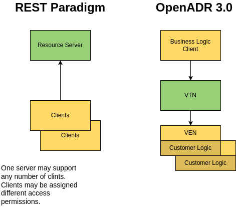
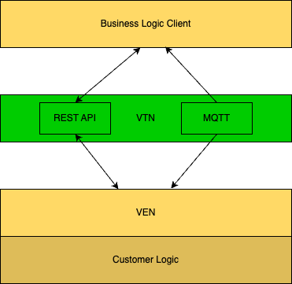
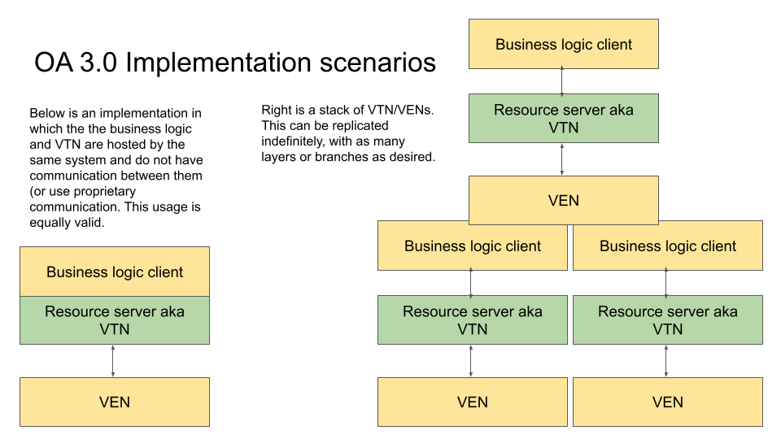
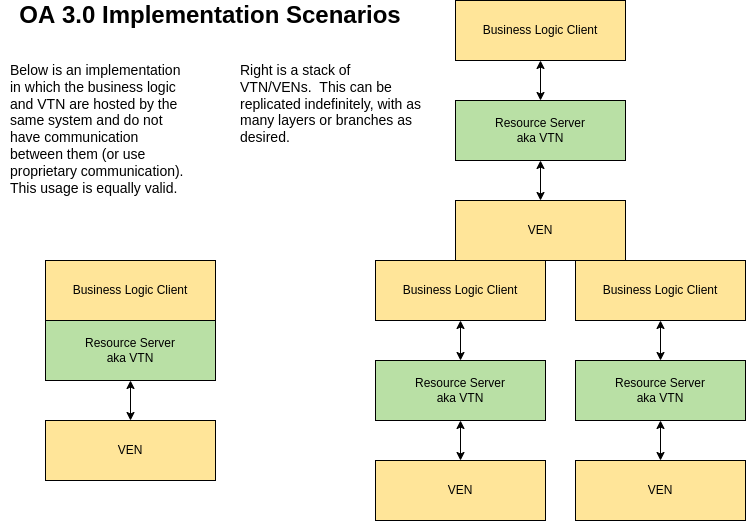
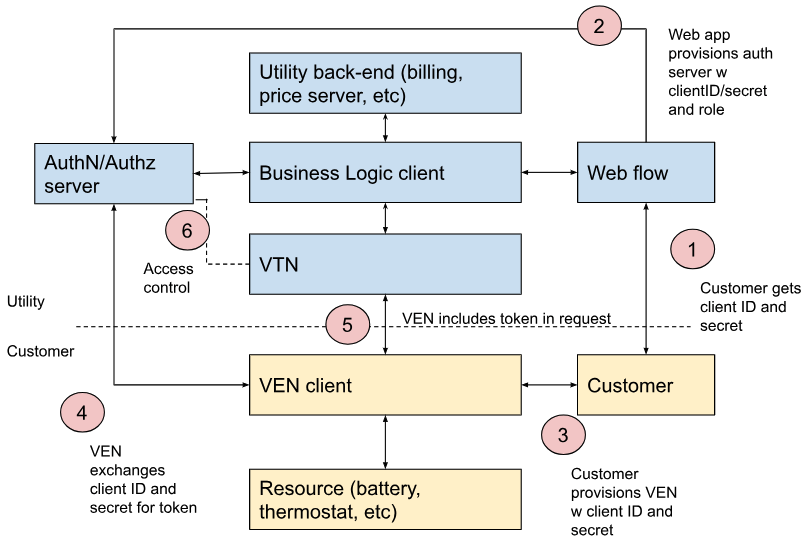
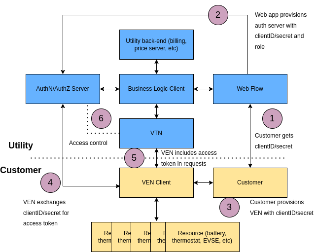

# OpenADR 3.1.0 Definitions

<p align="right"> Updated 08/07/2025 </p>

<p align="right"> Revision Number: 3.1.0 </p>

<p align="right"> Document Status: Final Specification </p>

<p align="right"> Document Number: 20250807-X </p>


<table width="100%">
<tr>
<th>Contact:</th>
<th>Editors</th>
<th>Technical Director OpenADR Alliance:</th>
</tr>
<td style="vertical-align: top">
OpenADR Alliance<br> 111 Deerwood Road, Suite 200 <br> San Ramon, CA 94583 <br> USA<br> <a href="mailto:info@openadr.org">info@openadr.org</a>
</td>
<td style="vertical-align: top">
Frank Sandoval Pajarito Technologies LLC <a href="mailto:frank@pajaritotech.com">frank@pajaritotech.com</a>  <br> Bruce Nordman – LBNL <a href="mailto:bnordman@lbl.gov">bnordman@lbl.gov</a> <br> Other OpenADR Alliance Members
</td>
<td style="vertical-align: top">
Rolf Bienert <a href="mailto:rolf@openadr.org">rolf@openadr.org</a> 
</td>
</tr>
<tr>
<td colspan="3">
Please send general questions and comments about the documentation to <a href="mailto:comments@openadr.org">comments@openadr.org</a>
</td>
</tr>
</table>


# Introduction

This document describes the third major iteration of the OpenADR protocol. It serves as a near functional equivalent of its predecessor, OpenADR 2.0b, but departs from the 2.0b SOAP-like web service design and instead adheres to RESTful web service best practices. REST services are much more common today than SOAP and are generally considered much more straightforward to use and troubleshoot. The main goal in providing this version as a complement to 2.0b is to lower the barriers of entry for new implementers and thereby encourage more widespread adoption of the standard.

This document contains normative and non-normative content and may contain simplifications for the purpose of conveying the underlying OpenADR REST concepts. Additional normative content can be found in the Normative References section, including the OpenADR 3 OpenAPI document. [OADR-3-Specification] which is the authoritative specification of the interface between VTN and clients.

## Revision 3.1.0 Introduction

Previous revisions (3.0, 3.0.1) supported a single mechanism (webhooks, via HTTP) for the Virtual Top Node (VTN) to push notifications to clients (resulting from Subscriptions), this revision adds support for additional notification event delivery protocols, with MQTT being the first such protocol defined.

# Normative References
[OADR-3-Specification] OpenADR 3 OpenAPI YAML (SwaggerDoc) Specification, [[https://github.com/oadr3/specification]](https://github.com/oadr3/specification)

[RFC 3339] Internet profile of ISO 8601 date and time format. https://datatracker.ietf.org/doc/html/rfc3339

[ISO 8601] ISO duration format. https://www.iso.org/iso-8601-date-and-time-format.html

[ISO 4217] ISO 4217 Currency Codes: https://www.six-group.com/en/products-services/financial-information/data-standards.html%23scrollTo=maintenance-agency

[MQTT 3.1.1] MQTT Version 3.1.1 [[https://docs.oasis-open.org/mqtt/mqtt/v3.1.1/mqtt-v3.1.1.html]](https://docs.oasis-open.org/mqtt/mqtt/v3.1.1/mqtt-v3.1.1.html)

[MQTT 5.0] MQTT Version 5.0: [[https://docs.oasis-open.org/mqtt/mqtt/v5.0/mqtt-v5.0.html]](https://docs.oasis-open.org/mqtt/mqtt/v5.0/mqtt-v5.0.html)

[mDNS] Multicast DNS: [[https://datatracker.ietf.org/doc/html/rfc6762]](https://datatracker.ietf.org/doc/html/rfc6762)

[DNS-SD] DNS-Based Service Discovery: [[https://datatracker.ietf.org/doc/html/rfc6763]](https://datatracker.ietf.org/doc/html/rfc6763)

# Informative References

[OADR-3-User_Guide] OpenADR 3 User Guide, Draft April 17, 2023

[OADR-3-Reference_Implementation] OpenADR 3 Reference Implementation [[https://github.com/oadr3/openadr3-vtn-reference-implementation]](https://github.com/oadr3/openadr3-vtn-reference-implementation)

[REST_Best_Practice] RESTful web API design (website) https://docs.microsoft.com/en-us/azure/architecture/best-practices/api-design

[CTA-2045-B] Modular Communications Interface for Energy Management, November 2020

[OpenAPI Auth] Authentication in OpenAPI [[https://swagger.io/docs/specification/authentication/]](https://swagger.io/docs/specification/authentication/)

[REST-API-Best_Practices] REST API Security Essentials. [[https://dzone.com/refcardz/rest-api-security-1]](https://dzone.com/refcardz/rest-api-security-1)

[OAuth] The OAuth 2.0 Authorization Framework, 2012. [[https://www.rfc-editor.org/rfc/rfc6749]](https://www.rfc-editor.org/rfc/rfc6749)

[OAuth2 Threat Model] OAuth 2.0 Threat Model and Security Considerations. [[https://www.rfc-editor.org/rfc/rfc6819](https://www.rfc-editor.org/rfc/rfc6819)]

[JWT] JSON Web Token (JWT), 2015. [[https://www.rfc-editor.org/rfc/rfc7519]](https://www.rfc-editor.org/rfc/rfc7519)

[Oauth2 Client Flow] OAuth 2.0 Client Credentials Grant. [[https://oauth.net/2/grant-types/client-credentials]](https://oauth.net/2/grant-types/client-credentials)

[Client Flow Overview] Client Credentials Flow. [[https://auth0.com/docs/get-started/authentication-and-authorization-flow/client-credentials-flow]](https://auth0.com/docs/get-started/authentication-and-authorization-flow/client-credentials-flow)

[SEMVER] Semantic Versioning [[https://semver.org]](https://semver.org)

[TLS] How SSL and TLS provide identification, authentication, confidentiality, and integrity, [[https://www.ibm.com/docs/en/ibm-mq/7.5?topic=ssl-how-tls-provide-authentication-confidentiality-integrity]](https://www.ibm.com/docs/en/ibm-mq/7.5?topic=ssl-how-tls-provide-authentication-confidentiality-integrity)

[URI] Uniform Resource Identifier (URI): Generic Syntax [[https://www.rfc-editor.org/rfc/rfc3986]](https://www.rfc-editor.org/rfc/rfc3986)

This document’s use of requirements keywords in BOLD is modeled after, and consistent with:

[IETF RFC 2119] Key words for use in RFCs to Indicate Requirement Levels [[https://www.ietf.org/rfc/rfc2119.txt]](https://www.ietf.org/rfc/rfc2119.txt)


# Terms and Definitions

OpenADR 3 adopts many terms from 2.0b directly, such as Event and Report. Terms that are new or modified are:

- **Program** - The business context for a given usage of the VTN. May be a Demand Response program, tariff, or other business construct.
- **ProgramName** - A unique name for a program or tariff. May be used by customers.
- **Program Description** - A human readable document provided out-of-band by a Business Logic entity that specifies a usage of the OpenADR 3 object model and configuration details such as VTN address, program names, applicable customer types, etc.
- **Tariff** - A type of program that defines the basic agreement between a retailer and a customer, such as an electricity pricing structure, as opposed to optional programs offered on top of a tariff.
- **Virtual Top Node (VTN)** - An application that implements the OpenADR 3 APIs. This is a Resource Server in REST parlance.
- **Virtual End Node (VEN)** - A software application that consumes events, generates reports, and directly or indirectly causes changes in energy consumption patterns. This is a client of a VTN.
- **Business Logic (BL)** - Application logic embodied in one or more software applications deployed by a utility, retailer, or other 'program owner' of the VTN that typically produces events and consumes reports. It may be incorporated into the VTN resource server such that the business logic application exposes the OpenADR 3 API. We use the term here to refer to a client of a VTN.
- **Customer Logic (CL)** - Application logic that requests and responds to program and event objects, produces reports, and may provide human facing features to support configuration and monitoring. May be incorporated into or interface with a VEN client.

## Notifier Terms and Defintions

- **Binding** - A specification (and implementation) of a protocol to support notifications of operations on OpenADR 3 objects.
Revision 3.1.0 specifies the binding to the MQTT protocol, and includes the original and existing webhook notifications as a notifier binding.
Future revisions may specify additional bindings, examples of possible future bindings include WebSockets and Kafka.

## Messaging Protocol Terms and Definitions

MQTT and Kafka are messaging protocols.

- **Broker** - The standard term for the "server" component of a messaging protocol system. VTNs implementing notifications via MQTT would include a MQTT broker.
- **Topic** - A category used to organize messages. Each topic has a name that is unique to the broker.
- **Client** - A client connects to a broker, in order to write or read messages.
- **Publisher/Producer** - A client that writes messages to a topic on a broker. VTNs implementing notifications via MQTT would be publishing clients
- **Subscriber/Consumer** - A client that reads messages from a topic on a broker. Typically the subscribing client will subscribe to a topic, and subsequently receive (read) messages published to that topic. VENs implementing notifications via MQTT would be subscribing clients.
- **Subscribe-able Object** - An OpenADR 3 object that can be subscribed to, resulting in subsequent notifications of changes to the subscribed object are sent to the subscriber. OpenADR 3 subscribe-able objects include: PROGRAM, EVENT, REPORT, SUBSCRIPTION, VEN, and RESOURCE.

# Overview

## System Architecture

REST systems are composed of a Resource Server exposing a set of HTTP APIs and multiple clients of the API. An OpenADR 3 VTN is a Resource Server, and like an OpenADR 2.0b VTN it provides a mechanism for business logic of a utility or other entity to transmit events and receive reports to and from an energy consuming client, known as a VEN.

OpenADR 3.0 defines a RESTful interface that is used by both business logic clients and customer logic clients, aka VENs, which represent flexible loads and other customer devices. In this model, an OpenADR 3.0 Resource Server (VTN) provides a mechanism for business logic and energy consumers to exchange events and reports. Figure 1 illustrates the canonical REST paradigm of server and clients, and how OpenADR terms are applied to these constructs.



Business Logic (BL) is application software hosted by an energy retailer that integrates to the retailers backend systems and interfaces with a VTN. It may also support an onboarding process, including a User Interface, by which VENs are provided security credentials and other configuration information (e.g. VTN URL).

Customer Logic (CL) uses a VEN client to obtain demand response events produced by BL and subsequently manage a set of 'resources' such as flexible loads and customer devices. CL may expose a User Interface to facilitate configuration and management of the VEN, e.g. configure VTN address.

An implementation of an OpenADR 3 system might incorporate Business Logic (BL) into a VTN, such that certain API features are not used by the BL and instead implementation specific mechanisms are used to support BL functions.

OpenADR 3.1.0 VTNs supporting notifications via MQTT will include a MQTT broker. VTN clients will make a (new) REST request to the VTN to determine the VTN's support for additional notification protocols, and for each notification supported, details of how to obtain notifications via that notification binding.  For VTNs supporting notifications via MQTT, the binding will include details of how the client can connect to the the VTN's MQTT broker.
The relationships between the VTNs REST API, MQTT broker, and potential clients are shown in Figure 1.5



A tiered hierarchy of VTNs and VENs may also be supported, in which an entity acts as a VEN to interact with a VTN, and then presents its own VTN to 'downstream' VENs. This is shown in Figure 2.

<!--  -->



## Local Scenarios

A common expected future usage of OpenADR will be for a central device in a utility-customer location to receive OpenADR events as a VEN,
then rebroadcast these - possibly modified - to local flexible loads and other devices.
The term 'local' here is applied to match IT usage as with a Local Area Network (LAN),
and this is different and distinct from 'locational' to refer to a geographic region, as with locational retail prices.
The central device might be a large building energy management system,
a home energy management system (HEMS) managing a collection of local devices,
or a microgrid controller.
Such a device is also then a VTN for other local devices.
This is an example of the use of a hierarchy of OpenADR links as in the right side of Figure 2.

There are several cases in which centralizing the reception of retail prices is beneficial.
Only one device needs to be aware of the identity of the retailer and tariff, so that if these change only one device needs to be updated.
Another case is when the customer wishes to incorporate the burden of greenhouse gas emissions into the optimization of loads and other devices, and do so with a 'local price';
the GHG value is multiplied by a \$/ton burden value and added to the retail price.
The localPrice boolean in a program description notifies downstream devices that the retail price has been modified.
Another use of a central device is to receive OpenADR signals over multiple communication channels for redundancy.
Yet another is for microgrid operation when the grid is down - the central device can be a microgrid controller and use OpenADR events, e.g. prices, to balance supply and demand.

It is not anticipated that the OpenADR standard needs to be modified in any way to fully support local operation, but any changes would be supplementary capabilities.

Note that the central device might also manage (some) local devices using protocols other than OpenADR, for example, Matter, BACnet, or Modbus.

### Discovery and Configuration of Local VTNs

The mDNS and DNS-SD protocols provide a convenient and standard method for a VEN within a customer site (e.g. a flexible load)
to automatically discover a VTN also within the site (e.g. a gateway).

A VEN intended for use within a customer site (a VEN that is not specifically intended to be used only in the cloud)
**SHOULD** support mDNS discovery of a local VTN.

A VTN intended for use within a customer site:

* **SHOULD** announce its `.local` hostname
* **SHOULD** advertise the service type `_openadr3._tcp.`
* **SHOULD** respond to PTR queries to the service type `_openadr3._tcp.` with:
  * A PTR record for the service instance name
  * A SRV record with the target hostname and port
  * A/AAAA records for the IP address(es)
  * TXT record metadata as follows:
    * `version` with value being the OpenADR3 version its supports, e.g. `3.1.0`
    * `base_path` whose value is whatever prefix is needed before the actual OA3 endpoint, e.g. `openadr3/3.1.0`
    * `local_url` with value `"https://{hostname).local:{port}/{base_path}"`
    * `program_names` with value being a comma separated string containing all `programNames` to be used by local VENs
	* `requires_auth` with values of `True` or `False`
    * `openapi_url` with value being a URL to the OpenAPI specification for the VTN

mDNS and DNS-SD support does not change the content of the OpenADR 3 standard; rather it occurs before any OpenADR communication occurs.

A VEN **SHOULD** favor use of the local VTN's `.local` hostname over its IP address, as dynamically assigned IP addresses (via DHCP) may change over time.

#### Example mDNS responses:

##### PTR Record – service type → service instance
```
_openadr3._tcp.local.      IN PTR My_VTN._openadr3._tcp.local.
```
This tells the client: There is a service instance named `My_VTN._openadr3._tcp.local` offering `_openadr3._tcp.`

##### SRV Record – service instance → hostname and port
```
My_VTN._openadr3._tcp.local.  IN SRV 0 0 883 myvtn.local.
```
This indicates the OpenADR3 service is at `myvtn.local`, port `883`. Priority and weight are both `0` here.

##### A Record – hostname → IPv4 address
```
myvtn.local.   IN A 192.168.1.42
```

##### AAAA Record – hostname → IPv6 address (if available)
```
myvtn.local.   IN AAAA fe80::abcd:1234:5678:90ef
```

##### TXT Record – service metadata
```
My_VTN._openadr3._tcp.local.  IN TXT version=3.1.0 \
      base_path=openadr3/3.1.0 \
      local_url=https://myvtn.local:883/openadr3/3.1.0 \
      program_names=local requires_auth=False
```

(Text wrapped for visual clarity.  It should be on one line.)

## VEN enrollment

OpenADR relies on an out-of-band process by which Business Logic provision VENs with information to allow VENs to obtain access tokens and make requests to the VTN.

A VEN **MUST** support end-user configuration of:

* VTN URL
* `clientID` and `clientSecret` (required for OAuth 2 client credential flow)

A VEN **MAY** be pre-configured with those (or other) items, but **MUST** support end-user reconfiguration.

Certain programs may further wish to provision application level information such as VEN names, resource names, targeting
labels, or other, but VENs are not required to support such configuration.
In such cases, VENs must integrate with BL systems to accomplish this.

A ‘tariff’ program may choose to configure a VTN to respond to requests from unauthenticated clients, but this behavior is outside the scope of the typical openADR 3 security model.
In such situations, only the VTN URL must be provisioned into the VEN.
See the section below “Security/Non-Authenticated Clients"

# General Usage

## Object Metadata

On object creation of programs, events, reports, subscriptions, vens,
and ven resources, client representations provided to the VTN on POST
requests are incomplete, as clients do not have the context to provide
accurate or meaningful values for the following attributes:

* objectID
* createdDataTime
* modificationDateTime
* objectType

A VTN SHALL populate object representations with the above fields on object creation.

## Required and optional properties

The specification is purposefully sparse of required fields so that clients may create and modify objects by creating requests with minimal effort.

If a representation sent to the VTN lacks a required property, a VTN SHALL return a 400, Bad Request response. A resource is not created or updated. Required fields do not have default values.

A representation provided in a write request (PUT, POST) to the VTN may
exclude optional fields. The VTN may create a corresponding object with
such excluded fields set to default values.

A VTN may provide representations of an object that do not include
optional properties that have their default value.

Optional fields are generally nullable and have default values of null,
where no assumption can be made on what reasonable a default value might
be.

If a representation includes a property that is not defined by an
object's schema, a VTN may create a corresponding resource without the
additional property, effectively ignoring the additional content.

## Response Codes and Errors

A VTN SHALL support the following standard codes:

```
GET
  200 - OK
  400 - Bad Request
  403 - Forbidden
  404 - Not Found
  500 - Internal Server Error

POST
  201 - Created
  400 - Bad Request
  403 - Forbidden
  404 - Not Found
  409 - Conflict (item already exists)
  500 - Internal Server Error

PUT
  200 - OK
  400 - Bad Request
  403 - Forbidden
  404 - Not Found
  409 - Conflict
  500 - Internal Server Error

DELETE
  200 - OK
  400 - Bad Request
  403 - Forbidden
  404 - Not Found
  500 - Internal Server Error
```

Servers may implement other response codes, but VENs might not recognize them.

### Problem

On 40x and 500 responses, a VTN SHALL respond with a *problem* object that contains details of the error. The problem object is intended to help clients determine what caused a particular response, such as Bad Request, Unauthorized, Forbidden, etc.

For example:

```json
{
  "title": "Not Found",
  "status": 404,
  "detail": "Unrecognized URL"
}
```

**Figure 3. Problem Example**

## POST and PUT

POST is used to create new objects, and PUT is used to update an
existing object. A VTN SHALL ignore objectID, createdDateTime,
modificationDateTime, and objectType values included in representations
used in POST and PUT requests.

## Compression

In some circumstances the size of responses should be minimized, such as
over bandwidth-constrained connections.

The HTTP protocol allows a client to request encoding using one of
several compression algorithms, such as GZIP, by using the
Accept-Encoding header. Server responses can then use the
Content-Encoding header to indicate the algorithm chosen, and the
response body is compressed accordingly. The result should be a seamless
exchange where data is compressed.

Configuring this behavior is outside the scope of the OpenAPI definition
of the OpenADR protocol. Instead, compression is implemented through
configuration of the HTTP/REST framework used for OpenADR clients and
servers.

Support for a given compression format is optional for VTNs, although
gzip is encouraged.

## Support for Strongly Typed languages

Certain OpenAPI construct, such as oneOf and anyOf are not suited to
code-generation of client or server stubs in strongly typed languages
like Java and C#. Code generators could operate if such constructs
explicitly included a super class with the alternative schemas modeled
as subclasses, but this is not implemented in OpenADR 3. Where OpenADR
3 uses oneOf and anyOf, classes should be manually created in some
languages.

## Message validation

A VTN SHALL reject request bodies that do not contain required fields.
Content that is not described by a message schema MAY be ignored. (See
Section 9.1 Model Extension). Validation of content by a VTN is
outside the scope of this specification and is considered an
implementation detail.

Content validation is the responsibility of clients and therefore
outside the scope of this specification.

## Subscriptions

OpenADR 3 supports both pull and push interactions. Pull interactions
are initiated by a client and are implemented with HTTP GET, POST, PUT,
and DELETE.

Push interactions are implemented with Subscriptions via webhooks. These
allow a client to be notified when certain operations transpire. A
webhook is a client endpoint registered with the VTN. When a specified
operation occurs, for example when an event is created, a request to the
client endpoint may be made by the VTN, thus notifying the client of the
new event.

Webhooks are implemented using subscription objects. A client creates a
new subscription object, which contains the webhook callback URL, and a
description of the objects and operations that will trigger a request to
the callback URL.

Subscription objects may contain targets, which are used by the VTN to filter
the notifications to the client in the same manner as targets are used in
response filtering.

`POST subscription`

```json
{
  "clientName": "myClient",
  "programID": "44",
  "objectOperations": [{
    "callbackUrl": "https://myserver.com/callbacks",
    "operations": [
      "CREATE",
      "UPDATE"
    ],
    "objects": [
      "EVENT",
      "PROGRAM"
    ]
  }]
}
```

**Figure 4. Subscription**

A subscription object is associated with a specific client and optionally a specific
program. The objectOperations list specifies what operations on which
resource types the client requests to be notified about.

A client may provide multiple resourceOperation entries to provide
different callbackUrls to catch notifications of different resources and
operations.

`POST subscription`

```json
{
  "clientName": "myClient",
  "programID": "44",
  "objectOperations": [
    {
      "callbackUrl": "https://myserver.com/event_callbacks",
      "operations": [
        "CREATE",
        "UPDATE"
      ],
      "objects": [
        "EVENT"
      ]
    },
    {
      "callbackUrl": "https://myserver.com/program_callbacks",
      "operations": [
        "CREATE",
        "UPDATE"
      ],
      "objects": [
        "PROGRAM"
      ]
    }
  ]
}
```

**Figure 5. multiple callback Subscription**

A VTN SHALL make a request to the callback URL when the conditions are
met per the objectOperations registered subscriptions. The callback
request body is a Notifications object that indicates the object type of
the resource, the operation that provoked the request, and the relevant
resource object.

`Notification`

```json
{
  "objectType": "PROGRAM",
  "operation": "POST",
  "object": {
    "bindingEvents": false,
    "createdDateTime": "2023-06-15T15:51:29.000Z",
    "id": "0",
    "localPrice": false,
    "objectType": "PROGRAM",
    "programName": "myProgram"
  }
}
```

**Figure 6. Notification Example**

## Notifications via Additional Protocols

As an alternative to object Subscriptions via REST and resulting
Notifications via webhooks, revision 3.1.0 defines a mechanism for a VTN to provide notifications via other protocols,
initially MQTT is the only defined alternate protocol.

A client may request information about supported notifications protocols
via the GET /notifiers request:

`GET /notifiers`

```json
{
  "MQTT": {
    "URIS": [
      "mqtts://broker.vtn.company.com"
    ],
    "authentication": {
      "method": "ANONYMOUS"
    },
    "serialization": "JSON"
  },
  "WEBHOOK": true
}
```

The example response above details that the VTN supports the `WEBHOOK` and `MQTT` notifiers.

The binding for the `MQTT` notifier provides a list of `URIS` for the VTN's MQTT broker, the authentication method required by the broker, and the message serialization, `JSON`.


**Figure 7. GET / notifiers Example**

The client may then connect to the VTN's MQTT broker with the information provided in the MQTT binding specification above.
The client can request the topic names for OpenADR objects and operations upon them.
The topic name request endpoints include:

- `GET /notifiers/mqtt/topics/programs`
- `GET /notifiers/mqtt/topics/programs/{programID}`
- `GET /notifiers/mqtt/topics/events`
- `GET /notifiers/mqtt/topics/programs/{programID}/events`
- `GET /notifiers/mqtt/topics/reports`
- `GET /notifiers/mqtt/topics/subscriptions`
- `GET /notifiers/mqtt/topics/vens`
- `GET /notifiers/mqtt/topics/vens/{venID}`
- `GET /notifiers/mqtt/topics/resources`
- `GET /notifiers/mqtt/topics/vens/{venID}/events`
- `GET /notifiers/mqtt/topics/vens/{venID}/programs`
- `GET /notifiers/mqtt/topics/vens/{venID}/resources`

An example request and response for the MQTT topic names for operations on all programs on the VTN:

`GET /notifiers/mqtt/topics/programs`

```json
{
  "topics": {
	"ALL": "programs/+",
	"CREATE": "programs/create",
	"DELETE": "programs/delete",
	"UPDATE": "programs/update"
    }
}
```

The response from the VTN is a JSON object, containing the key `topics`, and the value is a JSON object, each key being the operation on the object, and the value of that key is the topic-name for that operation.

Unlike the Subscriptions REST request, response filtering (see section
6.9 below) is not supported for topic subscriptions made via messaging
protocols. If a client subscribes to an object's operations, it will
receive all such notifications, and it is the responsibility of the
client to ignore/filter events to which it is not interested.

The format and content of the notification messages received by clients
will be the same as the existing notification JSON response format
specified in OpenADR 3 (which is also the same as what is returned
when the message is obtained via an OpenADR 3 REST GET request).

## Response Filtering

A VTN may support large numbers of objects, such as vens and associated
resources. In order to reduce potentially large responses that might
include object representations of no interest to a client, clients may
provide query params to allow a VTN to filter results.

For example, when requesting a list of reports, a client may specify,
through query params, that only reports associated with a specific
program, and/or created by a specific client, be included in a response.

Targeting criteria can be used to filter responses to include only those
objects that include target terms found in the query. See the Object Privacy 
section below for details on how targeting may be use to enhance object privacy.

VTN SHALL support limit and skip query params on GET operations, as
described by [OADR-3-Specification], to control pagination of
potentially large responses.

VTN SHALL treat filtering params as additive, that is, results must
match every filter term.

Future versions of OpenADR3 may provide other features that facilitate
massive scalability or operation under extremely bandwidth or memory
constrained environments.

## Object names

Some objects have name attributes that can be used as query parameters
to retrieve them. This requires uniqueness with given scopes.

* `program.programName` - must be unique to a VTN instance.
* `ven.venName` - must be unique within the scope of a VTN instance.
* `ven.resource.resourceName` - must be unique to its associated ven.

Event and report names are not required to be unique.

## Object Privacy
An important aspect of security is preventing unintended access to objects. BL clients are given carte blanche access to all
objects, but VEN clients are limited to accessing those objects they have themselves created or for which they have been granted access.

ven, resource, report, and susbcription objects may be created by VENs and it is assumed these are intended to be read by BL and no other VENs.
BL may also create ven and resource objects and similarly limit visibility to intended VENs. Finally, BL may create
program and event objects intended for one or a set of VENs via targeting.

### VEN created object privacy
When a VEN creates a ven, subscription, or report object the VTN SHALL discover a VEN's client identifier associated with the request's token and write the identifier into
the object.clientID field (not unlike how VTN writes object metadata on creation).
The means by which the VTN discovers a client identifier associated with the token is not specified here.
Strategies may include using JWT tokens and extracting the clientID from the token or maintaining an association between a token and client identifier in a database.

On read, update or delete requests to /vens, /resources, /subscriptions or /reports by a VEN, the VTN SHALL discover the client identifier associated with the requestor's 
token and return the list of objects with matching clientID. 
If none exist, an empty set is returned. 

BL has unrestricted read access to all objects.

### BL created object privacy
#### ven objects
When BL creates a ven object it is expected to provide the clientID in the request body. BL may subsequently create resource objects associated with an existing ven object.

#### program and event objects - targeting
Targeting is used to enforce program and event object privacy. BL may append targets to program and event objects
to ensure these objects are only accessible to VENs that include those targets in their associated ven or resource objects. 

Targeting is a multi-step process: first, a ven object and optionally a number of resource objects,
must exist that BL has created or modified to 'grant' targets to a given VEN. Second, 
program and event objects are created that contain targets. When a VEN makes a read request for programs or events the VTN ensures that the requested targets have been granted to the requesting VEN.

On receipt of a VEN request to read a program or event object that has targets, a VTN SHALL
discover the requestor's clientID via token inspection (described above in VEN created object privacy), use this value to find a corresponding ven object, 
and perform a logical AND of the targets in the request and of the ven object and associated resource objects, and use the resulting set to perform target matching on the object. 
If no ven object exists with the requestor's clientID, if the intersection of request targets and ven targets is empty, or if the request targets do not 
match with the objects targets, an empty set is returned. 

When evaluating whether to send a notification of a change of state of an object with targets, the VTN SHALL use the clientID of 
a subscription object to discover the associated ven and resource objects, and process the targets as described above. 

This mechanism provides token-based assurance that the program or event object
is accessible only to those clients that have specifically been 'granted' targets (via the ven object) and
include those or a subset of targets in a request.

Additional requirements to support targeting are:
* Target hiding: For program and event objects, a VTN will only include requested targets in a response. This prevents VENs from learning targets that have
not been explicitly assigned to them by BL. Target hiding is not performed on ven, resource, or subscription objects as these objects are read-able only by a specific VEN.
* Only BL clients may write targets to ven and resource objects, because of the interdependency between program and event targets and
the targets 'granted' to a VEN.
* VENs are assigned a default security scope of 'read_targets' that indicates to a VTN that read operations by a VEN for an object that has targets must include matching targets in the query.

# Information Model

An Information Model is a conceptual representation of entities and
relationships to facilitate human communication; to be useful for
machines it is translated to a data model. [OADR-3-Specification] is
a machine-readable YAML file providing the authoritative description of
the protocol, including schema components that define a concrete
representation of the Information Model. While the YAML is
human-readable, the description here is provided as an easier to digest
summary of the main data objects defined in the Specification.

The specification document does not describe all aspects of the meaning
of the data elements below. Considerable detail on this is in the User
Guide [OADR-3-User_Guide]. Examples of detail found there are for
payload descriptors, events, reports, interval timing, data quality, and
targeting.

IDs for programs, events, and reports are created by the VTN when these
objects are posted, and all such IDs are unique within the VTN. Other
identifiers are created out-of-band of OpenADR such as clientID in
report or created by the entity creating the object such as ID in
interval.

Objects that are addressable through the API, i.e. can be accessed via
`<url>/path/{objectID}`, contain an ID attribute that is of type
objectID, and creation and modification timestamps. These attributes are
populated by the VTN on object creation and modification.

In the listing below, any default value is listed in brackets after the
definition.

<!-- @InformationModel@ -->
<span id="information-model-table">

<ul>
<li><b>objectMetadata</b>: metadata common to all addressable objects. Values provided by VTN on object creation.

<ul>

<li><span class="information-model-property"><b>id</b>: </span><span class="information-model-ref"> #/components/schemas/objectID</span></li>

<li><span class="information-model-property"><b>createdDateTime</b>: </span><span class="information-model-ref"> #/components/schemas/dateTime</span></li>

<li><span class="information-model-property"><b>modificationDateTime</b>: </span><span class="information-model-ref"> #/components/schemas/dateTime</span></li>

<li><span class="information-model-property"><b>objectType</b>: </span><span class="information-model-ref"> #/components/schemas/objectTypes</span></li>

</ul>

</li>
</ul>

<ul>
<li><b>program</b>: Server provided representation of program

<ul>

</ul>

</li>
</ul>

<ul>
<li><b>programRequest</b>: Client provided description of program

<ul>

<li><span class="information-model-property"><b>programName</b>: </span><span class="information-model-description"> Short name to uniquely identify program.</span></li>

<li><span class="information-model-property"><b>intervalPeriod</b>: </span><span class="information-model-ref"> #/components/schemas/intervalPeriod</span></li>

<li><span class="information-model-property"><b>programDescriptions</b>: </span><span class="information-model-description"> A list of programDescriptions</span></li>

<li><span class="information-model-property"><b>payloadDescriptors</b>: </span><span class="information-model-description"> A list of payloadDescriptors.</span></li>

<li><span class="information-model-property"><b>attributes</b>: </span><span class="information-model-description"> A list of valuesMap objects describing attributes.</span></li>

<li><span class="information-model-property"><b>targets</b>: </span><span class="information-model-description"> A list of targets.</span></li>

</ul>

</li>
</ul>

<ul>
<li><b>report</b>: Server provided representation of report

<ul>

</ul>

</li>
</ul>

<ul>
<li><b>reportRequest</b>: report object.

<ul>

<li><span class="information-model-property"><b>eventID</b>: </span><span class="information-model-ref"> #/components/schemas/objectID</span></li>

<li><span class="information-model-property"><b>clientName</b>: </span><span class="information-model-ref"> #/components/schemas/clientName</span></li>

<li><span class="information-model-property"><b>reportName</b>: </span><span class="information-model-description"> User defined string for use in debugging or User Interface.</span></li>

<li><span class="information-model-property"><b>payloadDescriptors</b>: </span><span class="information-model-description"> A list of reportPayloadDescriptors.</span></li>

<li><span class="information-model-property"><b>resources</b>: </span><span class="information-model-description"> A list of objects containing report data for a set of resources.</span></li>

</ul>

</li>
</ul>

<ul>
<li><b>event</b>: Server provided representation of event

<ul>

</ul>

</li>
</ul>

<ul>
<li><b>eventRequest</b>: Event object to communicate a Demand Response request to VEN.
If intervalPeriod is present, sets default start time and duration of intervals.


<ul>

<li><span class="information-model-property"><b>programID</b>: </span><span class="information-model-ref"> #/components/schemas/objectID</span></li>

<li><span class="information-model-property"><b>eventName</b>: </span><span class="information-model-description"> User defined string for use in debugging or User Interface.</span></li>

<li><span class="information-model-property"><b>duration</b>: </span><span class="information-model-ref"> #/components/schemas/duration</span></li>

<li><span class="information-model-property"><b>priority</b>: </span><span class="information-model-description"> Relative priority of event. A lower number is a higher priority.</span></li>

<li><span class="information-model-property"><b>targets</b>: </span><span class="information-model-description"> A list of targets.</span></li>

<li><span class="information-model-property"><b>reportDescriptors</b>: </span><span class="information-model-description"> A list of reportDescriptor objects. Used to request reports from VEN.</span></li>

<li><span class="information-model-property"><b>payloadDescriptors</b>: </span><span class="information-model-description"> A list of payloadDescriptor objects.</span></li>

<li><span class="information-model-property"><b>intervalPeriod</b>: </span><span class="information-model-ref"> #/components/schemas/intervalPeriod</span></li>

<li><span class="information-model-property"><b>intervals</b>: </span><span class="information-model-description"> A list of interval objects.</span></li>

</ul>

</li>
</ul>

<ul>
<li><b>subscription</b>: Server provided representation of subscription

<ul>

</ul>

</li>
</ul>

<ul>
<li><b>subscriptionRequest</b>: An object created by a client to receive notification of operations on objects.
Clients may subscribe to be notified when a type of object is created,
updated, or deleted.


<ul>

<li><span class="information-model-property"><b>clientName</b>: </span><span class="information-model-ref"> #/components/schemas/clientName</span></li>

<li><span class="information-model-property"><b>programID</b>: </span><span class="information-model-ref"> #/components/schemas/objectID</span></li>

<li><span class="information-model-property"><b>objectOperations</b>: </span><span class="information-model-description"> list of objects and operations to subscribe to.</span></li>

<li><span class="information-model-property"><b>targets</b>: </span><span class="information-model-description"> A list of target objects. Used by server to filter notifications.</span></li>

</ul>

</li>
</ul>

<ul>
<li><b>ven</b>: Server provided representation of ven

<ul>

</ul>

</li>
</ul>

<ul>
<li><b>venRequest</b>: 

<ul>

</ul>

</li>
</ul>

<ul>
<li><b>resource</b>: Server provided representation of resource

<ul>

</ul>

</li>
</ul>

<ul>
<li><b>resourceRequest</b>: 

<ul>

</ul>

</li>
</ul>

<ul>
<li><b>interval</b>: An object defining a temporal window and a list of valuesMaps.
if intervalPeriod present may set temporal aspects of interval or override event.intervalPeriod.


<ul>

<li><span class="information-model-property"><b>id</b>: </span><span class="information-model-description"> A client generated number assigned an interval object. Not a sequence number.</span></li>

<li><span class="information-model-property"><b>intervalPeriod</b>: </span><span class="information-model-ref"> #/components/schemas/intervalPeriod</span></li>

<li><span class="information-model-property"><b>payloads</b>: </span><span class="information-model-description"> A list of valuesMap objects.</span></li>

</ul>

</li>
</ul>

<ul>
<li><b>intervalPeriod</b>: Defines temporal aspects of intervals.
A start of &quot;0001-01-01&quot; or &quot;0001-01-01T00:00:00&quot; may indicate &#39;now&#39;. See User Guide.
A duration of &quot;P9999Y&quot; may indicate infinity. See User Guide.
A randomizeStart indicates absolute range of client applied offset to start. See User Guide.


<ul>

<li><span class="information-model-property"><b>start</b>: </span><span class="information-model-ref"> #/components/schemas/dateTime</span></li>

<li><span class="information-model-property"><b>duration</b>: </span><span class="information-model-ref"> #/components/schemas/duration</span></li>

<li><span class="information-model-property"><b>randomizeStart</b>: </span><span class="information-model-ref"> #/components/schemas/duration</span></li>

</ul>

</li>
</ul>

<ul>
<li><b>valuesMap</b>: Represents one or more values associated with a type.

See enumerations in Definitions for defined string values, or use privately defined strings


<ul>

<li><span class="information-model-property"><b>type</b>: </span><span class="information-model-description"> Represents the nature of values.

See enumerations in Definitions for defined string values, or use privately defined strings
</span></li>

<li><span class="information-model-property"><b>values</b>: </span><span class="information-model-description"> A list of data points. Most often a singular value such as a price.</span></li>

</ul>

</li>
</ul>

<ul>
<li><b>point</b>: A pair of floats typically used as a point on a 2 dimensional grid.

<ul>

<li><span class="information-model-property"><b>x</b>: </span><span class="information-model-description"> A value on an x axis.</span></li>

<li><span class="information-model-property"><b>y</b>: </span><span class="information-model-description"> A value on a y axis.</span></li>

</ul>

</li>
</ul>

<ul>
<li><b>eventPayloadDescriptor</b>: Contextual information used to interpret event valuesMap values.
E.g. a PRICE payload simply contains a price value, an
associated descriptor provides necessary context such as units and currency.


<ul>

<li><span class="information-model-property"><b>objectType</b>: </span><span class="information-model-description"> Used as discriminator.</span></li>

<li><span class="information-model-property"><b>payloadType</b>: </span><span class="information-model-description"> Represents the nature of values.

See enumerations in Definitions for defined string values, or use privately defined strings
</span></li>

<li><span class="information-model-property"><b>units</b>: </span><span class="information-model-ref"> #/components/schemas/units</span></li>

<li><span class="information-model-property"><b>currency</b>: </span><span class="information-model-description"> Currency of price payload.</span></li>

</ul>

</li>
</ul>

<ul>
<li><b>reportPayloadDescriptor</b>: Contextual information used to interpret report payload values.
E.g. a USAGE payload simply contains a usage value, an
associated descriptor provides necessary context such as units and data quality.


<ul>

<li><span class="information-model-property"><b>objectType</b>: </span><span class="information-model-description"> Used as discriminator.</span></li>

<li><span class="information-model-property"><b>payloadType</b>: </span><span class="information-model-description"> Represents the nature of values.

See enumerations in Definitions for defined string values, or use privately defined strings
</span></li>

<li><span class="information-model-property"><b>readingType</b>: </span><span class="information-model-ref"> #/components/schemas/readingType</span></li>

<li><span class="information-model-property"><b>units</b>: </span><span class="information-model-ref"> #/components/schemas/units</span></li>

<li><span class="information-model-property"><b>accuracy</b>: </span><span class="information-model-description"> A quantification of the accuracy of a set of payload values.</span></li>

<li><span class="information-model-property"><b>confidence</b>: </span><span class="information-model-description"> A quantification of the confidence in a set of payload values.</span></li>

</ul>

</li>
</ul>

<ul>
<li><b>reportDescriptor</b>: An object that may be used to request a report from a VEN.


<ul>

<li><span class="information-model-property"><b>payloadType</b>: </span><span class="information-model-description"> Represents the nature of values.

See enumerations in Definitions for defined string values, or use privately defined strings
</span></li>

<li><span class="information-model-property"><b>readingType</b>: </span><span class="information-model-ref"> #/components/schemas/readingType</span></li>

<li><span class="information-model-property"><b>units</b>: </span><span class="information-model-ref"> #/components/schemas/units</span></li>

<li><span class="information-model-property"><b>targets</b>: </span><span class="information-model-description"> A list of targets.</span></li>

<li><span class="information-model-property"><b>aggregate</b>: </span><span class="information-model-description"> True if report should aggregate results from all targeted resources.
False if report includes results for each resource.
</span></li>

<li><span class="information-model-property"><b>startInterval</b>: </span><span class="information-model-description"> The interval on which to generate a report.
-1 indicates generate report at end of last interval.
</span></li>

<li><span class="information-model-property"><b>numIntervals</b>: </span><span class="information-model-description"> The number of intervals to include in a report.
-1 indicates that all intervals are to be included.
</span></li>

<li><span class="information-model-property"><b>historical</b>: </span><span class="information-model-description"> True indicates report on intervals preceding startInterval.
False indicates report on intervals following startInterval (e.g. forecast).
</span></li>

<li><span class="information-model-property"><b>frequency</b>: </span><span class="information-model-description"> Number of intervals that elapse between reports.
-1 indicates same as numIntervals.
</span></li>

<li><span class="information-model-property"><b>repeat</b>: </span><span class="information-model-description"> Number of times to repeat report.
1 indicates generate one report.
-1 indicates repeat indefinitely.
</span></li>

<li><span class="information-model-property"><b>reportIntervals</b>: </span><span class="information-model-description"> Indicates VEN report interval options. See User Guide.</span></li>

</ul>

</li>
</ul>

<ul>
<li><b>clientCredentialRequest</b>: Body of POST request to /auth/token. Note snake case per https://www.rfc-editor.org/rfc/rfc6749


<ul>

<li><span class="information-model-property"><b>grant_type</b>: </span><span class="information-model-description"> OAuth2 grant type, must be &#39;client_credentials&#39;</span></li>

<li><span class="information-model-property"><b>client_id</b>: </span><span class="information-model-description"> client ID to exchange for bearer token.</span></li>

<li><span class="information-model-property"><b>client_secret</b>: </span><span class="information-model-description"> client secret to exchange for bearer token.</span></li>

<li><span class="information-model-property"><b>scope</b>: </span><span class="information-model-description"> application defined scope.</span></li>

</ul>

</li>
</ul>

<ul>
<li><b>clientCredentialResponse</b>: Body response from /auth/token. Note snake case per https://www.rfc-editor.org/rfc/rfc6749


<ul>

<li><span class="information-model-property"><b>access_token</b>: </span><span class="information-model-description"> access token provided by Authorization service</span></li>

<li><span class="information-model-property"><b>token_type</b>: </span><span class="information-model-description"> token type, must be Bearer.</span></li>

<li><span class="information-model-property"><b>expires_in</b>: </span><span class="information-model-description"> expiration period in seconds.</span></li>

<li><span class="information-model-property"><b>refresh_token</b>: </span><span class="information-model-description"> refresh token provided by Authorization service</span></li>

<li><span class="information-model-property"><b>scope</b>: </span><span class="information-model-description"> application defined scope.</span></li>

</ul>

</li>
</ul>

<ul>
<li><b>objectID</b>: URL safe VTN assigned object ID.

<ul>

</ul>

</li>
</ul>

<ul>
<li><b>notification</b>: VTN generated object included in request to subscription callbackUrl.


<ul>

<li><span class="information-model-property"><b>objectType</b>: </span><span class="information-model-ref"> #/components/schemas/objectTypes</span></li>

<li><span class="information-model-property"><b>operation</b>: </span><span class="information-model-description"> the operation on on object that triggered the notification.</span></li>

<li><span class="information-model-property"><b>object</b>: </span><span class="information-model-description"> the object that is the subject of the notification.</span></li>

<li><span class="information-model-property"><b>targets</b>: </span><span class="information-model-description"> A list of targets.</span></li>

</ul>

</li>
</ul>

<ul>
<li><b>objectTypes</b>: Types of objects addressable through API.

<ul>

</ul>

</li>
</ul>

<ul>
<li><b>dateTime</b>: datetime in RFC 3339 format

<ul>

</ul>

</li>
</ul>

<ul>
<li><b>duration</b>: duration in ISO 8601 format

<ul>

</ul>

</li>
</ul>

<ul>
<li><b>problem</b>: reusable error response. From https://opensource.zalando.com/problem/schema.yaml.


<ul>

<li><span class="information-model-property"><b>type</b>: </span><span class="information-model-description"> An absolute URI that identifies the problem type.
When dereferenced, it SHOULD provide human-readable documentation for the problem type
(e.g., using HTML).
</span></li>

<li><span class="information-model-property"><b>title</b>: </span><span class="information-model-description"> A short, summary of the problem type. Written in english and readable
for engineers (usually not suited for non technical stakeholders and
not localized); example: Service Unavailable.
</span></li>

<li><span class="information-model-property"><b>status</b>: </span><span class="information-model-description"> The HTTP status code generated by the origin server for this occurrence
of the problem.
</span></li>

<li><span class="information-model-property"><b>detail</b>: </span><span class="information-model-description"> A human readable explanation specific to this occurrence of the
problem.
</span></li>

<li><span class="information-model-property"><b>instance</b>: </span><span class="information-model-description"> An absolute URI that identifies the specific occurrence of the problem.
It may or may not yield further information if dereferenced.
</span></li>

</ul>

</li>
</ul>

<ul>
<li><b>authError</b>: error response on HTTP 400 from auth/token per https://www.rfc-editor.org/rfc/rfc6749

<ul>

<li><span class="information-model-property"><b>error</b>: </span><span class="information-model-description"> As described in rfc6749 | invalid_request – The request is missing a parameter so the server can’t proceed with the request. This may also be returned if the request includes an unsupported parameter or repeats a parameter. invalid_client – Client authentication failed, such as if the request contains an invalid client ID or secret. Send an HTTP 401 response in this case. invalid_grant – The authorization code (or user’s password for the password grant type) is invalid or expired. This is also the error you would return if the redirect URL given in the authorization grant does not match the URL provided in this access token request. invalid_scope – For access token requests that include a scope (password or client_credentials grants), this error indicates an invalid scope value in the request. unauthorized_client – This client is not authorized to use the requested grant type. For example, if you restrict which applications can use the Implicit grant, you would return this error for the other apps. unsupported_grant_type – If a grant type is requested that the authorization server doesn’t recognize, use this code. Note that unknown grant types also use this specific error code rather than using the invalid_request above.</span></li>

<li><span class="information-model-property"><b>error_description</b>: </span><span class="information-model-description"> Should be a sentence or two at most describing the circumstance of the error</span></li>

<li><span class="information-model-property"><b>error_uri</b>: </span><span class="information-model-description"> Optional reference to more detailed error description</span></li>

</ul>

</li>
</ul>

<ul>
<li><b>notifiersResponse</b>: Provides details of each notifier binding supported

<ul>

<li><span class="information-model-property"><b>WEBHOOK</b>: </span><span class="information-model-description"> Currently MUST be true</span></li>

<li><span class="information-model-property"><b>MQTT</b>: </span><span class="information-model-ref"> #/components/schemas/mqttNotifierBindingObject</span></li>

</ul>

</li>
</ul>

<ul>
<li><b>mqttNotifierBindingObject</b>: Details of MQTT binding for messaging protocol support

<ul>

<li><span class="information-model-property"><b>URIS</b>: </span></li>

<li><span class="information-model-property"><b>serialization</b>: </span><span class="information-model-description"> Currently always JSON, perhaps other formats supported in future</span></li>

<li><span class="information-model-property"><b>authentication</b>: </span><span class="information-model-description"> Authentication method supported for connection to MQTT broker</span></li>

</ul>

</li>
</ul>

<ul>
<li><b>mqttNotifierAuthenticationAnonymous</b>: MQTT broker anonymous authentication details

<ul>

<li><span class="information-model-property"><b>method</b>: </span><span class="information-model-description"> Specifies anonymous authentication</span></li>

</ul>

</li>
</ul>

<ul>
<li><b>mqttNotifierAuthenticationOauth2BearerToken</b>: MQTT broker OAuth2 Bearer Token authentication details

<ul>

<li><span class="information-model-property"><b>method</b>: </span><span class="information-model-description"> Specifies OAuth2 bearer token authentication</span></li>

<li><span class="information-model-property"><b>username</b>: </span><span class="information-model-description"> Either the distinguished string &quot;{clientID}&quot;, or any other literal string</span></li>

</ul>

</li>
</ul>

<ul>
<li><b>mqttNotifierAuthenticationCertificate</b>: MQTT broker mTLS client certificate authentication details

<ul>

<li><span class="information-model-property"><b>method</b>: </span><span class="information-model-description"> Specifies certificate authentication</span></li>

<li><span class="information-model-property"><b>caCert</b>: </span><span class="information-model-description"> String containing the Certificate Authority certificate</span></li>

<li><span class="information-model-property"><b>clientCert</b>: </span><span class="information-model-description"> String containing the Client certificate</span></li>

<li><span class="information-model-property"><b>clientKey</b>: </span><span class="information-model-description"> String containing the client certificate private key</span></li>

</ul>

</li>
</ul>

<ul>
<li><b>notifierTopicsResponse</b>: 

<ul>

<li><span class="information-model-property"><b>topics</b>: </span><span class="information-model-ref"> #/components/schemas/notifierOperationsTopics</span></li>

</ul>

</li>
</ul>

<ul>
<li><b>notifierOperationsTopics</b>: MQTT notifier topic names for notifications of subscribable-object operations

<ul>

<li><span class="information-model-property"><b>CREATE</b>: </span><span class="information-model-description"> &#39;Topic path for CREATE operations,
 not provided for notifications for a specific object ID,
 e.g. until programID foo is created, clients unable to
 request notifications of its creation&#39;
</span></li>

<li><span class="information-model-property"><b>UPDATE</b>: </span><span class="information-model-description"> Topic path for UPDATE operations</span></li>

<li><span class="information-model-property"><b>DELETE</b>: </span><span class="information-model-description"> Topic path for DELETE operations</span></li>

<li><span class="information-model-property"><b>ALL</b>: </span><span class="information-model-description"> Topic path for ALL operations, if supported by VTN</span></li>

</ul>

</li>
</ul>

</span>
<!-- @ENDInformationModel@ -->

<!--
**NOTE**: This table was autogenerated from the OpenADR specification.

< openapi-information-model >< /openapi-information-model >
-->

<!--

**NOTE**: This table is manually generated
**NOTE**: It is being saved as a comment in case it is preferred

* **program**: Provides program specific metadata from VTN to VEN.
  * **id**: VTN provisioned ID of this object instance.
  * **createdDateTime**: Creation time for object, e.g.
  "2023-06-15T12:58:08.000Z".
  * **modificationDateTime**: Modification time for object, e.g. "2023-06-16T12:58:08.000Z".
  * **objectType:** Used as discriminator. [PROGRAM]
  * **programName**: Name of program with which this event is associated, e.g. "ResTOU".
  * **programLongName**: User provided ID, e.g. "Residential Time of Use-A".
  * **retailerName**: Program defined ID, e.g. "ACME".
  * **retailerLongName**: Program defined ID, e.g. "ACME Electric Inc.".
  * **programType**: User defined string categorizing the program, e.g. "PRICING_TARIFF".
  * **country**: Alpha-2 code per ISO 3166-1, e.g. "US".
  * **principalSubdivision**: Coding per ISO 3166-2. E.g. state in US, e.g. "CO".
  * **intervalPeriod**: The temporal span of the program, could be years long.
  * **programDescriptions**: List of URLs to human and/or machine-readable content, e.g. "mple: www.myCorporation.com/myProgramDescription".
  * **bindingEvents**: True if events can be expected to not be modified. [false]
  * **localPrice**: True if events have been adapted from a grid event. [false]
  * **payloadDescriptors**: An optional list of objects that provide context to payload types.
  * **targets**: An optional list of valuesMap objects.


* **report**: report object.
  * **id**: VTN provisioned ID of this object instance.
  * **createdDateTime**: server provisions timestamp on object creation, e.g. \"2023-06-15T12:58:08.000Z.
  * **modificationDateTime**: server provisions timestamp on object modification, e.g. \"2023-06-16T12:58:08.000Z\".
  * **objectType:** Used as discriminator. REPORT
  * **eventID**: ID attribute of event object this report is associated with.
  * **clientName**: String ID of client, may be VEN ID provisioned during program enrollment.
  * **reportName**: User defined string for use in debugging or UI, e.g. \"Battery_usage_04112023\".
  * **payloadDescriptors**: An optional list of objects that provide context to payload types.
  * **resources**: An array of objects containing report data for a set of resources.
  * **resourceName**: User generated identifier. A value of
  AGGREGATED_REPORT indicates an aggregation of more than one resource\'s data.
  * **intervalPeriod**: Defines temporal aspects of intervals.
  * **intervals**: An object defining a temporal window and a list of payloads.


* **event**: Event object to communicate a Demand Response request to VEN.
  * **id**: VTN provisioned ID of this object instance.
  * **createdDateTime**: server provisions timestamp on object creation, e.g. \"2023-06-15T12:58:08.000Z\".
  * **modificationDateTime**: server provisions timestamp on object modification, e.g. \"2023-06-16T12:58:08.000Z\".
  * **objectType:** Used as discriminator. EVENT
  * **programID**: ID attribute of program object this event is associated with.
  * **eventName**: User defined string for use in debugging or UI, e.g. \"price event 11-18-2022\".
  * **priority**: relative priority of event. A lower number is a higher priority.
  * **targets**: An array of valuesMap objects.
  * **reportDescriptors**: An array of reportDescriptor objects. Used to request reports from VEN.
  * **payloadDescriptors**: An array of payloadDescriptor objects.
  * **intervalPeriod**: Defines default start and durations of intervals.
  * **intervals**: An array of interval objects


* **subscription**: An object created by a client to receive notification of operations on objects.
  * **id**: VTN provisioned ID of this object instance.
  * **createdDateTime**: server provisions timestamp on object creation, e.g. \"2023-06-15T12:58:08.000Z\".
  * **modificationDateTime**: server provisions timestamp on object modification, e.g. \"2023-06-16T12:58:08.000Z\".
  * **objectType:** Used as discriminator. SUBSCRIPTION
  * **clientName**: User generated identifier
  * **programID**: ID attribute of program object this subscription is associated with.
  * **objectOperations**: list of objects and operations to subscribe to.
  * **objects:** List of objects to subscribe to.
  * **operations:** list of operations to subscribe to.
  * **callbackUrl:** User provided webhook URL.
  * **bearerToken**: User provided token.

* **ven**: Ven represents a client with the ven role.
  * **id**: VTN provisioned ID of this object instance.
  * **createdDateTime**: server provisions timestamp on object creation,  e.g. \"2023-06-15T12:58:08.000Z\".
  * **modificationDateTime**: server provisions timestamp on object   modification, e.g. \"2023-06-16T12:58:08.000Z\".
  * **objectType:** Used as discriminator. VEN
  * **venName**: String identifier for VEN. VEN may be configured with ID   out-of-band.
  * **attributes**: A list of valuesMap objects describing attributes.
  * **targets**: An array of valuesMap objects.
  * **resources**: A list of resource objects representing end-devices or systems.

* **resource**: a resource is an energy device or system subject to control by a VEN.
  * **id**: VTN provisioned ID of this object instance.
  * **createdDateTime**: server provisions timestamp on object creation,   e.g. \"2023-06-15T12:58:08.000Z\".
  * **modificationDateTime**: server provisions timestamp on object   modification,   e.g. \"2023-06-16T12:58:08.000Z\".
  * **objectType:** Used as discriminator. RESOURCE
  * **resourceName**: String identifier for resource. resource may be   configured with ID out-of-band.
  * **venID:** VTN provisioned on object creation based on path
  * **attributes**: A list of valuesMap objects describing attributes.
  * **targets**: An array of valuesMap objects.


* **interval**: An object defining a temporal window and a list of payloads.
  * **id**: A client generated number assigned an interval object. Not a sequence number. \[0\]


* **intervalPeriod**: Defines temporal aspects of intervals.
  * **payloads**: An array of payload objects.
  * **intervalPeriod**: Defines temporal aspects of intervals.
  * **start**: The start time of an interval or set of intervals, e.g.   "2023-06-15T12:58:08.000Z".
  * **duration**: The duration of an interval or set of intervals, e.g.   "PT1H".
  * **randomizeStart**: Indicates a randomization time that may be applied to start, e.g. "PT5M".


* **valuesMap**: Represents one or more values associated with a type.
  * **type**: Enumerated or private string signifying the nature of values, e.g. "PRICE".
  * **values**: : A sequence of data points. Most often a singular value such as a price. [None]


* **point**: A pair of floats typically used as a point on a 2 dimensional
grid.
  * **x**: a value on an x axis
  * **y**: a value on a y axis

* **eventPayloadDescriptor**: Contextual information used to interpret
event payload values.
  * **payloadType**: Enumerated or private string signifying the nature of values, e.g. "PRICE".
  * **units**: units of measure, e.g. "KWH".
  * **currency**: currency of price payload, e.g. "USD".


* **reportPayloadDescriptor**: Contextual information used to interpret report payload values.
  * **payloadType**: Enumerated or private string signifying the nature of values, e.g. "USAGE".
  * **readingType**: Enumerated or private string signifying the type of reading, e.g. "DIRECT_READ". ["DIRECT_READ"]
  * **units**: units of measure, e.g. "KWH".
  * **accuracy**: a quantification of the accuracy of a set of payload
  values.
  * **confidence**: a quantification of the confidence in a set of payload values.


* **reportDescriptor**: An object that may be used to request a report from a VEN.
  * **payloadType**: Enumerated or private string signifying the nature of   values, e.g. \"USAGE\".
  * **readingType**: Enumerated or private string signifying the type of   reading, e.g. \"DIRECT_READ\".
  * **units**: units of measure, e.g. \"KWH\".
  * **targets**: An array of valuesMap objects.
  * **aggregate**: True if report should aggregate results from all targeted   resources \[false\]
  * **startInterval**: The interval on which to generate a report. \[-1\]
  * **numIntervals**: The number of intervals to include in a report. \[-1\]
  * **historical**: True indicates report on intervals preceding   startInterval. \[true\]
  * **frequency**: Number of intervals that elapse between reports. \[-1\]
  * **repeat**: Number of times to repeat a report. [1]


* **objectID**: URL safe VTN assigned object ID.

* **notification**: the object that is the subject of the notification.
  * **objectType**: type of object being returned, i.e. PROGRAM, EVENT,   REPORT, e.g. \"EVENT\".
  * **operation**: the operation on on object that triggered the   notification, e.g. \"POST\".
  * **object**: the object that is the subject of the notification.

* **objectTypes**: Types of objects addressable through API.

* **dateTime**: datetime in [ISO 8601] format

* **duration**: duration in [ISO 8601] format

* **problem**: reusable error response. From
https://opensource.zalando.com/problem/schema.yaml
  * **type**: An absolute URI that identifies the problem type. When dereferenced, it SHOULD provide human-readable documentation for the problem type (e.g., using HTML). e.g. \"\'https://zalando.github.io/problem/constraint-violation\'\". \[\'about:blank\'\]
  * **title**: A short summary of the problem type. Written in english and readable, e.g. \"\".
  * **status**: The HTTP status code generated by the origin server for this occurrence.
  * **detail**: A human readable explanation specific to this occurrence of the problem, e.g. \"Connection to database timed out\".
  * **instance**: An absolute URI that identifies the specific occurrence of the problem

* **bindings**: An object detailing the supported messaging protocol bindings supported by the VTN.

* **binding:** An object detailing a specific message protocol binding.
  * **connectionURI**: The URI providing message broker connection details.
  * **serialization**: Enumerated string specifying the serialization format of the notification messages.
  * **auth**: Enumerated string specifying the authentication method required by the broker.
  * **certs**: An object providing the strings required for the client to connect with a certificate.


* **certs**: An object providing the cert strings required to connect to the message broker.
  * **ca_crt**: String containing the Certificate Authority certificate.
  * **client_crt:** String containing the client certificate.
  * **client_key:** String containing the client private key.

* **topicNames:** An object providing topic names (per operation).
  * **request:** A string containing the object(s) associated with the topic names.
  * **topics:** An object providing the topic names for operations on the subscribe-able object.
  * **binding:** An enumerated string describing the binding associated with the topic names.


* **topics:** An object providing the topic names for operations on the subscribe-able object.
  * **CREATE:** Topic name string for create operations on the
  subscribe-able object.
  * **UPDATE:** Topic name string for update operations on the
  subscribe-able object.
  * **DELETE:** Topic name string for delete operations on the
  subscribe-able object.
  * **ALL:** Topic name string for all/any operations on the subscribe-able object.

-->

# EndPoints

A REST API provides URLs that clients use to perform CRUD operations on
'resources'; this is a URL path but usually called an 'endpoint'. Object
instances of the items described by the Information Model above are
'resources', and CRUD operations are Create, Read, Update, and Destroy,
implemented by the HTTP verbs POST, GET, PUT, and DELETE. There is
copious free information on the web regarding REST APIs. One good
example for background is [REST_Best_Practice].

The YAML document [OADR-3-Specification] provides the authoritative
and complete definition of the endpoint​​ and operations supported by the
profile. For programs and events, only the BL will do POST, PUT, and
DELETE operations. Only VENs will POST and PUT reports and
subscriptions.

POST is used to create new objects, and PUT is used to update an
existing object. objectID and createdDateTime values included in
representations used in POST and PUT requests will be ignored by the VTN
server.

The text below is a heavily subsetted version of the specification that
summarizes only the essential information for human readability. The
term 'security' below indicates the scopes necessary to perform the
associated operation. Scopes are discussed elsewhere.

The security terms below (e.g. "security: [read_all]") indicate the
access permissions required to perform an operation. From the
specification:

<!-- @SecurityScopes@ -->
<table id="security-scopes">
<caption>OAuth2 Security Scopes</caption>
<tr><th>Scope</th><th>Description</th></tr>
<tr><td>read_all</td><td>BL can read all resources</td></tr>
<tr><td>read_targets</td><td>VENs may only read objects with targets by providing matching targets</td></tr>
<tr><td>read_ven_objects</td><td>VENs may only read objects whose clientID matches their own</td></tr>
<tr><td>write_programs</td><td>Only BL can write to programs</td></tr>
<tr><td>write_events</td><td>Only BL can write to events</td></tr>
<tr><td>write_reports</td><td>only VENs can write to reports</td></tr>
<tr><td>write_subscriptions</td><td>VENs and BL can write to subscriptions</td></tr>
<tr><td>write_vens</td><td>VENS and BL can write to vens and resources</td></tr>
</table>
<!-- @ENDSecurityScopes@ -->


<!-- @APIEndpoints@ -->
<table id="endpoints-table">
<caption>API Endpoints</caption>
<tr>
<th>Method</th>
<th>Path</th>
<th>Description</th>
</tr>

<tr>
<td class="align-middle"><code>GET</code></td>
<td class="align-middle"><code>/programs</code></td>
<td class="align-middle">

<p>Description: List all programs known to the server.
May filter results by targets params.
Use skip and pagination query params to limit response size.
</p>


<p>Security: read_targets</p>


<p>Query Parameters: targets skip limit</p>


</td>
</tr>

<tr>
<td class="align-middle"><code>POST</code></td>
<td class="align-middle"><code>/programs</code></td>
<td class="align-middle">

<p>Description: Create a new program in the server.</p>


<p>Security: write_programs</p>


<p>Request Body: #/components/schemas/programRequest</p>

</td>
</tr>

<tr>
<td class="align-middle"><code>GET</code></td>
<td class="align-middle"><code>/programs/{programID}</code></td>
<td class="align-middle">

<p>Description: Fetch the program specified by the programID in path.
</p>


<p>Security: read_targets</p>


</td>
</tr>

<tr>
<td class="align-middle"><code>PUT</code></td>
<td class="align-middle"><code>/programs/{programID}</code></td>
<td class="align-middle">

<p>Description: Update an existing program with the programID in path.</p>


<p>Security: write_programs</p>


<p>Request Body: #/components/schemas/programRequest</p>

</td>
</tr>

<tr>
<td class="align-middle"><code>DELETE</code></td>
<td class="align-middle"><code>/programs/{programID}</code></td>
<td class="align-middle">

<p>Description: Delete an existing program with the programID in path.</p>


<p>Security: write_programs</p>


</td>
</tr>

<tr>
<td class="align-middle"><code>GET</code></td>
<td class="align-middle"><code>/reports</code></td>
<td class="align-middle">

<p>Description: List all reports known to the server.
May filter results by programID, eventID,  and clientName as query param.
Use skip and pagination query params to limit response size.
</p>


<p>Security: read_ven_objects</p>


<p>Query Parameters: programID eventID clientName skip limit</p>


</td>
</tr>

<tr>
<td class="align-middle"><code>POST</code></td>
<td class="align-middle"><code>/reports</code></td>
<td class="align-middle">

<p>Description: Create a new report in the server.</p>


<p>Security: write_reports</p>


<p>Request Body: #/components/schemas/reportRequest</p>

</td>
</tr>

<tr>
<td class="align-middle"><code>GET</code></td>
<td class="align-middle"><code>/reports/{reportID}</code></td>
<td class="align-middle">

<p>Description: Fetch the report specified by the reportID in path.
</p>


<p>Security: read_ven_objects</p>


</td>
</tr>

<tr>
<td class="align-middle"><code>PUT</code></td>
<td class="align-middle"><code>/reports/{reportID}</code></td>
<td class="align-middle">

<p>Description: Update the report specified by the reportID in path.</p>


<p>Security: write_reports</p>


<p>Request Body: #/components/schemas/reportRequest</p>

</td>
</tr>

<tr>
<td class="align-middle"><code>DELETE</code></td>
<td class="align-middle"><code>/reports/{reportID}</code></td>
<td class="align-middle">

<p>Description: Delete the report specified by the reportID in path.</p>


<p>Security: write_reports</p>


</td>
</tr>

<tr>
<td class="align-middle"><code>GET</code></td>
<td class="align-middle"><code>/events</code></td>
<td class="align-middle">

<p>Description: List all events known to the server.
May filter results by programID query param.
May filter results by targets params.
Use skip and pagination query params to limit response size.
</p>


<p>Security: read_targets</p>


<p>Query Parameters: programID targets skip limit active</p>


</td>
</tr>

<tr>
<td class="align-middle"><code>POST</code></td>
<td class="align-middle"><code>/events</code></td>
<td class="align-middle">

<p>Description: Create a new event in the server.</p>


<p>Security: write_events</p>


<p>Request Body: #/components/schemas/eventRequest</p>

</td>
</tr>

<tr>
<td class="align-middle"><code>GET</code></td>
<td class="align-middle"><code>/events/{eventID}</code></td>
<td class="align-middle">

<p>Description: Fetch event associated with the eventID in path.
</p>


<p>Security: read_targets</p>


</td>
</tr>

<tr>
<td class="align-middle"><code>PUT</code></td>
<td class="align-middle"><code>/events/{eventID}</code></td>
<td class="align-middle">

<p>Description: Update the event specified by the eventID in path.</p>


<p>Security: write_events</p>


<p>Request Body: #/components/schemas/eventRequest</p>

</td>
</tr>

<tr>
<td class="align-middle"><code>DELETE</code></td>
<td class="align-middle"><code>/events/{eventID}</code></td>
<td class="align-middle">

<p>Description: Delete the event specified by the eventID in path.
</p>


<p>Security: write_events</p>


</td>
</tr>

<tr>
<td class="align-middle"><code>GET</code></td>
<td class="align-middle"><code>/subscriptions</code></td>
<td class="align-middle">

<p>Description: List all subscriptions.
May filter results by programID and clientName as query params.
May filter results by objects as query param. See objectTypes schema.
Use skip and pagination query params to limit response size.
</p>


<p>Security: read_ven_objects</p>


<p>Query Parameters: programID clientName objects skip limit</p>


</td>
</tr>

<tr>
<td class="align-middle"><code>POST</code></td>
<td class="align-middle"><code>/subscriptions</code></td>
<td class="align-middle">

<p>Description: Create a new subscription.</p>


<p>Security: write_subscriptions</p>


<p>Request Body: #/components/schemas/subscriptionRequest</p>

</td>
</tr>

<tr>
<td class="align-middle"><code>GET</code></td>
<td class="align-middle"><code>/subscriptions/{subscriptionID}</code></td>
<td class="align-middle">

<p>Description: Return the subscription specified by subscriptionID specified in path.</p>


<p>Security: read_ven_objects</p>


</td>
</tr>

<tr>
<td class="align-middle"><code>PUT</code></td>
<td class="align-middle"><code>/subscriptions/{subscriptionID}</code></td>
<td class="align-middle">

<p>Description: Update the subscription specified by subscriptionID specified in path.</p>


<p>Security: write_subscriptions</p>


<p>Request Body: #/components/schemas/subscriptionRequest</p>

</td>
</tr>

<tr>
<td class="align-middle"><code>DELETE</code></td>
<td class="align-middle"><code>/subscriptions/{subscriptionID}</code></td>
<td class="align-middle">

<p>Description: Delete the subscription specified by subscriptionID specified in path.</p>


<p>Security: write_subscriptions</p>


</td>
</tr>

<tr>
<td class="align-middle"><code>GET</code></td>
<td class="align-middle"><code>/vens</code></td>
<td class="align-middle">

<p>Description: List all vens.
May filter results by venName as query param.
May filter results by targets params.
Use skip and pagination query params to limit response size.
</p>


<p>Security: read_ven_objects</p>


<p>Query Parameters: venName targets skip limit</p>


</td>
</tr>

<tr>
<td class="align-middle"><code>POST</code></td>
<td class="align-middle"><code>/vens</code></td>
<td class="align-middle">

<p>Description: Create a new ven.</p>


<p>Security: write_vens</p>


<p>Request Body: #/components/schemas/venRequest</p>

</td>
</tr>

<tr>
<td class="align-middle"><code>GET</code></td>
<td class="align-middle"><code>/vens/{venID}</code></td>
<td class="align-middle">

<p>Description: Return the ven specified by venID specified in path.</p>


<p>Security: read_ven_objects</p>


</td>
</tr>

<tr>
<td class="align-middle"><code>PUT</code></td>
<td class="align-middle"><code>/vens/{venID}</code></td>
<td class="align-middle">

<p>Description: Update the ven specified by venID specified in path.</p>


<p>Security: write_vens</p>


<p>Request Body: #/components/schemas/venRequest</p>

</td>
</tr>

<tr>
<td class="align-middle"><code>DELETE</code></td>
<td class="align-middle"><code>/vens/{venID}</code></td>
<td class="align-middle">

<p>Description: Delete the ven specified by venID specified in path.</p>


<p>Security: write_vens</p>


</td>
</tr>

<tr>
<td class="align-middle"><code>GET</code></td>
<td class="align-middle"><code>/resources</code></td>
<td class="align-middle">

<p>Description: List all ven resources associated with ven with specified venID.
May filter results by resourceName as query params.
May filter results by targets params.
Use skip and pagination query params to limit response size.
</p>


<p>Security: read_ven_objects</p>


<p>Query Parameters: resourceName venID targets skip limit</p>


</td>
</tr>

<tr>
<td class="align-middle"><code>POST</code></td>
<td class="align-middle"><code>/resources</code></td>
<td class="align-middle">

<p>Description: Create a new resource.</p>


<p>Security: write_vens</p>


<p>Request Body: #/components/schemas/resourceRequest</p>

</td>
</tr>

<tr>
<td class="align-middle"><code>GET</code></td>
<td class="align-middle"><code>/resources/{resourceID}</code></td>
<td class="align-middle">

<p>Description: Return the ven resource specified by venID and resourceID specified in path.</p>


<p>Security: read_ven_objects</p>


</td>
</tr>

<tr>
<td class="align-middle"><code>PUT</code></td>
<td class="align-middle"><code>/resources/{resourceID}</code></td>
<td class="align-middle">

<p>Description: Update the ven resource specified by venID and resourceID specified in path.</p>


<p>Security: write_vens</p>


<p>Request Body: #/components/schemas/resourceRequest</p>

</td>
</tr>

<tr>
<td class="align-middle"><code>DELETE</code></td>
<td class="align-middle"><code>/resources/{resourceID}</code></td>
<td class="align-middle">

<p>Description: Delete the ven resource specified by venID and resourceID specified in path.</p>


<p>Security: write_vens</p>


</td>
</tr>

<tr>
<td class="align-middle"><code>GET</code></td>
<td class="align-middle"><code>/auth/server</code></td>
<td class="align-middle">

<p>Description: Return the URL of the token endpoint.</p>


</td>
</tr>

<tr>
<td class="align-middle"><code>POST</code></td>
<td class="align-middle"><code>/auth/token</code></td>
<td class="align-middle">

<p>Description: Return an access token based on clientID and clientSecret.</p>


<p>Request Body: #/components/schemas/clientCredentialRequest</p>

</td>
</tr>

<tr>
<td class="align-middle"><code>GET</code></td>
<td class="align-middle"><code>/notifiers</code></td>
<td class="align-middle">

<p>Description: List all notifier bindings supported by the server
</p>


<p>Security: read_all</p>


</td>
</tr>

<tr>
<td class="align-middle"><code>GET</code></td>
<td class="align-middle"><code>/notifiers/mqtt/topics/programs</code></td>
<td class="align-middle">

<p>Description: List all MQTT notifier topic names for operations on programs
</p>


<p>Security: read_all</p>


</td>
</tr>

<tr>
<td class="align-middle"><code>GET</code></td>
<td class="align-middle"><code>/notifiers/mqtt/topics/programs/{programID}</code></td>
<td class="align-middle">

<p>Description: List all MQTT binding topic names for operations on a program
</p>


<p>Security: read_all</p>


</td>
</tr>

<tr>
<td class="align-middle"><code>GET</code></td>
<td class="align-middle"><code>/notifiers/mqtt/topics/events</code></td>
<td class="align-middle">

<p>Description: List all MQTT binding topic names for operations on all events
</p>


<p>Security: read_bl</p>


</td>
</tr>

<tr>
<td class="align-middle"><code>GET</code></td>
<td class="align-middle"><code>/notifiers/mqtt/topics/programs/{programID}/events</code></td>
<td class="align-middle">

<p>Description: List all MQTT binding topic names for operations on events for a program
</p>


<p>Security: read_all</p>


</td>
</tr>

<tr>
<td class="align-middle"><code>GET</code></td>
<td class="align-middle"><code>/notifiers/mqtt/topics/reports</code></td>
<td class="align-middle">

<p>Description: List all MQTT binding topic names for operations on all reports
</p>


<p>Security: read_bl</p>


</td>
</tr>

<tr>
<td class="align-middle"><code>GET</code></td>
<td class="align-middle"><code>/notifiers/mqtt/topics/subscriptions</code></td>
<td class="align-middle">

<p>Description: List all MQTT binding topic names for operations on all subscriptions
</p>


<p>Security: read_bl</p>


</td>
</tr>

<tr>
<td class="align-middle"><code>GET</code></td>
<td class="align-middle"><code>/notifiers/mqtt/topics/vens</code></td>
<td class="align-middle">

<p>Description: List all MQTT binding topic names for operations on vens
</p>


<p>Security: read_bl</p>


</td>
</tr>

<tr>
<td class="align-middle"><code>GET</code></td>
<td class="align-middle"><code>/notifiers/mqtt/topics/vens/{venID}</code></td>
<td class="align-middle">

<p>Description: List all MQTT binding topic names for operations on a ven
</p>


<p>Security: read_ven_objects</p>


</td>
</tr>

<tr>
<td class="align-middle"><code>GET</code></td>
<td class="align-middle"><code>/notifiers/mqtt/topics/resources</code></td>
<td class="align-middle">

<p>Description: List all MQTT binding topic names for operations on resources
</p>


<p>Security: read_bl</p>


</td>
</tr>

<tr>
<td class="align-middle"><code>GET</code></td>
<td class="align-middle"><code>/notifiers/mqtt/topics/vens/{venID}/events</code></td>
<td class="align-middle">

<p>Description: List all MQTT binding topic names for operations on events targated for a ven
</p>


<p>Security: read_ven_objects</p>


</td>
</tr>

<tr>
<td class="align-middle"><code>GET</code></td>
<td class="align-middle"><code>/notifiers/mqtt/topics/vens/{venID}/programs</code></td>
<td class="align-middle">

<p>Description: List all MQTT binding topic names for operations on programs targeted for a ven
</p>


<p>Security: read_ven_objects</p>


</td>
</tr>

<tr>
<td class="align-middle"><code>GET</code></td>
<td class="align-middle"><code>/notifiers/mqtt/topics/vens/{venID}/resources</code></td>
<td class="align-middle">

<p>Description: List all MQTT binding topic names for operations on resources for a ven
</p>


<p>Security: read_ven_objects</p>


</td>
</tr>

</table>
<!-- @ENDAPIEndpoints@ -->

<!-- openapi-security-scopes id="security-scopes"></openapi-security-scopes -->

<!-- openapi-endpoints id="openadr-endpoints"></openapi-endpoints -->

<!--
* `/programs:`
  * `get:`
    * description: List all programs known to the server.
    * security: \[read_all, read_targets\]
    * query parameters: targetType targetValues skip limit
  * post:
    * description: Create a new program in the server.
    * security: \[write_programs\]
    * requestBody: program
* /programs/{programID}:
  * get:
    * description: Fetch the program specified by the programID in path.
    * security: \[read_all, read_targets\]
  * put:
    * description: Update an existing program with the programID in path.
    * security: \[write_programs\]
    * requestBody: program
  * delete:
    * description: Delete an existing program with the programID in path.
    * security: \[write_programs\]
* /reports:
  * get:
    * description: List all reports known to the server.
    * security: \[read_all, read_targets\]
    * query parameters: programID clientName skip limit
  * post:
    * description: Create a new report on the server.
    * security: \[write_reports\]
    * requestBody: report
* /reports/{reportID}:
  * get:
    * description: Fetch the report specified by the reportID in path.
    * security: \[read_all, read_targets\]
  * put:
    * description: Update the report specified by the reportID in path.
    * security: \[write_reports\]
    * requestBody: report
  * delete:
    * description: Delete the program specified by the reportID in path.
    * security: \[write_reports\]
* /events:
  * get:
    * description: List all events known to the server. May filter results by programID query param.
    * security: \[read_all, read_targets\]
    * query parameters: programID targetType targetValues skip limit
  * post:
    * description: Create a new event in the server.
    * security: \[write_events\]
    * requestBody: event
* /events/{eventID}:
  * get:
    * description: Fetch event associated with the eventID in path.
    * security: \[read_all, read_targets\]
  * put:
    * description: Update the event specified by the eventID in path.
    * security: \[write_events\]
    * requestBody: event
  * delete:
    * description: Delete the event specified by the eventID in path.
    * security: \[write_events\]
* /subscriptions:
  * get:
    * description: List all subscriptions.
    * security: \[read_all, read_targets\]
    * query parameters: programID clientName targetType targetValues objectTypes skip limit
  * post:
    * description: Create a new subscription.
    * security: \[write_subscriptions\]
    * requestBody: subscription
* /subscriptions/{subscriptionID}:
  * get:
    * description: Return the subscription specified by subscriptionID specified in path.
    * security: \[read_all, read_targets\]
  * put:
    * description: Update the subscription specified by subscriptionID specified in path.
    * security: \[write_subscriptions\]
  * delete:
    * description: Delete the subscription specified by subscriptionID specified in path.
    * security: \[write_subscriptions\]
* /vens:
  * get:
    * description: List all vens.
    * security: \[read_all, read_targets\]
    * query parameters: targetType targetValues skip limit
  * post:
    * description: Create a new ven.
    * security: \[write_vens\]
    * requestBody: ven
* /vens/{venID}:
  * get:
    * description: Return the ven specified by venID specified in path.
    * security: \[read_all, read_targets\]
  * put:
    * description: Update the ven specified by venID specified in path.
    * security: \[write_vens\]
  * delete:
    * description: Delete the ven specified by venID specified in path.
    * security: \[write_vens\]
* /vens/{venID}/resources:
  * get:
    * description: Return the ven resources specified by venID specified in path.
    * security: \[read_all, read_targets\]
    * query parameters: targetType targetValues skip limit
  * post:
    * description: Create a new resource.
    * security: \[write_vens\]
    * requestBody: resource
* /vens/{venID}/resources/{resourceID}:
  * get:
    * description: Return the ven resource specified by venID and resourceID specified in path.
    * security: \[read_all, read_targets\]
  * put:
    * description: Update the ven resource specified by venID and resourceID specified in path.
    * security: \[write_vens\]
  * delete:
    * description: Delete the ven resource specified by venID and resourceID specified in path.
    * security: \[write_vens\]
* /auth/token:
  * get:
    * description: client ID to exchange for bearer token.
    * query parameters: clientID clientSecret
* /brokers:
  * get:
    * description: Return all message protocol bindings supported by VTN
    * security: \[read_all\]
* /brokers/{bindingName}/topics/programs
  * get:
    * description: Return topic names to subscribe to all programs operations
    * security: \[read_all\]
* /brokers/{bindingName}/topics/programs/{programID}
  * get:
    * description: Return topic names to subscribe to program operations specified by programID
    * security: \[read_all\]
* /brokers/{bindingName}/topics/programs/{programID}/events
  * get:
    * description: Return topic names to subscribe to the program specified by programID's events
    * security: \[read_all\]
* /brokers/{bindingName}/topics/programs/{programID}/reports
  * get:
    * description: Return topic names to subscribe to the program specified by programID's reports
    * security: \[read_all\]
* /brokers/{bindingName}/topics/programs/{programID}/subscriptions
  * get:
    * description: Return topic names to subscribe to the program specified by programID's subscriptions
    * security: \[read_all\]
* /brokers/{bindingName}/topics/vens
  * get:
    * description: Return topic names to subscribe to all vens operations
    * security: \[read_all\]
* /brokers/{bindingName}/topics/vens/{venID}/resources
  * get:
    * description: Return topic names to subscribe to all vens operations specified by venID
    * security: \[read_all\]
-->

# Revision

REST APIs may be designed to be revised and preserve backwards
compatibility. Typically, the base URL will contain a version number,
e.g. `https://myAPI/1.0/`, with 1.0
as a version number. A revision to the API can be given a new version
number and hosted at a new base URL, e.g
`https://myAPI/1.1/`. A VTN could offer both versions concurrently, allowing older clients to interoperate
with the older version while upgrading to the new version at a time of
their choosing. Typically, an older version will be deprecated after
some period of time. While there is currently no plan to revise OpenADR
3, doing so with this mechanism would be easy to implement.

Versioning will follow Semantic Versioning \[SEMVER\] guidelines where a
version number is of the form major.minor.patch and each may be
incremented as follows:

1. MAJOR version when you make incompatible API changes
2. MINOR version when you add functionality in a backwards compatible manner
3. PATCH version when you make backwards compatible bug fixes

# Extensibility

The OpenADR 3 protocol allows servers and clients to interoperate
without custom integration. It is intended to provide a functional
footprint that is sufficient to accommodate all common demand response
use cases. However, some demand response program developers may find it
useful to use content that cannot be expressed using the constructs of
the specification, or could be expressed in a better form with an
extension.

There are two extension mechanisms offered by OpenADR 3: model
extensions, and private strings.

## Model Extension

A VTN and clients might agree to private model extensions by adding
constructs to the standard models. VTNs that are ignorant of such
private extensions may simply ignore such content and underlying
functionality that represents such private extensions.

The example in Figure 3 shows an event object with a non-standardized
attribute called myPrivateObject. This attribute may be ignored by VTNs
that do not recognize it.

```json
{
  "ID": 1,
  "createdDateTime": "2023-06-15T09:12:28.000Z",
  "myPrivateObject": "whatever I want",
  \....\
}
```

**Figure 7. Example Event object**

## Private Strings

The standard provides enumerated values for a number of object fields.
These enumerations have defined semantics. A VTN and clients may agree
on additional values that can be supplied in these fields.

The example below shows a report payload object with the
non-standardized string PRIVATE_ALGORITHM. VTNs do not process attribute
values, so the use of non-standard strings does not affect the behavior
of the VTN but both Business Logic and VEN clients may process their
agreed upon strings.

```json
"payloads": [
{
  "type": "PRIVATE_ALGORITHM",
  "values": [0.17]
},
```

**Figure 8. Example Private String**

# Enumerations

## Introduction

A critical feature of OpenADR is the use of enumerations that provide
context to payload values. For example, a payload value of '0.17' is
associated with context in order for a client to know that it is a
price, or percent, or other type of data. OpenADR 3 uses enumerated
strings to provide context to data. These strings enable BL and VENs to
interoperate. Note that payload values are always an array and so
enclosed in brackets ("\[\...\]") even if just a single value.

VENs that support standard enumerations should interoperate with BL that
generates events with those values, and conversely generate reports that
can be consumed by BL that support them. A program may define its own
strings and work with VEN partners as they implement the appropriate
logic (see Private Extensions in \[OADR-3-User_Guide\]).

OpenADR 3 defines enumerations for those use cases that are well
described, are in use today, and/or are plausible for use in the near
future. Notes in definitions are not part of the formal definition but
include useful information and context.

The term "enumeration\" is used in its common form as simply indicating
lists, and not in the computer science sense of mapping numbers to
names. There is no utility in OpenADR to assign numeric values to the
strings defined here as enumerations.

## Event Payload Enumerations

The following defined names and types inform a VEN on how to interpret
values in an event interval payload. The enumerations may be assigned to
the payloadType attribute of a payload included in an interval included
in an event and in an associated payloadDescriptor in the Event or
Program. For example:

```json
{
  ...
  "payloadDescriptors": [
    {
      "payloadType": "PRICE",
      "units": "KWH",
      "currency": "USD"
    }
  ],
  "intervals": [
    {
      ...
      "payloads": [
      {
        "type": "PRICE",
        "values": [0.17]
      }
    }
  ]
}
```

**Figure 9. Example Event**

<!-- @EventPayloadEnumeration -->
<table id="event-payload-enumerations-table">
<caption>Table 1. Event Enumerations</caption>
<thead>
<tr>
<th>Event payload type</th>
<th>Definition</th>
</tr>
</thead>
<tr><td>SIMPLE</td><td>An indication of the level of a basic demand response signal. Payload
value is an integer of 0, 1, 2, or 3.
Note: An example mapping is normal operations, moderate load shed,
high load shed, and emergency load shed.
</td><tr><td>PRICE</td><td>The price of energy. Payload value is a float. Units and currency
defined in associated eventPayloadDescriptor.
Note: Can be used for any form of energy.
</td><tr><td>PRICE_ALTERNATE</td><td>The price of a second form of energy, as defined by the program.
Payload value is a float. Units and currency
defined in associated eventPayloadDescriptor.
Note: Can be used for any form of energy.
</td><tr><td>CHARGE_STATE_SETPOINT</td><td>The state of charge of an energy storage resource. Payload value is
indicated by units in associated eventPayloadDescriptor.
Note: Common units are percentage and kWh.
</td><tr><td>DISPATCH_SETPOINT</td><td>The absolute amount of consumption by a resource. Payload value is
a float and is indicated by units in associated eventPayloadDescriptor.
Note: This is used to dispatch resources.
</td><tr><td>DISPATCH_SETPOINT_RELATIVE</td><td>The relative change of consumption by a resource. Payload value is a
float and is indicated by units in associated eventPayloadDescriptor.
Note: This is used to dispatch a resource&#39;s load.
</td><tr><td>DISPATCH_INSTRUCTION</td><td>Implementation-specific instructions that can be mapped to resource-specific
control actions by VEN clients. Applicable values are communicated out of
band by VTN administrators.
</td><tr><td>CONTROL_SETPOINT</td><td>Resource dependent setting, generally used for
device control instructions. Payload value type depends on
application. The actual values to be used in this
payload will be defined by program providers.
</td><tr><td>CONTROL_LEVEL_OFFSET</td><td>Discrete integer levels that are relative to normal operations where 0 is normal operations.
There is no requirement to link the setpoints to specific load consumption values,
but the intention is that the higher the setpoint the less load is consumed
(where negative values would indicate higher load consumption).
Payload value is an integer between -10 and +10 with no units.
</td><tr><td>CONTROL_LEVEL_OFFSET_PERCENT</td><td>Percentage change from normal operations, where 0 is normal operations.
The percentage does not refer to specific load consumptions values,
but to load control operation levels. The lower the percentage the less load
is consumed. Negative values indicate higher load consumption.
Common payload values are floats from -1.0 to 1.0 with units of PERCENT, set
in associated eventPayloadDescriptor.
</td><tr><td>EXPORT_PRICE</td><td>The price of energy exported (usually to the grid). Payload value is
float and units and currency are defined in associated
eventPayloadDescriptor.
Note: Can be used for any form of energy.
</td><tr><td>GHG</td><td>An estimate of marginal GreenHouse Gas emissions, in g/kWh.
Payload value is float.
</td><tr><td>CURVE</td><td>A series of one or more Point objects representing a 2D curve
drawn on an x/y graph. The typical use is to represent
a VoltVar or VoltWatt curve for customizing inverter control.
</td><tr><td>OLS</td><td>Optimum Load Shape. Payload values array contains a list of values
0.0 to 1.0 representing percentage of usage over the set of intervals in
the event.
Note: See ANSI-SCTE 267.
</td><tr><td>IMPORT_CAPACITY_SUBSCRIPTION</td><td>The amount of import capacity a customer has subscribed to in
advance. Payload is a float, and meaning is indicated by units in
associated eventPayloadDescriptor.
</td><tr><td>IMPORT_CAPACITY_RESERVATION</td><td>The amount of additional import capacity that a customer has been
granted by the VTN. Payload is a float, and meaning is indicated by
units in associated eventPayloadDescriptor.
</td><tr><td>IMPORT_CAPACITY_RESERVATION_FEE</td><td>The cost per unit of power of extra import capacity available for
reservation. Payload is a float, and meaning is indicated by units in
associated eventPayloadDescriptor.
</td><tr><td>IMPORT_CAPACITY_AVAILABLE</td><td>The amount of extra import capacity available for reservation to the
customer. Payload is a float, and meaning is indicated by units in
associated eventPayloadDescriptor.
</td><tr><td>IMPORT_CAPACITY_AVAILABLE_PRICE</td><td>The cost per unit of power of extra import capacity available for
reservation. Payload is a float, and meaning is indicated by units in
associated eventPayloadDescriptor.
</td><tr><td>EXPORT_CAPACITY_SUBSCRIPTION</td><td>The amount of export capacity a customer has subscribed to in
advance. Payload is a float, and meaning is indicated by units in
associated eventPayloadDescriptor.
</td><tr><td>EXPORT_CAPACITY_RESERVATION</td><td>The amount of additional export capacity that a customer has been
granted by the VTN. Payload is a float, and meaning is indicated by
units in associated eventPayloadDescriptor.
</td><tr><td>EXPORT_CAPACITY_RESERVATION_FEE</td><td>The cost per unit of power of extra export capacity available for
reservation. Payload is a float, and meaning is indicated by units in
associated eventPayloadDescriptor.
</td><tr><td>EXPORT_CAPACITY_AVAILABLE</td><td>The amount of extra export capacity available for reservation to the
customer. Payload is a float, and meaning is indicated by units in
associated eventPayloadDescriptor.
</td><tr><td>EXPORT_CAPACITY_AVAILABLE_PRICE</td><td>The cost per unit of power of extra export capacity available for
reservation. Payload is a float, and meaning is indicated by units in
associated eventPayloadDescriptor.
</td><tr><td>IMPORT_CAPACITY_LIMIT</td><td>The maximum import level for the site. Payload is a float and meaning
is indicated by units in associated eventPayloadDescriptor.
</td><tr><td>EXPORT_CAPACITY_LIMIT</td><td>The maximum export level for the site. Payload is a float and meaning
is indicated by units in associated eventPayloadDescriptor.
</td><tr><td>ALERT_GRID_EMERGENCY</td><td>There is an imminent risk of the grid failing to continue supplying
power to some customers, maintaining operational parameters (e.g.
voltage), or ceasing to operate at all. Payload value contains a
human-readable string describing the alert.
</td><tr><td>ALERT_BLACK_START</td><td>The grid is in the process of resuming full operation. Devices should
minimize electricity use until the event is cleared. Payload value
contains a human-readable string describing the alert.
</td><tr><td>ALERT_POSSIBLE_OUTAGE</td><td>Customers may lose grid power in the coming hours or days.
Note: An example of this from California is Public Service Power
Shutoffs (usually from fire risk). Payload value contains a
human-readable string describing the alert.
</td><tr><td>ALERT_FLEX_ALERT</td><td>Power supply will be scarce during the event. Devices should seek to
shift load to times before or after the event. Devices that can shed
should do so during the event. Payload value contains a
human-readable string describing the alert.
Note: See: flexalert.org
</td><tr><td>ALERT_FIRE</td><td>There is a substantial risk of fire in the area which could interrupt
electricity supply in addition to being a danger to life and property.
Payload value contains a human-readable string describing the alert.
</td><tr><td>ALERT_FREEZING</td><td>There is (or is forecast to be) temperatures low enough to be of
concern. Payload value contains a human-readable string describing
the alert.
</td><tr><td>ALERT_WIND</td><td>There is (or is forecast to be) wind speeds high enough to be of
concern. Includes hurricanes. Payload value contains a
human-readable string describing the alert.
</td><tr><td>ALERT_TSUNAMI</td><td>Tsunami waves expected to hit the coastline. Payload value contains a
human-readable string describing the alert.
</td><tr><td>ALERT_AIR_QUALITY</td><td>Air quality is or is forecast to be. Payload value contains a
human-readable string describing the alert.
</td><tr><td>ALERT_OTHER</td><td>No specific definition. See associated text data element. Payload value
contains a human-readable string describing the alert.
</td><tr><td>CTA2045_REBOOT</td><td>Pass through for resources that support [CTA-2045B]. Payload value 0
= SOFT, 1 = HARD. See [CTA-2045B] for definitions.
</td><tr><td>CTA2045_SET_OVERRIDE_STATUS</td><td>Pass through CTA-2045 Override status: 0 = No Override, 1 =
Override. See [CTA-2045B].
</td>
</table>
<!-- @ENDEventPayloadEnumeration -->

<!-- schema-descriptions id="event-payload-enumeration" schemahref="/home/david/Projects/openadr/openapi-3.0.0/enumerations/event-interval-payloads.schema.yaml" caption="Table 1. Event Enumerations" keyheader="Event payload type" descriptionheader="Definition"></schema-descriptions -->

## Report Enumerations

The following enumerations may be assigned to the payloadType attribute
of a payload included in an interval included in a report. For example:

```json
{
  ...
  "intervals": [
    {
      "ID": 0,
      "payloads": [
        {
          "type": "USAGE",
          "values": [0.10]
        }
      ]
    }
  ]
}
```

**Figure 10. Example Event**

<!-- @ReportPayloadEnumeration -->
<table id="report-payload-enumerations">
<caption>Table 2. Report Enumerations</caption>
<thead>
<tr>
<th>Report payload type</th>
<th>Definition</th>
</tr>
</thead>
<tr><td>READING</td><td>An instantaneous data point, as from a meter. Same as pulse count. Payload
value is a float and units are defined in payloadDescriptor.
</td><tr><td>USAGE</td><td>Energy usage over an interval. Payload value is a float and units are defined in
payloadDescriptor.
</td><tr><td>DEMAND</td><td>Power usage for an interval, i.e. Real Power. Payload value is a float, units
defined in payloadDescriptor. Reading type indicates MEAN, PEAK,
FORECAST.
</td><tr><td>SETPOINT</td><td>Current control setpoint of a resource, see CONTROL_SETPOINT
in event interval payloads. Payload values are determined
by the application.
The actual values to be used in this
payload will be defined by program providers.
</td><tr><td>DELTA_USAGE</td><td>Change in usage as compared to a baseline. Payload value is a float and units
are defined in payloadDescriptor.
</td><tr><td>BASELINE</td><td>Indicates energy or power consumption in the absence of load control.
Payload value is determined by reading type which may indicate usage or
demand.
</td><tr><td>OPERATING_STATE</td><td>Payload values array includes a list of operating state enumerations, see
below.
</td><tr><td>UP_REGULATION_AVAILABLE</td><td>Up Regulation capacity available for dispatch, in real power. Payload value is a
float, units defined in payloadDescriptor.
Reading type indicates MEAN, PEAK, FORECAST.
</td><tr><td>DOWN_REGULATION_AVAILABLE</td><td>Down Regulation capacity available for dispatch, in real power. Payload value
is a float, units defined in payloadDescriptor.
Reading type indicates MEAN, PEAK, FORECAST.
</td><tr><td>REGULATION_SETPOINT</td><td>Regulation setpoint as instructed as part of regulation services. Payload value
is a float, units defined in payloadDescriptor.
Reading type indicates MEAN, PEAK, FORECAST.
</td><tr><td>STORAGE_USABLE_CAPACITY</td><td>Usable energy that the storage device can hold when fully charged. Payload
value is a float, units of energy defined in payloadDescriptor.
</td><tr><td>STORAGE_CHARGE_LEVEL</td><td>Current storage charge level expressed as a percentage, where 0% is empty
and 100% is full. Payload value is a float, units of PERCENT defined in
payloadDescriptor.
</td><tr><td>STORAGE_MAX_DISCHARGE_POWER</td><td>The maximum sustainable power that can be discharged into an electricity
network (injection). Payload value is a float, units of power defined in
payloadDescriptor.
</td><tr><td>STORAGE_MAX_CHARGE_POWER</td><td>The maximum sustainable power that can be charged from an electricity
network (load). Payload value is a float, units of power defined in
payloadDescriptor.
</td><tr><td>SIMPLE_LEVEL</td><td>Simple level that a VEN resource is operating at for each Interval. Payload
value is an integer 0, 1, 2, 3 corresponding to values in SIMPLE events.
</td><tr><td>USAGE_FORECAST</td><td>Payload values array contains a single float indicating expected resource
usage for the associated interval. Units of energy defined in payloadDescriptor.
</td><tr><td>STORAGE_DISPATCH_FORECAST</td><td>Payload values array contains a single float indicating expected stored energy
that could be dispatched for the associated interval.
</td><tr><td>LOAD_SHED_DELTA_AVAILABLE</td><td>Payload values array contains a single float indicating expected increase or
decrease in load by a resource for the associated interval.
</td><tr><td>GENERATION_DELTA_AVAILABLE</td><td>Payload values array contains a single float indicating expected generation by
a resource for the associated interval.
</td><tr><td>DATA_QUALITY</td><td>Payload values array contains a string indicating data quality of companion
report payload in the same interval. Strings may be one of enumerated Data
Quality enumerations.
</td><tr><td>IMPORT_RESERVATION_CAPACITY</td><td>Amount of additional import capacity requested. Payload values are a float.
</td><tr><td>IMPORT_RESERVATION_FEE</td><td>Amount per unit of import capacity that the VEN is willing to pay for the
requested reservation. Payload value is a float with currency defined in
payloadDescriptor.
</td><tr><td>EXPORT_RESERVATION_CAPACITY</td><td>Amount of additional export capacity requested. Payload values are a float.
</td><tr><td>EXPORT_RESERVATION_FEE</td><td>Amount per unit of export capacity that the VEN is willing to pay for the
requested reservation. Payload value is a float with currency defined in
payloadDescriptor.
</td>
</table>
<!-- @ENDReportPayloadEnumeration -->


<!-- schema-descriptions id="report-payload-enumeration" schemahref="/home/david/Projects/openadr/openapi-3.0.0/enumerations/report-payloads.schema.yaml" caption="Table 2. Report Enumerations" keyheader="Report payload type" descriptionheader="Definition"></schema-descriptions -->

## Reading Type Enumerations

These labels are qualifiers to report name labels, to indicate the nature of the reported value. DIRECT_READ is the default, if the qualifier is absent. Note that these apply to the data source in general, not to specific intervals.

Reading types are used in `payloadDescriptor` objects to provide context to associated payloads. For example, reading type usage in a `payloadDescriptor`:

```json
{
  "payloadType": "USAGE",
  "readingType": "DIRECT_READ",
  "units": "KWH"
}
```

Reading type usage in a `valuesMap`:

```json
{
  "type": "USAGE",
  "values": [ 0.17 ]
}
```

**Figure 11. Example Reading Types as used in reportPayloadDescriptor and in report payload**

<!--
This enumeration table is a simple "enum".
Therefore we don't have a JSON table to read
where there is a KEY and DESCRIPTION as two fields
of an array of objects.

<--schema-descriptions id="reading-types-enumeration" schemahref="/home/david/Projects/openadr/openapi-3.0.0/enumerations/reading-types.schema.yaml"></schema-descriptions
-->

Table: Table 3. Reading Type Enumerations

| **Reading type** | **Definition** |
-------------------|----------------|
| DIRECT_READ      | Payload values have been determined by direct measurement from a resource. |
| ESTIMATED        | Payload value is an estimate where no Direct Read was available for the interval, but sufficient other data exist to make a reasonable estimate. |
| SUMMED           | Payload value is the sum of multiple data sources. |
| MEAN             | Payload value represents the mean measurements over an interval. |
| PEAK             | Payload value represents the highest measurement over an interval. |
| FORECAST         | Payload value is a forecast of future values, not a measurement or estimate of actual data. |
| AVERAGE          | Payload value represents the average of measurements over an interval. |


## Operating State Enumerations

These definitions characterize the operating state of a resource under control of a VEN.

<!-- As with Reading Type, this is a simple enumeration
and if there were a schema file it would not
be useful for constructing this table. -->

Table: Table 4. Operating State Enumerations

| **Operating State** |  **Definition** |
|---------------------|-----------------|
| NORMAL              | Resource is operating normally. No Demand Response directives are currently being followed. |
| ERROR               | Resource has self-reported an error or is not addressable by VEN. |
| IDLE_NORMAL         | CTA-2045 device "Indicates that no demand response event is in effect and the SGD has no/insignificant energy consumption." |
| RUNNING_NORMAL      | CTA-2045 device "Indicates that no demand response event is in effect and the SGD has significant energy consumption." |
| RUNNING_CURTAILED   | CTA-2045 device "Indicates that a curtailment type demand response event is in effect and the SGD has significant energy consumption." |
| RUNNING_HEIGHTENED  | CTA-2045 device "Indicates that a heightened-operation type of demand response event is in effect and the SGD has significant energy consumption." |
| IDLE_CURTAILED      | CTA-2045 device "Indicates that a curtailment type demand response event is in effect and the SGD has no/insignificant energy consumption." |
| SGD_ERROR_CONDITION | CTA-2045 device "Indicates that the SGD is not operating because it needs maintenance support or is in some way disabled (i.e. no response to the grid)." |
| IDLE_HEIGHTENED     | CTA-2045 device "Indicates that a heightened-operation type of demand response event is in effect and the SGD has no/insignificant energy consumption." |
| IDLE_OPTED_OUT      | CTA-2045 device "Indicates that the SGD is presently opted out of any demand response events and the SGD has no/insignificant energy consumption." |
| RUNNING_OPTED_OUT   | CTA-2045 device "Indicates that the SGD is presently opted out of any demand response events and the SGD has significant energy consumption." |

## ResourceName Enumerations

Table 5. `resourceName` Enumeration

| **Label**            | **Description**  |
|--------------|------------------|
| AGGREGATED_REPORT   | A report contains a list of resources, each of which may contain a list of intervals containing reporting data. Each item in the resource list contains a resourceName attribute. This resourceName indicates the interval data is the aggregate of data from more than one resource. |


## Data Quality Enumerations

These can be used to qualify report payloads, to indicate the status of individual interval values. These are values that may be used in payloads of type DATA_QUALITY.

```json
{
  ...
  "intervals": [
    {
      "payloads": [
        {
          "type": "USAGE",
          "values": [ 0 ]
        },
        {
          "type": "DATA_QUALITY",
          "values": [ "MISSING" ]
        }
      ]
    }
  ]
}
```

**Figure 12. Example Data Quality as used in a Report**

<!-- Because this is a simple enum of possible values
for the DATA_QUALITY payload, no schema file can be
written from which we can autogenerate this table -->

Table 6. Data Quality Enumerations

| **Data quality values**     |    **Definition** |
|-----------------------------|------------------|
| OK            | There are no known reasons to doubt the validity of the data. |
| MISSING       | The data item is unavailable for this interval. |
| ESTIMATED     | This data item has been estimated from other relevant information such as adjacent intervals. |
| BAD           | There is a data item but it is known or suspected to be erroneous. |

## Attribute Enumerations

VEN and resource representations may include a list of attributes,
based on the valueMap object:

attribute

```json
{
  "type": "LOCATION",
  "values": [ 40.57, -73.96 ]
}
```

**Figure 14. Example Attribute**


<!-- @VenResourceEnumeration -->
<table id="ven-resource-attributes-enumerations">
<caption>Table 8. Attribute Enumerations</caption>
<thead>
<tr>
<th>Label</th>
<th>Definition</th>
</tr>
</thead>
<tr><td>LOCATION</td><td>Describes a single geographic point. Values[] contains 2 floats, generally
representing longitude and latitude. Demand Response programs may define
their own use of these fields.
</td><tr><td>AREA</td><td>Describes a geographic area. Values[] contains application specific data.
Demand Response programs may define their own use of these fields, such
as GeoJSON polygon data.
</td><tr><td>MAX_POWER_CONSUMPTION</td><td>Values contains a floating point number describing the maximum
consumption, in kiloWatts.
</td><tr><td>MAX_POWER_EXPORT</td><td>Values contains a floating point number describing the maximum power the
device can export, in kiloWatts.
</td><tr><td>DESCRIPTION</td><td>Free-form text tersely describing a ven or resource.
</td>
</table>
<!-- @ENDVenResourceEnumeration -->

<!--schema-descriptions id="ven-resource-attributes-enumeration" schemahref="/home/david/Projects/openadr/openapi-3.0.0/enumerations/ven-resource-attributes.schema.yaml" caption="Table 8. Attribute Enumerations" keyheader="Label" descriptionheader="Definition"></schema-descriptions-->


## Unit Enumerations

Units are used in `payloadDescriptor` objects to provide context to associated payloads.

Units in an `eventPayloadDescriptor`:

```json
{
  "payloadType": "PRICE",
  "units": "KWH",
  "currency": "USD"
}
```

Corresponding payload `valuesMap` showing a `PRICE` of `0.17` USD per kiloWatt-hour:

```json
{
  "type": "PRICE",
  "values": [ 0.17 ]
}
```

**Figure 15. Example Units used in `eventPayloadDescriptor` and payload**

Table: Table 9. Unit Enumerations

| **Label**    | **Description**      |
|--------------|----------------------|
| KWH          | kiloWatt-hours (kWh) |
| THERMS       | 1 Therm = 100k BTU   |
| GHG          | Greenhouse gas emissions: g/kWh |
| VOLTS        | volts (V)            |
| AMPS         | Current (A)          |
| CELSIUS      | Temperature (C)      |
| FAHRENHEIT   | Temperature (F)      |
| PERCENT      | Percentage Percentage, represented as a floating point number between -1.0 and 1.0, representing -100% to +100% (0.0 to 1.0 in cases where negative values are rrelevant).          |
| KW           | kilowatts (kW)  |
| KVAH         | kilovolt-ampere hours (kVAh) |
| KVARH        | kilovolt-amperes reactive hours (kVARh) |
| KVA          | kilovolt-amperes (kVA) |
| KVAR         | kilovolt-amperes reactive (kVAR) |

These are represented as floating point numbers with the meaning described above.

## Currency Enumerations

Currency is used in `payloadDescriptor` objects to provide context to associated payloads. See example above in the section titled "Units Enumerations".

Currency denominations adhere to the ISO 4217 standard [ISO 4217]. Also available on the web section [ISO 4217] - Currency Code Maintenance: Get the Correct Currency Code under "List One (XLS)".

## Notifiers Binding Protocol Enumerations

Table: Table 10. Binding enumerations

| **Label**            |  **Description** |
|----------------------|------------------|
| WEBHOOK              | The binding specified is for notifications via HTTP webhook      |
| MQTT                 | The binding specified is for notifications via the MQTT protocol |

## Notifier Binding Serialization Enumerations

Table: Table 11. Serialization enumerations

| **Label**            | **Description**  |
|----------------------|------------------|
| JSON                 | Messages published to the topic are in JSON format |

## MQTT Notifier Binding Authentication Enumerations

Table: Table 12. Message Broker Enumerations

| **Label**             | **Description**  |
|-----------------------|------------------|
| `ANONYMOUS`           | No authentication to message broker |
| `OAUTH2_BEARER_TOKEN` | Use token as password and specified username as username |
| `CERTIFICATE`         | Use strings provided as the client certificate |


## Program Attributes Enumerations
The followng defined names and types indicate attributes that may be defined 
in the attributes property of a program object. 

<!-- @ProgramAttributesEnumeration -->
<table id="program-attributes-enumerations-table">
<caption>Table 8. Program Attribute Enumerations</caption>
<thead>
<tr>
<th>Label</th>
<th>Definition</th>
</tr>
</thead>
<tr><td>PROGRAM_LONG_NAME</td><td>Long name of program for human readability.
</td><tr><td>RETAILER_NAME</td><td>Short name of energy retailer providing the program.
</td><tr><td>RETAILER_LONG_NAME</td><td>Long name of energy retailer for human readability.
</td><tr><td>PROGRAM_TYPE</td><td>A program defined categorization.
</td><tr><td>COUNTRY</td><td>Alpha-2 code per ISO 3166-1.
</td><tr><td>PRINCIPAL_SUBDIVISION</td><td>Coding per ISO 3166-2. E.g. state in US.
</td><tr><td>BINDING_EVENTS</td><td>True if events are fixed once transmitted.
</td><tr><td>LOCAL</td><td>Indicates that data in the program, e.g. price signals, have been created by a local VTN, possibly adapting from a grid VTN.

See the Local Scenarios chapter for more information.
</td>
</table>
<!-- @ENDProgramAttributesEnumeration -->

<!-- schema-descriptions id="program_attributes-enumeration" schemahref="./3.1.0/enumerations/program_attributes.schema.yaml" caption="Table 13. Program Attribbute Enumerations" keyheader="Program Attribute type" descriptionheader="Definition"></schema-descriptions -->

# Security

Security in OpenADR addresses the Authentication and Authorization of client requests to the VTN server. Common REST API best practices are followed, and the Oauth2 client credential flow describes the mechanism to secure the API.

## Security objectives

The overall approach to security in OpenADR 3 is based on the following three pillars.

- **Authentication.** A client request is Authenticated with a VTN in order to access resources[^1]. REST servers are 'stateless' and do not maintain session state, therefore every API request must contain some token or credential to allow the VTN server to authenticate the identity of the requestor.
- **Authorization.** Within the context of a given program, a VEN will be authorized to access some set of resources and associated operations. The VTN server will limit access to resources and associated operations to those authorized to a requestor, based on the identity of the requestor. See Authentication above.
- **Common (well known and widely implemented) Security Model**. OADR REST adopts common industry approaches to Authentication and Authorization. [REST-API-Best_Practices]


[^1]: Note that VTNs may provide some endpoints with no access restrictions for freely available information such as prices for common tariffs.

## Assumptions

The following specific assumptions underlie the OpenADR 3 security model.

- VTN security must meet stringent requirements. Client requests must be able to be authenticated and access to API resources and operations must be able to be authorized.
  - VTNs are software applications that do not directly interface with any element of the grid. As an information service provided by a utility retailer, the VTN provides APIs to allow the retailer to 'publish' information it deems appropriate to share with customers and other interested parties. There is no mechanism by which a VTN (if restricted to implement only its function as a resource server) or its clients may interact with other components of a utility\'s systems.
- VTN clients include utility Business Logic and VENs; therefore a security solution must work for both scenarios.
  - Client requests must be associated with a client role, and roles define what operations on what API objects a given client may perform. For example, a Business Logic client may create an event, but a VEN cannot. Both can read an event, but a VEN can only read events associated with the programs it is entitled to access.
- VENs may be implemented within on-site customer devices such as a water heater, external hardware controllers, or a central device. VENs may also be implemented in servers in the cloud.
  - This implies that certifying devices and provisioning x.509 certs or other PKI (Public Key Infrastructure) as detailed in OpenADR 2.0b is daunting at best, or simply not supportable.
  - A REST API requires some form of application level credential exchange to authenticate and authorize client requests. Even where PKI may be required, it is not sufficient to address access control of API objects.
- Devices (OpenADR 'resources') represented by VENs are owned by a utility customer, who has a customer account with the utility.
  - A utility may require that for a customer to participate in a DR program they enroll their account in the program, and may need to register their 'resources' or devices into the program.
- VENs must be manually provisioned with a VTN address that has been provided by the utility retailer.
  - This implies that there is no plug-n-play scenario in which a customer owned device simply begins to participate in a conventional demand response program without some manual configuration. Therefore, the device should present a web UI or other interface to a customer. (Much like a home router presents a web app at a known address).
  - A typical means to acquire a VTN address would be for a customer to login in to their utility account and obtain the address as part of the enrollment and registration flow described in the bullet above.
  - Methods to automate and standardize this are under consideration by the OpenADR Alliance but separate from the OpenADR 3 standard itself. This could be particularly applicable for automated discovery of price servers with only the identity of a retailer or tariff, or completely automated discovery of a price server local to a customer site.
- Business Logic and VEN clients must be provisioned with client secrets or other credentials prior to accessing a VTN.

## Client Scenarios

The choice of security protocol(s) depends in part on what client scenarios are anticipated.

A protocol that is difficult and error prone for end users to support represents a security threat in itself; it is anticipated that humans may be engaged in creating accounts, obtaining credentials and tokens, and so on. What can be supported by the average customer is less complex than what IT professionals could support.

OpenADR 2.0b relies on x509 certificates provisioned into the OS of VTNs and VENs. This is most appropriate for commercial server to server communications, as acquiring, provisioning, and maintaining such certs is generally considered overly complex for use in consumer owned devices. X509 certs may also be useful in scenarios where a consumer device has factory installed certs.

VEN client platforms include:

- Cloud-based applications managed by IT professionals, e.g. a DER aggregator, product manufacturer, or other cloud-based service provider. Public cloud environments do not lend themselves to device-level authentication as per x.509 as installing and managing such certs is impractical.
- Commercial servers on site managed by IT professionals, e.g. a building or energy management system, or even a device as simple as a Wi-Fi access point.
- External control device for a single customer device such as a gateway device of some sort. Such environments do not lend themselves to device-level authentication as per x.509 as installing and managing such certs is impractical.
- Appliance or other customer device such as a water heater, refrigerator, in-home battery, or EV. These may be provisioned with security certificates or otherwise configured before installation at a customer site, or provisioned remotely by an IT professional.

Note that a VEN may directly control a device, may translate grid signals into device control signals that it passes on,
or may pass along grid signals with a subsidiary VTN/VEN relationship or via another in-building protocol (e.g. Matter, Modbus, BacNET etc).

## Non-Authenticating VTNs

A VTN that provides only public information may choose to support unauthenticated OpenADR 3 requests, by responding to all incoming requests, without the specified OAuth2 access token.
This provision allows programs to offer public information, such as public pricing schedules to any software client that makes a request.

A non-authenticating VTN would provide the VTN's URL to VENs, for out-of-band configuration, with no `clientID`/`clientSecret`.
A VEN configured with a VTN URL and no `clientID`/`clientSecret` **SHOULD** proceed to make requests to the OpenADR 3 REST API without obtaining a OAuth2 token.

## HTTPS/TLS

A VTN or VEN **MUST**  use ‘HTTP over TLS’ (HTTPS), regardless of its intended operating environment.

A VEN **SHOULD** default to verifying the VTN's TLS certificate, and if unverified, refuse to connect with VTN, and indicate that (somehow) to the VEN's admin.

A VEN **SHOULD** support a configuration setting to allow unverified TLS connections.

The TLS version used **MUST** be `1.2` (or later).

A VTN **SHOULD** use TLS certificates that are verifiable via well-known Certificate Authorities, (e.g. DigiCert or Let's Encrypt).

A VTN implementation designed for use only within a private network **MAY** use self-signed certificates,
at the risk that (local) VENs will be unable to verify the VTN's self-signed certificate.
Methods to enable enable local VENs to work with a local VTN's self-signed certificate include:

* Configure local VENs to allow unverified certificates.
* Configure local VENs with the VTN's CA certificate via some out-of-band proceedure

It is the responsibility of a VTN service provider to maintain a secure platform, including updating TLS ciphers when appropriate.

## MQTT

MQTT brokers and clients **MUST** support MQTT version 3.1.1 (or later).

MQTT brokers and clients **SHOULD** support MQTT version 5.0 (or later).

MQTT clients **MUST** use MQTT over TLS (MQTTS) to connect to the VTN's MQTT broker.

A VTN **MUST** configure, and enforce, access to the MQTT broker’s topics in accordance with its security and access policy which should be consistent with the security policy defined in the OpenAPI, “by any means necessary” (e.g. via the broker’s authorization API, if any), and this is out-of-band with respect to OpenADR 3 itself.

## API Gateway

A production VTN might deploy with an API gateway to implement rate limiting and perhaps other features. Rate limiting blocks requests after a certain number within a given time period from a given IP address, thus mitigating Denial of Service attacks.

## OAuth 2.0 client credential flow

Certified VEN clients must implement the OAuth2 [OAuth] client credential flow in which an out of band (from the REST interactions) process provides a clientID and secret to the VEN and associates the VEN with a role and associated Access Controls in the VTN. At runtime the VEN trades the clientID/secret for a short-lived token, which the VTN uses to Authenticate the client, and therefore Authorize access to certain resources. The VTN uses the token to determine which programs or tariffs may be accessed by the VEN.

OAuth2 Client Credentials Flow [Oauth2 Client Flow] is designed to help facilitate Authentication & Authorization for a Machine To Machine application. While OAuth itself does not specify the format of the Access Token, the most common format used is a JSON Web Token (JWT [JWT]) and this is advantageous for use in OpenADR 3.

The Authentication / Authorization process is as follows:

- A client is provided a client ID and secret via an out-of-band process. In the case of a VEN, a utility customer may engage with their energy retailer via web flow or other process to obtain these values, and then provision the VEN with them.
- The client makes a call to an Authorization server with a `ClientId` and `ClientSecret`.
- The client receives a short-lived API access token.
- The VEN client then makes a request to VTN API resource with the access token (in header "`Authorization: Bearer <token>`")
- The VTN verifies the token and returns an Unauthorized response if invalid or expired.
- The VTN determines the client role from the API token and applies fine-grained access control. For example, a VEN client not being allowed to create event objects.

The following is a simplified view of the client credential flow for VENs. This does not include details such as coordinating the Authentication server with Business Logic web flow to share client IDs and secrets or illustrate a similar process for Business Logic clients of VTN. [Client Flow Overview]

<!--  -->



**Figure 16: OAuth2 client credential flow**

## OpenAPI Specification

OpenADR 3 is defined by an OpenAPI (aka swaggerdoc) YAML file. The OpenAPI platform provides mechanisms to define security objects and use them to assign scopes to operations \[OpenAPI Auth\]. In this manner the specification defines which clients can perform which operations on which objects. For example, Business logic clients can create events, but VENs cannot.

Each endpoint operation definition includes a security attribute, with a child attribute of `oAuth2ClientCredentials` that specifies what permissions are required for the operation. For example,

```yaml
  /programs:
    # ...
    get:
      # ...
      security:
        - oAuth2ClientCredentials: [read_all]
```

The `'read_all'` scope is defined in the `oAuth2ClientCredentials.securitySchemes` section of the OpenAPI document, as are other scopes.

## Token endpoint discovery

The OpenADR3 API includes two endpoints that help clients discover the token endpoint: the URL that will allow them to exchange client credentials for an authorization token.

  1. `/auth/server` is a required endpoint that returns information about the authentication and authorization service including the URL of the token endpoint.
  1. `/auth/token` is an optional endpoint that may act as the token endpoint.

VTN deployments may choose different mechanisms to provision tokens to VENs, including:

  - a VTN MAY integrate with an internal authentication service and providing tokens via the `/auth/token` endpoint.
    In this scenario, the `/auth/server` endpoint returns the `/auth/token` as the token endpoint URL.

    Since using `/auth/token` as the OAuth2 token endpoint involves sending client credentials to the OpenADR3 server, the client should ensure that the OpenADR3 server cannot use those credentials to impersonate the client for non-OpenADR3-related purposes.
    For more information, see the [OAuth2 Threat Model].

  - a VTN MAY use `/auth/server` endpoint to expose the location of an external authentication service.
    In this scenario, `/auth/token` MAY be excluded from the implementation or provide an implementation-defined informative response, such as
    ```
    HTTP/1.1 501 Not Implemented
    "This endpoint is not supported. Please use `/auth/server` \
    to look up the authentication server."
    ```

  - a VTN MAY expect that VENs have been provisioned out of band with the location of the authentication service by "mutual agreement" of the VTN provider and participating VENs.
    In this scenario, VTNs MUST still implement at least `/auth/server`, and MAY implement `/auth/token` at their discretion.

## Bearer tokens

A VTN is responsible for issuing bearer tokens, and it is an implementation detail what format to use, what features are encoded in the token, and how the token is used at runtime besides the role-based operation access control described above.

For example, a token may encode and be used to filter the events a VEN can read to only those associated with certain programs.

## Webhooks

When working with webhooks there are multiple potential security concerns, such as infiltrating and probing the VTN internal network (SSRF)[^2], etc. These can arise on the sender end (the VTN). On the receiver end (the VEN), the client needs to verify that the data coming into their webhook endpoint (the endpoint that accepts webhook notifications) is actually from the correct application, the VTN, and has not been spoofed/corrupted in transit.

[^2]: https://owasp.org/www-community/attacks/Server_Side_Request_Forgery

To strengthen the webhooks security, the following requirements are to be met:

- The VEN client MUST use HTTPS for the webhook callback URL. The VTN MUST validate that an HTTPS schema is used for the callback URL of the webhook subscription that is created and/or updated.
- The VTN MUST verify the webhook callback URL is active and belongs to the requestor. To achieve this, the VTN MUST send a GET request to the provided callback URL that includes a challenge, a query string parameter named \'echo\', with random generated string value. When the VEN receives this request on the callback URL, it MUST respond with 200 OK response and include the query string parameter value in the body of the response. The VTN MUST verify that the echo parameter value that was sent back is the same as the one that was initially sent. In case when the validation fails, the VTN MUST NOT allow creation of the subscription.

### Additional guidelines

Following are a few guidelines that can be taken into consideration in relation with the webhooks in order to ensure even better security and reliability.

- *Configure timeouts*. The VTN should configure a timeout when making requests to the VEN client as a webhook consumer. The nature of webhooks suggests that they execute relatively quickly, therefore it is recommended that a VTN configure a timeout period between 10 and 30 seconds.
- *Check for private IPs and reserved IPs*. The VTN should check if users are creating subscriptions with a webhook callback URL to `http://127.0.0.1` or attempting to use URLs that resolve to private ranges. As a potential attack vector are domains that resolve to private IPs. For example, an attacker could set up `http://foo.com`> which resolves to a private IP.
- *Redirects to private IPs*. If the VTN HTTP client library follows redirects, the attacker can set up a webhook callback URL endpoint that redirects to a private IP. It is recommended that a VTN does not follow redirects.
- *Sign webhook payloads*. A VEN client may verify the source of a VTN request when a VTN signs the webhook payload with a secret key. One way to do this is symmetrically by using HMAC cryptography algorithm. The VTN signs the webhook payloads with a symmetrical secret key and sends the signature in the request header for the VEN client to verify it.
- *List the origin IPs*. A VTN may list and communicate out of band the IP origins of the sent requests to VEN clients. This information allows developers to implement IP policies in their VEN clients for additional security.
- *Error handling and backing off*. The VTN sends POST requests to VEN clients endpoints but some of them will inevitably fail (DNS issues, incorrect routing, etc.). VTN may retry to some degree, but not constantly and not forever. The general practices for handling this should be the following:
  - Use fixed delay between retries or even exponential backoff to slowly increase the time between retries.
  - If an endpoint hasn't been responding for a while, mark it as "broken" and stop sending requests to it.
  - Once an endpoint is marked as broken, send a notification (e.g., email) to the developer notifying them that the VTN has been unable to reach the endpoint and they need to fix it.
{.list-no-margin}

# Reference Implementation

The OpenADR Alliance provides an open source Reference Implementation (RI) [OADR3-RI] which includes a simple implementation of the client credential flow.

Using constructs available in OpenAPI and the swaggerhub auto-generated python VTN server, the RI provides an `<base_url>/auth/token` endpoint that clients use to exchange pre-allocated clientID and secret credentials for an access token. The token is included as a bearer token header in each subsequent API request. The server framework resolves the token to a set of scopes which are used to enforce access control to each endpoint operation. These steps are described below:

## Step 1: Trade clientID/clientSecret for access token

CURL is a command line tool for making http requests. The example here illustrates an http GET request to obtain an access token. ClientID and clientSecret are included as headers, per best practice.

```shell
$ curl http://localhost:8080/openadr3/OADR-3.0.0/1.0.0/auth/token \
  -H 'clientID: ven_client' -H 'clientSecret: 999'
```

The RI hardcodes `clientIDs` and `clientSecrets` and tokens. On requests to the auth/token endpoint the endpoint handler (`fetch_token()`) interprets the `clientID` and `clientSecret` headers in the request and returns one of `'ven_token'`, `'bl_token'`, or 'bad_token'.

In a production environment, the entity that grants `clientIDs` and
`clientSecrets` populates a service or database with an association
between those credentials and a token and set of scopes, such that Step 3 below can be performed.

## Step 2: Include access token in API requests

The token obtained from Step 1 is used in a Bearer token header in API requests, as illustrated below:

```shell
$ curl http://localhost:8080/openadr3/OADR-3.0.0/1.0.0/programs \
  -H "Authorization: Bearer ven_token"
```

## Step 3: Resolve token to scopes

A scope is a string associated with an endpoint operation that the server framework checks to ensure an incoming request is permitted. See section above titled **OpenAPI Specification** for an example.

On every API request (except `<base_url>/auth/token`) the server framework invokes the `authorization_controller.check_oAuth2ClientCredentials()` method to resolve a token to a set of scopes.

The RI hardcodes the association between tokens and scopes.

In a production environment, the association between tokens and scopes is dynamically maintained by service or database.

## Step 4: Enforce Access Control

On every API request (except `<base_url>/auth/token`), after a token as been resolved to scopes, the server framework invokes the `authorization_controller.validate_scope_oAuth2ClientCredentials()` method to ensure the request has been granted the required scopes for the requested operation. If the required scopes have not been granted an http 403 status code will be returned.
