<!-- omit from toc -->
# OpenADR 3.1.0 User Guide

<p align="right"> (non-normative) </p>

<p align="right"> Updated 08/07/2025 </p>

<p align="right"> Revision Number: 3.1.0 </p>

<p align="right"> Document Status: Final Specification </p>

<p align="right"> Document Number: 20250807-X </p>


<table width="100%">
<tr>
<th>Contact:</th>
<th>Editors</th>
<th>Technical Director OpenADR Alliance:</th>
</tr>
<td style="vertical-align: top">
OpenADR Alliance<br> 111 Deerwood Road, Suite 200 <br> San Ramon, CA 94583 <br> USA<br> <a href="mailto:info@openadr.org">info@openadr.org</a>
</td>
<td style="vertical-align: top">
Frank Sandoval Pajarito Technologies LLC <a href="mailto:frank@pajaritotech.com">frank@pajaritotech.com</a>  <br> Bruce Nordman – LBNL <a href="mailto:bnordman@lbl.gov">bnordman@lbl.gov</a> <br> Other OpenADR Alliance Members
</td>
<td style="vertical-align: top">
Rolf Bienert <a href="mailto:rolf@openadr.org">rolf@openadr.org</a> 
</td>
</tr>
<tr>
<td colspan="3">
Please send general questions and comments about the documentation to <a href="mailto:comments@openadr.org">comments@openadr.org</a>
</td>
</tr>
</table>


<!-- omit from toc -->
# CONTENTS
TBD: TOC

# 1 Normative References

[OADR-3-Specification] OpenADR 3 OpenAPI YAML (SwaggerDoc) Specification. Available at openadr.org.

[MQTT 3.1.1] [MQTT Version 3.1.1](https://docs.oasis-open.org/mqtt/mqtt/v3.1.1/mqtt-v3.1.1.html)

[MQTT 5.0] [MQTT Version 5.0](https://docs.oasis-open.org/mqtt/mqtt/v5.0/mqtt-v5.0.html)

[OADR-3-Definition] OpenADR 3 Definition document. Available at openadr.org.

# 2 Informative References

[OADR-3-Reference_Implementation] OpenADR 3 Reference Implementation https://github.com/oadr3-org/openadr3-vtn-reference-implementation

[OADR-2.0b-Program_Guide] OpenADR 2.0 Demand Response Program Implementation Guide, Revision Number: 1.1.2, 2017 (1.0 from 2016)

[REST_Best_Practice] RESTful web API design (website)

[swaggerhub] API tools

[URI] Uniform Resource Identifier (URI): Generic Syntax

# 3 Introduction

This document describes a number of common user scenarios of OpenADR 3, providing examples of program, event, reports, and endpoint usage. These examples are not prescriptive or normative but are provided as illustrations of how one might use the API.

This document has a similar purpose as the OpenADR 2.0b Program Guide [OADR-2.0b-Program_Guide].

See [OADR-3-Specification]  and [OADR-3-Definition] for formal specification of the OpenADR platform.

# 4 Design Principles

OpenADR 3 was designed with the following goals and principles in mind.

## 4.1 Business objectives

### Lower barriers to entry for new entrants.

REST is a more common approach for web services today than SOAP-like interfaces as embodied in OpenADR 2.0b. Therefore more programmers are familiar with more tools to work with REST APIs. It is anticipated that OpenADR will be adopted more quickly by more entities with a simple REST definition as an alternative.

### Simpler Implementation.

REST interfaces are less verbose than SOAP equivalents and therefore reduce network utilization, memory footprint, and message latency. REST/JSON is easier to develop and debug than SOAP equivalents. This is particularly important for flexible loads that have a modest overall software footprint.

### Coexistence with OpenADR 2.0b.

A REST format of OpenADR is significantly different from 2.0b and the formats are incompatible. It is envisioned that new entrants will develop to the REST format and therefore a growing population of 3 VTNs and VENs will emerge. Existing 2.0b VENs may add support for 3 to interoperate with newer 3 VTNs, and existing 2.0b VTNs may add support for REST and therefore support both 2.0b and 3 VENs. It is conceivable that real-time translators between the formats will be developed.

## 4.2 Design Goals

### Functional equivalence with 2.0b.

OpenADR 3 supports most, if not all, use cases supported by 2.0b and in use today. OpenADR 3 drops support for some use cases that are not currently or likely to be used.

### Forward Compatibility.

The API will be able to add new functionality without breaking compatibility with existing clients, i.e. VTNs can evolve independently of VENs.

### Push.

A pure REST implementation does not support a PUSH model, as it relies only on HTTP requests from a client, which requires clients to poll the API.
In order to deliver events to clients in a low latency application, OpenADR 3.0 defines a PUSH model based on webhooks.
OpenADR 3.1 enables VTNs to support additional notifcation protocols, the first such protocol being MQTT,
in order to enable/simplify the transmission of notification messages from a VTN to VENs behind common Internet firewalls.

### Best Practices.

Numerous sources publish REST best practices, and while there is no authoritative guide, [REST_Best_Practice] is a good starting point.

# 5 User Stories

A User Story is a single sentence in the form of “As an [actor,] I [want to], [so that]”. This makes explicit which entity is doing what action and the value they receive. Typically a User Story represents an action of a human, but many of these interactions are conducted automatically by software agents.

## 5.1 Actors

Business entity: an electricity provider or other business entity that provides back-end services that support a Business Logic client.

Business Logic (BL): a software client of a VTN that performs operations on behalf of an energy or energy service provider.

VTN: Virtual Top Node. An OpenADR3 resource server

VEN Client: Virtual End Node. A software client of a VTN that performs operations as requested by Business Logic via a VTN.

Customer Logic (CL): a software entity that embodies the functional logic within a VEN. A VEN is the software that communicates via the OpenADR 3 protocol, and the CL is the software, embodied within the VEN or separated via a VEN specific interface, that in turn interfaces with a set of energy resources.

Resource. A device or system that performs operations as informed by program and events obtained by a VEN and provides data for VEN reports. I.e. a flexible load.

Customer (not illustrated): a person that performs setup tasks prior to a VEN conducting interactions with a VTN.

| Actor      | Description |
| ----------- | ----------- |
| Business Logic      | back-end systems of program provider       |
| Business Logic client   | OpenADR3 client to VTN        |
| VTN   | OpenADR3 Virtual Top Node e.g. server        |
| VEN client   | OpenADR3 Virtual End Node e.g. client to VTN        |
| Customer Logic   | Integration layer between VEN and resources       |
| Resource | System or device that consumes or produces energy |

<p class="table-caption" align="center"> Table 1. Actors </p>


## 5.2 BL User Stories

- As BL, I want to create, read, update, and delete program objects, so that I can implement my Demand Response (DR) programs.

- As BL, I want to create, read, update, and delete events, so that I can influence customer energy resource behavior.

- As BL, I want to request reports, and read and delete reports, so that I can measure and manage a DR program.

- As BL, I want to register a callback and receive a notification when a report is created, so that I can measure and manage a DR program.

## 5.3 Customer User Stories

- As a Customer, I want to receive a ‘Program Description’ from a BL entity, so that I can configure my VEN to interoperate with a set of programs and events available from a BL entity.

- As a Customer, I want to receive the baseURL of the appropriate VTN from a BL entity, so that I can access the VTN to obtain programs and events and perform operations on energy resources.

- As a Customer, I want to receive a client ID from a BL entity, so that I can use the VTN to obtain programs and events and perform operations on energy resources.

- As a Customer, I want to receive API credentials from a BL entity, so that I can use the VTN to obtain programs and events and perform operations on energy resources.

- As a Customer, I want to receive energy resources IDs from a BL entity, so that I can report energy resource data to a VTN..

## 5.4 CL User Stories

- As CL, I want to read a list of programs or an individual program, so that I have the context necessary to understand what DR programs exist, or select the one appropriate to me.

- As CL, I want to register a callback and receive a notification when a program is created, deleted, or updated, so that I have the context necessary to respond to a DR program.

- As CL, I want to read a list of events or an individual event, so that I may respond to DR events within a program.

- As CL, I want to register a callback and receive a notification when an event is created, updated or deleted, so that I may respond to DR events within a program.

- As CL, I want to create and update reports, so that I can inform BL of energy resource status and behavior in response to events.

# 6 Scenarios

The following are a set of scenarios that illustrate common interactions. In the sequence diagrams, a dashed line indicates that time has passed. Solid lines indicate actions that occur close in time.

## 6.1 High Level Workflow

A VEN client generally requires security credentials to access the VTN API, therefore it is presumed that a Business Logic entity provides an onboarding process for VENs to access the API and participate in a DR program. Once the onboarding process is complete, the typical interaction pattern is for BL to create program and event resources in the VTN, and for VENs to subsequently read these resources and then generate reports. Finally, BL reads reports from the VTN. Figure 1 illustrates a typical expected sequence of interactions.

<!-- img src="./ug_img/workflow.png" alt="High level workflow"/ -->

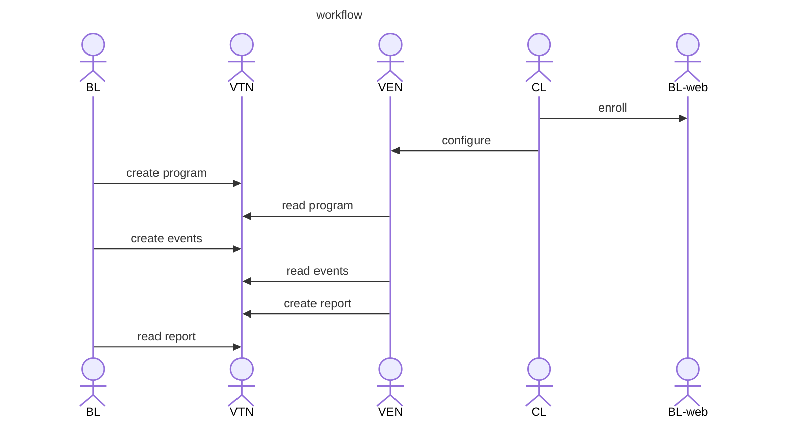

<p align="center"> Figure 1. High Level Workflow </p>

An exception to this process is for programs that are available to anyone, without a security credential. The most common case for this is ordinary tariffs, in which there is no reason to keep private the prices they include. 
In this case, the workflow is mostly the same except that there is no initial ‘enroll’ activity, and generally no use of reports (since the VEN is not known to the VTN). The CL does need to configure the VEN with the URL for the VTN, 
possibly the identity of the retailer (this may be the same for the entire VTN), and the tariff the customer is on (locational tariffs can be implemented with a simple suffix on the program ID).

## 6.2 VEN Enrollment Scenarios

OpenADR 3 assumes an enrollment or registration process has happened prior to interactions of a VEN with a VTN, in order to provision security credentials and otherwise onboard a VEN into a energy provider’s set of programs.
Activities may include associating a VEN with a customer account, providing clientID and secret, adress of the VTN and Authentication Service, and perhaps assigning ven and resource IDs or names. 

See [OADR-3-Definition] VEN Enrollment for additonal information.

The OpenADR 3 standard does not define how this process is implemented. It is addressed here as background information as every energy provider must develop their own process and mechanisms to support enrollment. 
Figure 2 illustrates what might be expected from a typical out-of-band, unspecified enrollment flow. 

BL is assumed to have visibility
into account information and the associated information described just above and represents here the entirety of a program provider's 'back-end' which may include billing, customer management, authentication, and other services.

<!-- img src="./ug_img/VEN_enrollment.png" alt="Ven Enrollment"/ -->

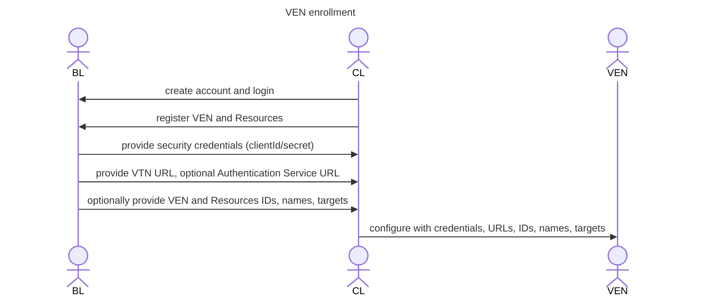

<p align="center"> Figure 2. Enrollment Scenario </p>


## 6.3 Subscription scenarios

### 6.3.1     Subscription via REST and notification via webhook

In order to support a PUSH model, the API provides a mechanism for a client to register interest in (“subscribe to”) operations on resources and receive a ‘callback’. This pattern is known as a ‘webhook’.

A client creates a subscription indicating a callback URL and a list of the operations and resources it is interested in. For example, a VEN client may wish to receive a callback whenever an event is created, or whenever it is created, modified, or deleted. A BL may set a subscription for reports created by VENs to be notified when a new report is created.

<!-- img src="./ug_img/subscriptions.png" alt="Subscriptions"/ -->

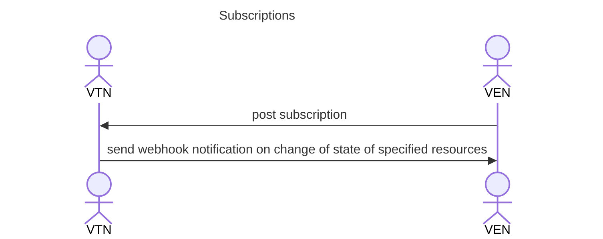

<p align="center"> Figure 3. Subscription scenario </p>


### 6.3.2 Notification via Additional Protocols

As an alternative to webhook based notification, the API provides a mechanism for a client to query for supported notification protocols, and if supported, make subsequent queries to obtain the topic names for object operations the client may subscribe to, and subsequently receive messages regarding operations on those objects.

OpenADR 3.1.0 defines one additional notifier protocol, MQTT.

<!-- img src="./ug_img/MQTT-Notifications.png" alt="MQTT Notifications"/ -->

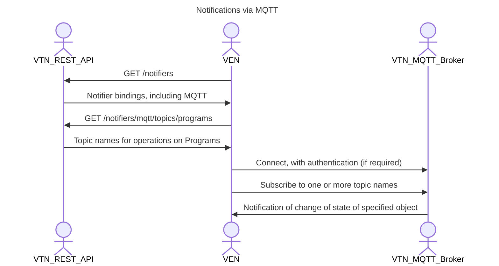

## 6.4 Program Scenarios

A program is a Demand Response offering of an energy provider. In OpenADR 3, a tariff is simply a type of program. Metadata about a program is represented by a program object in OpenADR 3 (there is no similar construct in 2.0b). Program metadata usually changes infrequently, perhaps once a year or less. Some fields in the program object may be displayed to persons using a VEN via a VEN provided user interface, but this feature is not required.

A program may declare a set of events and report types needed to meet the business objectives of the program. Every event and report is associated with exactly one program. A provider might offer several programs at the same time, such as a dynamic pricing program that executes concurrently with a load shed program. A single customer may be enrolled in multiple programs simultaneously, e.g. a battery program and an EV program.

Prior to creating events, the BL will create a program in the VTN, which VENs can query for. A VEN can also create a subscription for events, and then receive notifications of new events with a webhook. Webhooks support a ‘push’ model whereby a VEN may register a callback URL with the VTN to receive notifications, or subscription/notification via message protocol provides an alternate mechanism for VENs to receive event notifications. In practice, VENs may find that simple polling, or a ‘pull’ model is sufficient for receiving prices that are updated on a regular schedule, but utilize subscriptions for alerts or other events with no particular schedule. This observation applies to the other scenarios described below.

<!-- img src="./ug_img/programs.png" alt="Programs"/ -->

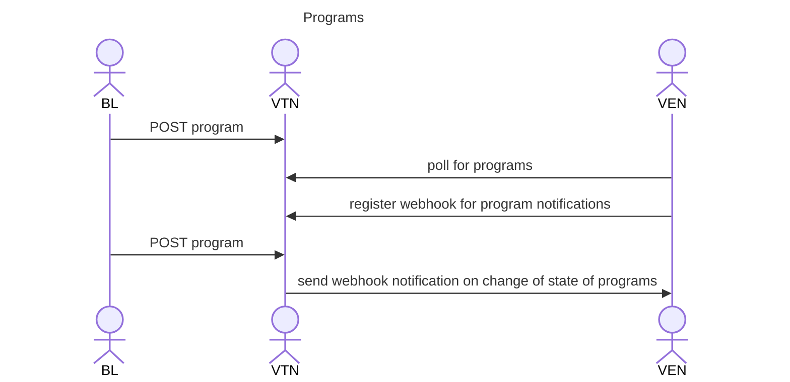

<p align="center"> Figure 4. Program Scenario </p>


## 6.5 Event Scenarios

The OpenADR framework supports a number of different Demand Response scenarios. A representative sample is documented here to ensure that OpenADR 3 fully supports a range of common use cases. For background see [OADR-2.0b-Program_Guide].

Episodic Demand Response: As BL I want to communicate a Demand Response signal to participating VENs. In this scenario, the event communicates a single start and duration pair. VENs are expected to be pre-programmed, according to an associated Program Description, to interpret the signal, manage associated resources, and generate a corresponding set of reports. Examples include Direct Load Control and Load Shed.

Continuous Demand Response. As a VTN I want to communicate Dynamic Pricing signals to participating VENs. In this scenario, an event communicates a set of start and duration pairs with associated price values. A representative example is sending day-ahead variable pricing for each hour of the following day. VENs are expected to interpret the event(s) and to generate a corresponding set of reports. EV (Electric Vehicle), TOU (Time of Use), CPP (Critical Peak Price), and VPP (Variable Peak Price) prices can be readily encoded as can more continuous prices such as hourly or smaller time periods.

BL will create events in the VTN, which VENs can query for, or receive notification of if they have previously registered a subscription (via either the Subscription/webhook or message protocol subscription mechanisms).  With day-ahead prices, they are fixed once announced and the intervals are never duplicated. With more real-time pricing, there may be a 24-hour forecast announced with each hour, but in subsequent hours, future prices may be adjusted as the forecast changes. It is assumed that a final price for each interval is announced before that interval begins.

<!-- img src="./ug_img/Events.png" alt="Events"/ -->

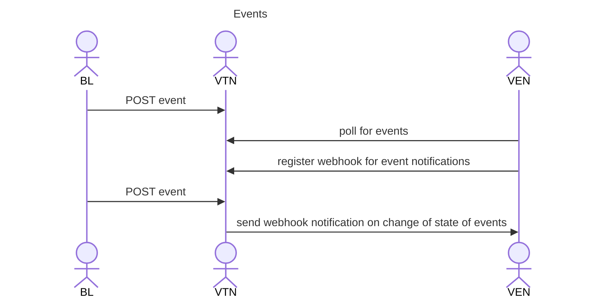

<p align="center"> Figure 5. Event Scenario </p>


## 6.6 Report Scenarios

OpenADR 3 defines mechanisms to enable Business Logic clients to request reports via events and VENs to respond with the appropriate reports. A catalogue of enumerated report types and qualifiers specified in [OADR-3-Definition] define a range of typical reports. This list can be privately extended..

Reports are requested by events. The data structures for events and reports are as identical as practical. This design allows VENs to determine how and when to send reports, and BL to unambiguously associate data included in reports to event elements. Example reports are:

### Hourly prices and usage

An electricity retailer may publish day ahead prices for each hour of a day, and bill customers at those prices according to usage over each hour. In this scenario, it is critical that usage data corresponds exactly to the hourly rates, that is, a VEN reports data for each hour as described in the event intervals.

BL may generate events that specify this behaviour via a reportDescriptor with the appropriate enumerations. A VEN responds with appropriate reports.

### Device status

BL requires the ability to poll resources enrolled in a program to determine their operational state. BL can generate an event containing a reportDescriptor that includes enumerations that indicate it requires a near-real time response indicating the state of every resource under control of each VEN. An event can limit the scope of VENs and resources by providing a set of targets.

### Load shed

BL generates an event that signals the start/end time of a load shed event, including report requirements via a list of reportDescriptors that may be interpreted by a VEN as a request to respond prior to the start of the event with a report indicating resource load shed capacity, and respond at the end of the event with an indication of amount of shed load for each resource.

In response to report requests in events, VENs will create reports in the VTN, which Business Logic can query for or receive notification of.

<!-- img src="./ug_img/Report_Request.png" alt="Report Request"/ -->

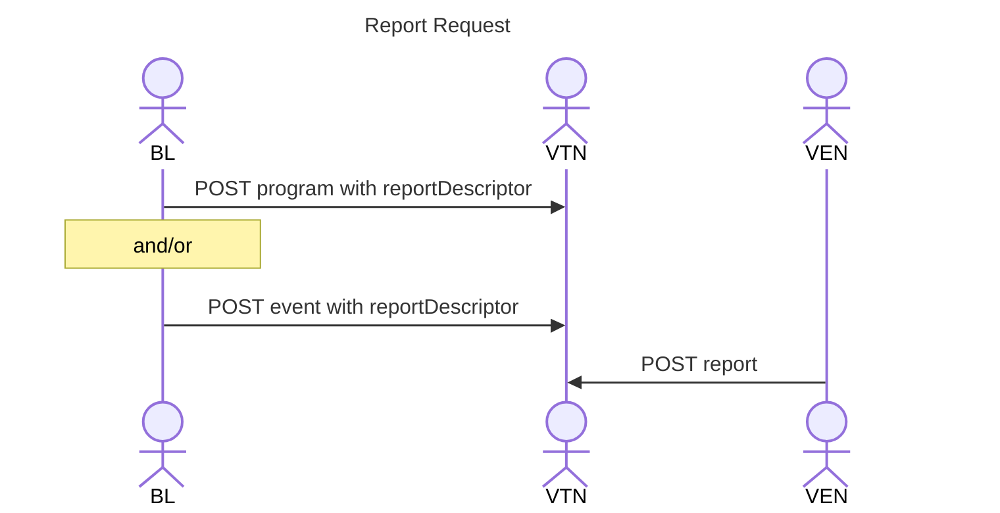

<p align="center"> Figure 6. Report Request Scenario </p>


<!-- img src="./ug_img/Reports.png" alt="Report"/ -->

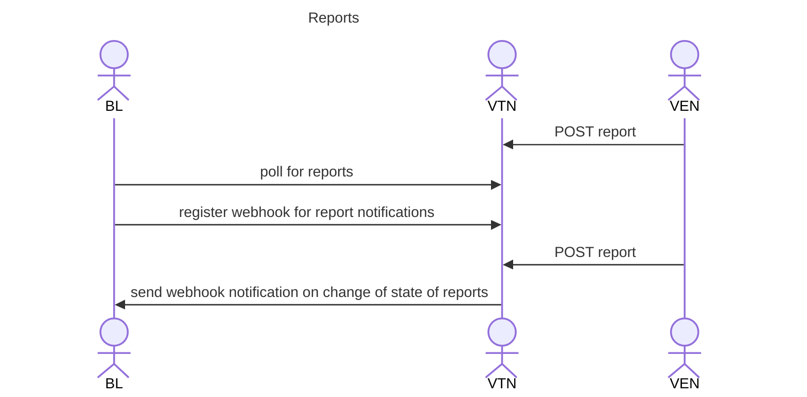

<p align="center"> Figure 7. Report Scenario </p>


## 6.7 VEN and Resource Scenarios

In order to assign targets to ven and resource objects the API provides mechanisms for clients to create ven objects, and vens may include a list of resource objects. 
Each of these objects may contain targets that can be modified over time.

Note: "VEN" refers to a VEN client, "ven" refers to a ven object on the VTN.

<!-- img src="./ug_img/vens-resources.png" alt="VEN and Resources"/ -->

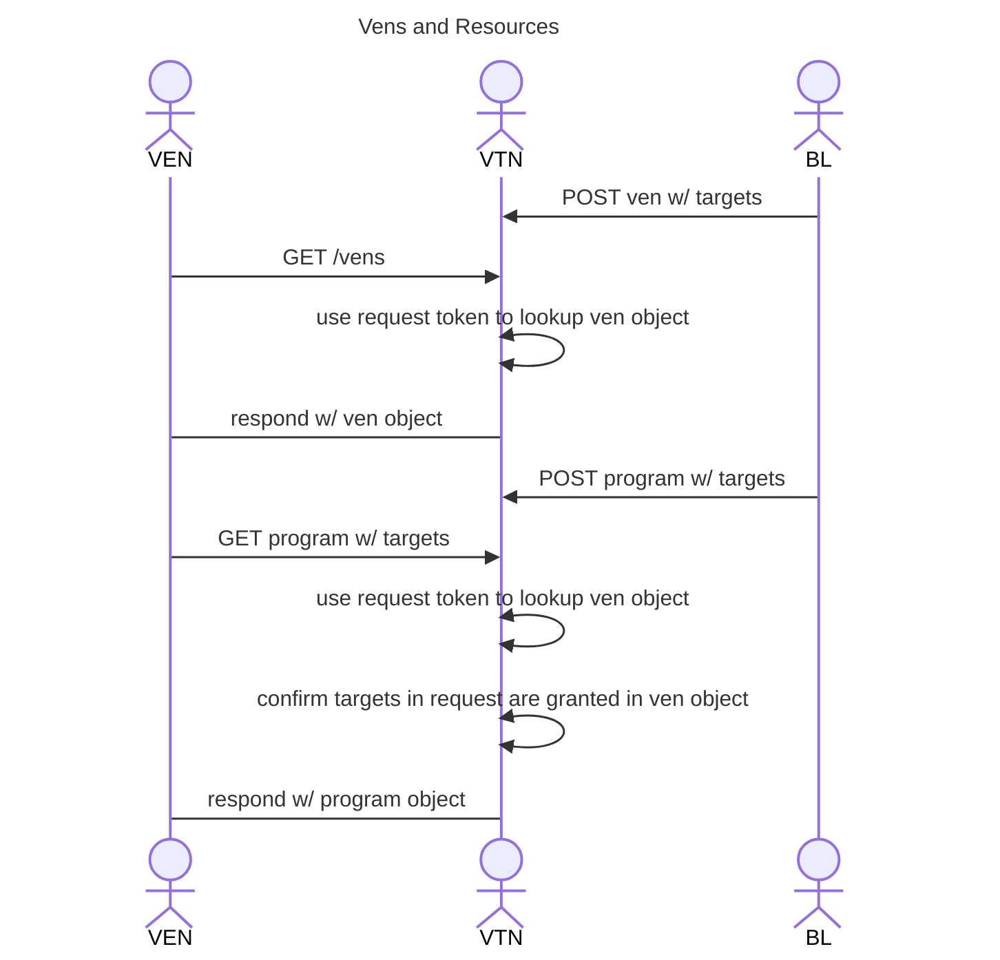

<p align="center"> Figure 8. VEN and Resource Scenario </p>


# 7. Feature Examples

The following subsections illustrate some of the features of OpenADR 3. This is not exhaustive and other features are illustrated by specific use cases below.

The descriptions here apply to content, and therefore do not imply requirements on a VTN, as a VTN does not operate on content except for schema validation. If the content guidelines provided here are not followed, client behavior may be unpredictable.

The JSON examples provided here represent message payloads a client sends to the VTN or returned by the VTN. POST examples can be used in a request to a VTN.

## 7.1 Event Priority

Event priority can be used if there is the possibility of events overlapping time and they conflict (events can overlap and not conflict e.g. prices and GHG values, or prices and alerts). Lower numbers have a higher priority, and the highest priority is zero. If two events conflict and they have the same priority, the resulting behavior is not specified by OpenADR.

## 7.2 Object References

OpenADR 3 objects may make reference to other addressable objects. For example, an event object is required to include a reference to an associated program. An addressable object is one that can be accessed directly via the API and is populated with an objectID by the VTN on creation. Addressable objects are:

- program
- event
- report
- subscription
- ven
- resource

objectID references are explicit references to specific objects in the VTN. The objectID is independent of any user-assigned attribute of the referenced object.

The usage scenario is that when a client wishes to create object A that includes a reference to object B, it will first read object B to find its VTN-provided objectID, and use that objectID to populate a reference attribute of object A.

For example, when creating an event, a BL client would read the associated program object and write its objectID into the event.programID attribute.

Note that direct object references are not the same as object names used in other contexts. For example, a report.resources.clientName represents an application-defined string and is not a direct reference to an existing object on the VTN. In this case, reports may be created without the need to populate ven or ven resource objects on the VTN.

Events and reports are always associated with a program, and reports are always associated with events. These associations are maintained by making direct object reference. For example, an event will contain the object reference of an associated program:

### Programs
POST minimal program

```shell
curl -X POST -H "Content-type: application/json" \
		-H "Authorization: Bearer BL_token" \
		-d @program.json \
		http://\<baseUrl\>/programs
```

```json
{"programName": "minimalProgram"}
```
<p align="center"> Example 7.2-1: Create Minimal program </p>


GET program

```shell
curl -H "Content-type: application/json" \
	-H "Authorization: Bearer BL_token" \
	http://\<baseUrl\>/programs
```

```json
{
  "createdDateTime": "17:15:16",
  "id": "0",
  "objectType": "PROGRAM",
  "programName": "minimalProgram"
}
```
<p align="center"> Example 7.2-2: Read Minimal program </p>


### Events
POST simple Price Event event

```shell
curl -X POST -H "Content-type: application/json" \
		-H "Authorization: Bearer BL_token" \
		-d @event.json \
		http://\<baseUrl\>/events
```

```json
{
	"eventName": "simplePriceEvent",
	"programID": "0",
	"intervalPeriod": {
		"start": "2023-02-10T00:00:00.000Z",
		"duration": "PT1H"
	},
	"intervals": [{
		"id": 0,
		"payloads": [{
			"type": "PRICE",
			"values": [0.17]
		}]
	}]
}
```
<p align="center"> Example 7.2-3: Create Minimal event </p>


GET event

```shell
curl -H "Content-type: application/json" \
	-H "Authorization: Bearer BL_token" \
	http://\<baseUrl\>/events
```

```json
{
  "createdDateTime": "14:13:26",
  "eventName": "simplePriceEvent",
  "id": "0",
  "intervalPeriod": {
    "duration": "PT1H",
    "start": "2023-02-10T00:00:00.000Z"
  },
  "intervals": [
    {
      "id": 0,
      "payloads": [
        {
          "type": "PRICE",
          "values": [
            0.17
          ]
        }
      ]
    }
  ],
  "objectType": "EVENT",
  "programID": "0"
}
```
<p align="center"> Example 7.2-4: Read Minimal event </p>


A report contains references to both program and event objects:

### Reports
POST minimal report

```shell
curl -X POST -H "Content-type: application/json" \
		-H "Authorization: Bearer ven_token" \
		-d @report_minimal.json \
		http://\<baseUrl\>/reports
```

```json
{
	"reportName": "minimalReport",
	"eventID": "0",
	"clientName": "myClient",
	"resources": []
}
```
<p align="center"> Example 7.2-5: Create Minimal report </p>


GET report

```shell
curl -H "Content-type: application/json" \
	-H "Authorization: Bearer ven_token" \
	http://\<baseUrl\>/reports
```

```json
{
  "clientName": "myClient",
  "createdDateTime": "17:35:55",
  "eventID": "0",
  "id": "0",
  "objectType": "REPORT",
  "reportName": "minimalReport",
  "resources": []
}
```
<p align="center"> Example 7.2-6: Read Minimal report </p>


## 7.3 Event and Interval Timing

OpenADR 2.0b introduced events and lists of intervals included in events. OpenADR 3 maintains these constructs but adapts them to fit the REST model.

Events generally include a list of one or more intervals, each of which defines a temporal window, and includes one or more payloads, such as a price value.

### intervalPeriod
The intervalPeriod structure defines the temporal aspects of a given interval, or when included as a property of an event provides a default that is applied to all intervals.

#### intervalPeriod.start
intervalPeriod.start provides an absolute start time for an interval, or the default start time of the event's set of intervals if present as a property of the event. 

If intervalPeriod.start is '0001-01-01' or '0001-01-01T00:00:00' ('the beginning of time') the absolute start time of the interval or set of intervals is:
- if at the event level (e.g event.intervalPeriod) indicates a 'do it now' event if the duration extends into the future, see below..
- if the first interval (e.g. event.intervals[0].intervalPeriod)
  - identical to the event.intervalPeriod.start if present, or
  - 'do it now' if event.intervalPeriod is not present
- for subsequent intervals, the start time of the interval is immediately after the previous interval, i.e. the previous interval start + duration.

##### 'do it now' event
A 'do it now' event is one in which the absolute start of the first interval begins prior to the moment a client has obtained the event and whose duration is in the future.
The client processes the event by calculating the appropriate interval corresponding to 'now'. For example, an event contains 25 hourly prices meginning at midnight and a client reads the event at 6 am, the client 
'skips ahead' to the 6th interval.

A convenient way to signal a 'do it now' event such as an alert is to start it at '0001-01-01' or '0001-01-01T00:00:00' and define a duration of "P9999Y".

#### intervalPeriod.duration
intervalPeriod.duration defines the duration of a given interval, or the default duration of each interval if present as a property of the event. 

An intervalPeriod.duration value of "P9999Y" indicates a duration significantly into the future, and so should be used to represent 'infinity', and can be useful to describe a 'do it now' event.  

The ISO 8601 compliant duration value  “P9999Y” represents infinity in this specification [OADR-3.0.1-Specification], as ‘agreed to by communicating parties” in ISO 8601 parlance. 
In this notation “P” represents ‘period’, “Y” represents year.

Intervals may be of even duration and contiguous. In this case, a single intervalPeriod can be included in an event object to set the beginning time of the first interval and the fixed duration of all intervals. 
In such cases, individual intervals do not need to include intervalPeriod representations. If an event contains both a default intervalPeriod (event.intervalPeriod) and intervalPeriods within intervals, 
the latter is expected to take precedence.

The lifespan of an event is the start time of the first interval plus the sum of all interval durations, adjusted for overlaps or gaps introduced by start times in individual intervals. See 'Variable duration intervals' below.

An event on the VTN whose intervals have all transpired is effectively 'inactive'. An 'active event' is one whose lifespan includes the moment at which a client has parsed the event. 
This can lead to an apparent race condition in which an event may become inactive in the time between the moment a VTN recieves a request for the event, or initiates a notification, and the moment at which
the client parses the event. The client should in this case consider the event in-active.

Note: It is recommended to avoid encoding duration in terms of months, as leap years may complicate client interpretation. To communicate an absolute end time via duration it is sufficient to use years, days, hours, minutes, or seconds.  

##### multi-valued payloads
Some payload types, such as PRICE, EXPORT_PRICE, and GHG are defined as expressing a single value, but in practice may contain multiple values. 
In such cases, the duration of an intervalPeriod must be divided by the number of entries in the payload values field to derive the
duration of each 'sub-interval'. 

For example, the following represents an interval with 3 prices, each relevant for 1 hour.


```json
{
  "eventName": "multiPriceEvent",
  "programID": "44",
  "payloadDescriptors": [
    {
      "payloadType": "PRICE",
      "units": "KWH",
      "currency": "USD"
    }
  ],
  "intervals": [
    {
      "id": 0,
      "intervalPeriod": {
        "start": "2025-06-25T00:00:00.000Z",
        "duration": "PT3H"
      },
      "payloads": [
        {
          "type": "PRICE",
          "values": [
            0.17,
            0.03,
            0.11
          ]
        }
      ]
    }
  ]
}

```
<p align="center"> Example 7.3-1: Create event with multi-valued payload </p>

#### intervalPeriod.randomizeStart
If intervalPeriod.randomizeStart is other than the default "P0S' the value indicates the maximum extent by which a client should arbitrarily increment or decrement start times, with uniform probability distribution, according to the following:
- shift the start of the first interval by some amount, positive or negative, within the bounds of the absolute value of randomizeStart.
- if subsequent intervals use the 'follow immediately' convention of using start = '0' (see above for full encoding) or not including an intervalPeriod, then all starts are shifted by the same amount. I.e. since in these cases intervals are contiguous, then shifting one start necessarily shifts all subsequent.
- if an interval includes an intervalPeriod with an absolute start time, this time is incremented or decremented by the same amount as the first interval unless it too included the randomizeStart property, in which case it (and potentially any later intervals) have a start which is randomized by this updated value.


#### event.duration
The event property 'duration' may be used to augment intervalPeriod definitions to shorten or lengthen the temporal span of an event. For example, event.duration = “P9999Y” indicates the set of intervals repeat indefinitely. This is useful for defining a persistent set of daily prices, for example a tariff that defines 24 hourly prices that persist indefinitely, or 24 hourly price intervals with duration = "P7D" repeats the prices for a week. In other uses, duration may effectively limit the number of intervals that are relevant for an event (e.g. 24 hourly price intervals but duration = "P12H" effectively omits the last 12 intervals).

#### multi-value payloads
Certain payload types, like POINT, naturally contain multiple values, e.g. x, y. Other payload types, such as PRICE, that are naturaly unitary, may include multiple values in the payload values array as a means to make the resulting JSON representation more compact, i.e. 'pack' many prices into a single interval.

Each value then represents a 'sub-interval'. The rule for determing the duration of each sub-interval  is to divide the duration of the interval by the number of items in the values array.


## 7.4 Variable duration intervals

To create intervals of unequal duration, or to have them overlap or have temporal gaps, each interval can include its own intervalPeriod. If an intervalPeriod is present in the event, it defines default values that are overridden by any intervalPeriods at the interval level.

If an intervalPeriod is not present in the event, then one must be present in every interval.

The example below shows an event with a set of intervals with the same duration, as specified by the intervalPeriod construct in the event, except the second interval which defines its own duration. 


### Events
POST event

```shell
curl  -X POST -H "Content-type: application/json" \
		-H "Authorization: Bearer bl_token" \
		-d @event_variable_intervals.json \
		http://\<baseUrl\>/events
```

```json
{
	"eventName": "variableIntervalsEvent",
	"programID": "44",
	"intervalPeriod": {
		"start": "2023-02-10T00:00:00.000Z",
		"duration": "PT1H"
	},
	"intervals": [{
			"id": 0,
			"payloads": [{
				"type": "PRICE",
				"values": [0.17]
			}]
		},
		{
			"id": 1,
			"intervalPeriod": {
				"duration": "PT2H"
			},
			"payloads": [{
				"type": "PRICE",
				"values": [0.22]
			}]
		}
	]
}
```
<p align="center"> Example 7.4-1: Create event with variable intervals </p>

## 7.5 Report Management

An event may include one or more reportDescriptors to request reports from VENs.

### interval id
A representative use case for reports is an event that contains 24 hourly prices for a given day and requests a report that includes usage for each price interval. in such scenarios, the intervals defined by the event are reflected in the associated report. To this end, every interval includes and application defined 'id' that can be used by a subsequent report to unambiguously associate a report interval to an event's interval, i.e. make explicit that a given hour's of usage correlates to a given hour's price. The event.id is not an 'object id' nor need it be a continuously ascending value.

Reports that respond to event intervals are expected to use the interval ids included in the associated event, except for 'report-only' events or reports that generate 'open intervals', see below for more discussion. Reports that include 'sub-intervals' should use that same id for each sub-interval that is associated with the corresponding event interval. 

### reportDescriptor
The reportDescriptor contains properties that support configuration of many aspects of reporting. This section provides a non-exhaustive list of supported use cases, a description of the properties of the reportDescriptor and some use case examples. Additional examples are found in section 8.

The following reporting use case are supported:

|Use Case| Notes                                                                                                                           |
| ---------- |---------------------------------------------------------------------------------------------------------------------------------|
|report all intervals| historical or forecast. See reportDescriptor.historical                                                                         ||
|report subset of intervals| See reportDescriptor.[startInterval, numIntervals]                                                                              |
|rolling report| See reportDescriptor.[startInterval, numIntervals, frequency, repeat, historical]                                               |
|loop reports| See event.duration=“P9999Y”                                                                                                     |
|repeat reports| See reportDescriptor.repeat                                                                                                     |
|ad hoc report| See reportDescriptor.frequency=0                                                                                                |
|report-only event| Restricted to certain report types. report contains a single interval of its choosing, and sends report at time of its choosing ||
|report sub-intervals.| See reportDescriptor.reportIntervals=SUB_INTERVALS                                                                                  |
|report arbitrary intervals.| See reportDescriptor.reportIntervals=OPEN_INTERVALS                                                                                 |

<p class="table-caption" align="center"> Table 7.5-1 reporting use cases  </p>


The reportDescriptor timing attributes are:

- startInterval. The interval (counted from the first, or zero-th) at which to generate a report. Default = -1 indicates end of last interval. Example: perhaps an event contains 10 intervals but is only interested in report data for the last 5. startInterval = 5.

- numIntervals. The number of intervals to include in a report. Default = -1 indicates include all intervals. Example: perhaps an event contains 10 intervals but is only interested in report data for 3. numIntervals = 3.

StartInterval and numIntervals together define a contiguous subset of intervals.

- historical. The “direction” of intervals included in a report. If true, intervals preceding the startInterval determine reporting periods, if false intervals succeeding the startInterval determine reporting periods e.g. a forecast. Default = true indicates report includes historical information. 
Example: an event contains 24 pricing intervals and wants a report that includes all the intervals AFTER the VEN has operated on the last interval. historical = true.

- frequency.The number of intervals between each report. Default = -1 indicates all intervals. Example: an event includes 10 intervals and wants 5 reports, one for each set of 2 intervals. frequency = 2. Where frequency = 0 the VEN is expected to generate a report at any time it chooses, e.g. an 'ad hoc' report. 
If event.duration is greater than sum of all interval durations and therefore causes reporting intervals to loop (see below), -1 indicates report when all intervals have transpired.

- repeat. Number of times to repeat. Default = 1 indicates produce 1 report. Example. an event contains no intervals definition ('report-only' event) but requests a continuous stream of reports based on default event intervalPeriod. repeat = -1 (repeat forever). See 8.7 Capability Forecast Reporting.

- reportIntervals. Indicates whether a report is to contain an identical set of intervals as the event, the VEN may insert sub-intervals, or the VEN is expected to generate intervals independent of the event's intervals. Allowed values are INTERVALS, SUB_INTERVALS, OPEN_INTERVALS.

The following sections provide examples of the use case above and associated reportDescriptor attributes.

### Report on all intervals - historical and forecast
An event may define a set of intervals and request reporting for the entire of the intervals.

All of the properties of the reportDescriptor have their default values.

Several enumerated report types indicate whether the report is generated after the last interval has been processed, e.g. USAGE, or whether the report is generated before the intervals start, e.g. the report is a forecast.

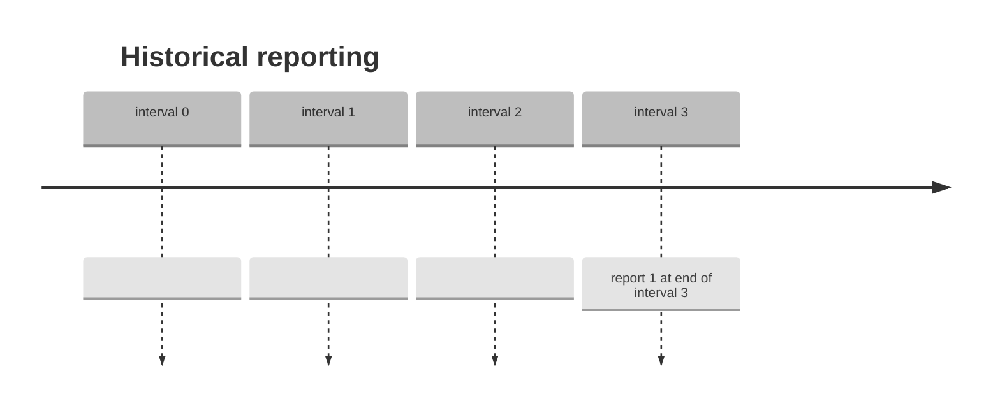

A report may be generated prior to the start of a set of intervals as a forecast.

All of the properties of the reportDescriptor have their default values except:
```
historical = False
```

```mermaid
---
config:
  theme: 'base'
  timeline:
    disableMulticolor: true
  themeVariables:
    cScale0: '#bebebe'
---
timeline
    title Forecast reporting
    interval 0 :  report 1 at beginning of interval 1
    interval 1 :  
    interval 2 :  
    interval 3 :  
```

### Report on a subset of intervals
An event may define a set of intervals and request reporting for some subset of the intervals.

All of the properties of the reportDescriptor have their default values except:
```
startInterval = 1
numIntervals = 3
```

```mermaid
---
config:
  theme: 'base'
  timeline:
    disableMulticolor: true
  themeVariables:
    cScale0: '#bebebe'
---
timeline
    title subset of intervals reporting
    interval 0 :  
    interval 1 :  report 1
    interval 2 :  report 2
    interval 3 :  report 3
    interval 4 :  

``` 

### Report on a subset of intervals at a regular period
This example perhaps illustrates a more typical scenario where a series of reports are requested at regular periods, 
e.g. a representative example being an event that signals 24 one hour intervals for day ahead pricing and requests a report every 4 hours. 
In the contracted example below, we illustrate 3 reports, one generated after every 2 intervals.

```
startInterval = 1
numIntervals = 2
frequency = 2
repeat = 3
```

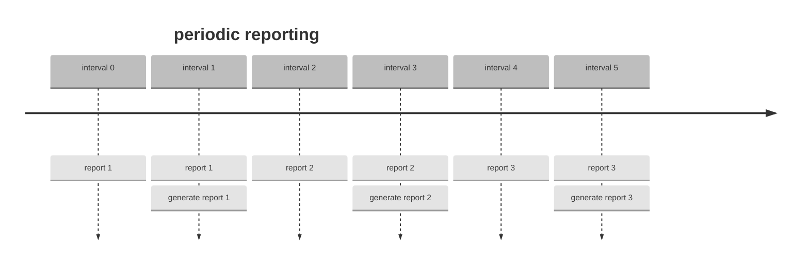

### Rolling reports
This example elaborates on the above to illustrate 'rolling' reports, for example a periodic stream of forecasts.

```
startInterval = 0
numIntervals = 3
frequency = 1
repeat = 3
historical = false
```

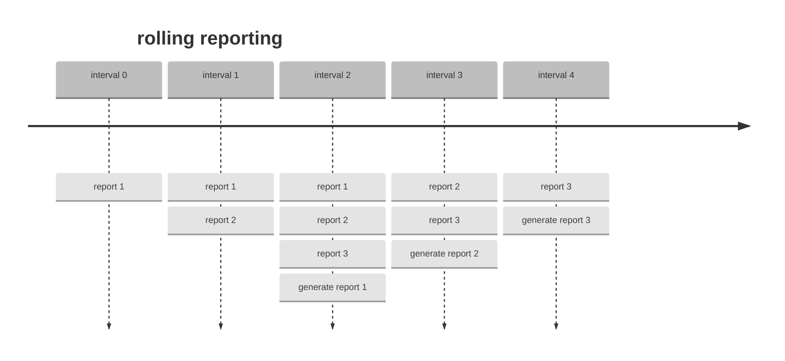

### Looping intervals
An  event's intervals may be repeated by setting event.duration to a value greater than the sum of all interval durations. To loop indefinitely, set event.duration as:
```
duration = P9999Y”
```

All of the properties of the reportDescriptor have their usual meaning except:

```mermaid
---
config:
  theme: 'base'
  timeline:
    disableMulticolor: true
  themeVariables:
    cScale0: '#bebebe'
---
timeline
    title looping reporting
    interval 0 :  report n
    interval 1 :  report n
    interval 2 :  report n : generate report n
    continue :  
``` 

### Ad hoc report
An event may indicate that VENs may generate a report at any time. This feature is useful to supports scenarios where the VEN wishes to report a change of state or other 'ad-hoc' circumstance.

All of the properties of the reportDescriptor have their usual meaning except:
```
frequency = 0
```

### 'report-only' event with VEN-determined intervals
An event may be a 'report-only' event by containing one or more reportDescriptors but no intervals. In this scenario the VEN generates a report with at least one interval and may generate the report whenever it deems useful. 
This feature is useful to supports scenarios where the VEN wishes to report a change of state or other 'ad-hoc' circumstance.

Interval ids of report intervals are determined by VEN.

### 'report-only' event with BL-determined intervals
An event may be a 'report-only' event by containing one or more reportDescriptors and intervals, but with empty payloads (i.e. payloads = []) in the event intervals.
The reportDescriptors control when the reports are generated and which interval periods they cover using the reportDescriptor properties as above.

This feature is useful to supports scenarios where the BL wishes to receive report data at specific times, and/or aligned to specific intervals (e.g. hourly forecasts) but does not have any useful payload to include in the events.

### 'report-only' event with implied intervals
Where an event has no payload data to communicate to VENs but requires reports to adhere to a set of intervals, the interval structure may be omitted and the
interval structure implied by a default intervalPeriod at the event level and the use of reportDescriptor flags that refer to 'implied' intervals. See section 8.7 below
for an example.

Interval ids of report intervals are determined by VEN.

### Sub-Intervals
A VEN may have cause to insert sub-intervals into the regular event interval reporting.

All of the properties of the reportDescriptor have their usual meanings, except:

```
reportIntervals=SUB_INTERVALS
```

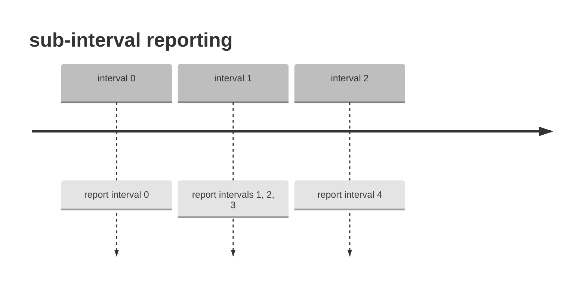

### Arbitrary report intervals.
A VEN may have cause to ignore event intervals and generate reports with VEN determined intervals.

All of the properties of the reportDescriptor have their usual meanings, except:

```
reportIntervals=OPEN_INTERVALS
```

### 'do it now' event reporting
See above for discussion of 'do it now' events. Reports are expected to simply not be sent for all but the most recent reporting intervals that have occurred in the past as defined by
the associated event. If any reporting intervals have already been passed, a single report should be issued immediately for the intervals that were intended to be reported in that previous report. 

## 7.6 payloadDescriptors

Events and reports generally contain one or more intervals, each of which may contain one or more payload objects. The payload object is purposely kept simple, just type and values attributes, to avoid duplicating static data across a potentially large series of intervals. The payloadDescriptor provides full context for a payload. For example, the values in payload with type of PRICE are simply numbers, and an accompanying payloadDescriptor supplies the units and currency information necessary to fully interpret the price values.

A payloadDescriptor contains a payloadType attribute which associates it to payloads of the same type within the associated intervals.

Note that events do not have a type. The type of an event is implicit in the type of contents that it contains. For example, an event with prices and GHG values can be thought of as a price event, but in OpenADR 3, there is no manifestation of this other than the contents of payloadDescriptors and associated payloads. Similarly, reports contain payloadDescriptors but are not otherwise typed.

### Events
POST event

```shell
curl  -X POST -H "Content-type: application/json" \
		-H "Authorization: Bearer bl_token" \
		-d @event_payload_descriptor.json \
		http://\<baseUrl\>/events
```

```json
{
  "eventName": "payloadDescriptorsEvent",
  "programID": "44",
  "intervalPeriod": {
     "start": "2023-02-10T00:00:00.000Z",
     "duration": "PT1H"
  },
  "payloadDescriptors": [{
        "payloadType": "PRICE",
        "units": "KWH",
        "currency": "USD"
     },
     {
        "payloadType": "GHG"
     }
  ],
  "intervals": [{
       "id": 0,
     "payloads": [{
           "type": "PRICE",
           "values": [
              0.17
           ]
        },
        {
           "type": "GHG",
           "values": [
              0.03
           ]
        }
     ]
  }]
}
```
<p align="center"> Example 7.6-1: Create event with payload descriptor  </p>

A payloadDescriptor list may also be included in a program object. This provides default values for all events associated with a program.

## 7.7 Aggregated Report

Where a VEN aggregates data from a number of resources, it may provide a single resource entry in the resources list of a report and set the resourceName to AGGREGATED_REPORT. Aggregation means the data from a set of resources are summed.

The event in this example requests an aggregate report by setting reportDescriptors[0].aggregate = true.

### Events
POST event

```shell
curl  -X POST -H "Content-type: application/json" \
		-H "Authorization: Bearer bl_token" \
		-d @event_report_descriptors.json \
		http://\<baseUrl\>/events
```

```json
{
	"eventName": "reportDescriptorsEvent",
	"programID": "44",
	"intervalPeriod": {
		"start": "2023-02-10T00:00:00.000Z",
		"duration": "PT1H"
	},
	"reportDescriptors": [{
		"payLoadType": "USAGE",
		"readingType": "DIRECT_READ",
		"aggregate": true
	}],
	"intervals": [{
        "id": 0,
		"payloads": [{
				"type": "PRICE",
				"values": [
					0.17
				]
			}
		]
	}]
}
```
<p align="center"> Example 7.7-1: Create event with aggregated report request  </p>

### Reports
POST report

```shell
curl  -X POST -H "Content-type: application/json" \
		-H "Authorization: Bearer ven_token" \
		-d @report_aggregated.json \
		http://\<baseUrl\>/reports
```

```json
{
	"reportName": "aggregatedReport",
	"eventID": "1",
	"clientName": "myClient",
	"resources": [{
		"resourceName": "AGGREGATED_REPORT",
		"intervals": [{
			"id": 0,
			"payloads": [{
				"type": "USAGE",
				"values": [0.012]
			}]
		}]
	}]
}
```
<p align="center"> Example 7.7-2: Create aggregated report </p>

## 7.8 Data Quality

When there is a need to characterize the data quality of a report payload value, a payload of type DATA_QUALITY can be added to a payload array.

### Reports
POST report

```shell
curl  -X POST -H "Content-type: application/json" \
		-H "Authorization: Bearer ven_token" \
		-d @report_data_quality.json \
		http://\<baseUrl\>/reports
```

```json
{
	"reportName": "DataQualityReport",
	"eventID": "1",
	"clientName": "myClient",
	"resources": [{
		"resourceName": "AGGREGATED_REPORT",
		"intervalPeriod": {
			"start": "2023-02-10T00:00:00.000Z",
			"duration": "PT1H"
		},
		"intervals": [{
			"id": 0,
			"payloads": [{
					"type": "USAGE",
					"values": [0.012]
				},
				{
					"type": "DATA_QUALITY",
					"values": ["MISSING"]
				}
			]
		}]
	}]
}
```
<p align="center"> Example 7.8-1: Create data quality report </p>

This approach is limited to payload lists that would normally contain a single entry so that the data quality payload is unambiguously associated with that payload. For example, if the payload list contained payloads for usage and GHG data, there is currently not a way to describe the data quality of one specifically, or both. 
In such a case, one could create additional intervals, with identical intervalPeriods, for each payload type, or additional events.

## 7.9 Event Cancellation

There is no specific mechanism to alter the status or otherwise cancel an event. An event’s start and duration may be set to minimal values (“0001-01-01” and “PT0S” respectively) to make its temporal window be of no duration and at some theoretical time in the past. Another approach is for a BL client to simply delete an event.

A client could subscribe to event notification to learn that a previously received event has been deleted and therefore cancelled: the VEN should discard the event and no longer act on it.

## 7.10 Targeting
BL may restrict which VEN clients may read programs and events  by including targets as properties of those 
objects and by 'granting' targets to VENs via ven and associated resource objects. 

See [Defintions] Object Privacy for detailed requirements. 

See Section 8 Dynamic Targeting below for detailed examples of targeting.

## 7.12 API explorer

[OADR-3-Reference_Implementation] provides an online view of the API specification [OADR-3-Specification] and interactive features to view and explore every operation on every resource. One may also use tools provided by [swaggerhub] to view and explore the API.

# 8 Use Cases

This section describes demand response Use Cases that are specifically supported by OpenADR. These are not formally defined as some Use Case templates require, but are intended as informative material for readers. This is not an exhaustive list as the protocol is flexible to accommodate many other uses than described here.

## 8.1 Alert

An Alert is an asynchronous message that generally occurs between a few times per year to only every few years. They are non-financial (do not themselves indicate a change in the customer’s bill) and are most commonly used for some sort of emergency or other anomalous condition. BL generates alerts as it deems fit. As they are asynchronous, they are well suited to subscriptions rather than polling.

An Alert is of a type (e.g. ‘Grid Emergency’) suitable for use by devices, and a free text string intended to be shared with any human involved with the customer site. For many alerts, the distribution system may be damaged interrupting power supply, and devices and humans may change their operation in response to this and other impacts of the alerts.

### Events
POST event

```shell
curl  -X POST -H "Content-type: application/json" \
		-H "Authorization: Bearer bl_token" \
		-d @event_alert.json \
		http://\<baseUrl\>/events
```

```json
{
	"eventName": "alertEvent",
	"programID": "44",
	"intervalPeriod": {
		"start": "2025-03-14T00:00:00.000Z",
		"duration": "PT4H"
	},
	"intervals": [{
		"id": 0,
		"payloads": [{
			"type": "ALERT_GRID_EMERGENCY",
			"values": ["The grid is currently under emergency conditions"]
		}]
	}]
}
```
<p align="center"> Example 8.1-1: Create Alert event </p>

## 8.2 Load Shed

A BL logic entity wishes to provide ad-hoc events to VENs to signal resources of an upcoming Load Shed ‘event’. Traditionally, resources have enrolled in an energy retailer’s load shed offering and await a signal indicating a temporal window during which to modify energy consumption. Specific examples following this pattern are critical peak prices, direct load control, and simple shed events, as from [OADR-2.0b-Program_Guide].

### 8.2.1 Critical Peak Pricing Program (CPP, VPP)

This use case employs the SIMPLE event type to communicate Load Shed windows based on high wholesale market prices or power system emergency conditions. This can be extended to a Variable Peak Pricing Program (VPP) of up to three different high prices with the SIMPLE event type.

### 8.2.2 Direct Load Control/Thermostat Program

A Demand Response event directly modifies the behavior of load shedding resources, without a layer of abstraction between receipt of the signal and the specific load shedding action taken. Direct Load Control is not typically implemented using OpenADR, but this use case is included as an example of how it might be used in the case of a Thermostat.

### Events

As indicated in the payloadDescriptors list, events contain payloads of type SIMPLE. A SIMPLE payload contains a value of 0, 1, 2, or 3 indicating a resource-defined load shed level. In this example, the event contains an intervalPeriod with a specific start time and a duration of  4 hours.

POST event

```shell
curl  -X POST -H "Content-type: application/json" \
		-H "Authorization: Bearer bl_token" \
		-d @event_simple.json \
		http://\<baseUrl\>/events
```

```json
{
	"eventName": "simpleEvent",
	"programID": "44",
	"intervalPeriod": {
		"start": "2025-03-14T00:00:00.000Z",
		"duration": "PT4H"
	},
	"payloadDescriptors": [{
		"payloadType": "SIMPLE"
	}],
	"intervals": [{
		"id": 0,
		"payloads": [{
			"type": "SIMPLE",
			"values": [1]
		}]
	}]
}
```
<p align="center"> Example 8.2-1: Create Simple event </p>

### Reports

No reports are required for this basic scenario.

## 8.3 Day Ahead Prices with Usage Report

Energy retailers may wish to provide dynamic pricing to encourage load shaping by flexible load resources. In other words, a fluctuating price encourages resources to consume more during periods of relatively low prices and less in the high price periods.

### Program

The configuration of a program object may contain a payloadDescriptors list indicating the event type PRICE and report type USAGE. Note that payload type values do not indicate whether they are event or report payloads as the definition of the value fully describes their usage. Note also the inclusion of ‘units’ and ‘currency’ attributes; these are included in order for consumers of PRICE events to fully interpret a price value.

POST program

```shell
curl  -X POST -H "Content-type: application/json" \
		-H "Authorization: Bearer bl_token" \
		-d @program_payloadDescriptor.json \
		http://\<baseUrl\>/programs
```

```json
{
	"programName": "payloadDescriptorProgram",
	"payloadDescriptors": [{
		"payloadType": "PRICE",
		"units": "KWH",
		"currency": "USD"
	}]
}
```
<p align="center"> Example 8.3-1: Create pricing program </p>

### Events

As indicated in the program payloadDescriptors list, events are expected to contain payloads of type PRICE.

A PRICE payload contains a float value. In the example, the event contains an intervalPeriod with a specific start time and a duration of 1 hour. This indicates that every interval spans 1 hour, therefore 24 intervals describe 24 hours.

This event contains a reportDescriptor that indicates the VEN is expected to create a USAGE report of reading type DIRECT_READ once the last interval has transpired.

POST event

```shell
curl  -X POST -H "Content-type: application/json" \
		-H "Authorization: Bearer bl_token" \
		-d @event_pricing.json \
		http://\<baseUrl\>/events
```

```json
{
	"eventName": "pricingEvent",
	"programID": "44",
	"intervalPeriod": {
		"start": "2023-02-10T00:00:00.000Z",
		"duration": "PT1H"
	},
	"reportDescriptors": [{
		"payloadType": "USAGE",
		"readingType": "DIRECT_READ",
		"units": "KWH",
		"startInterval": -1,
		"numIntervals": -1,
		"historical": true,
		"frequency": -1,
		"repeat": 1
	}],
	"payloadDescriptors": [{
			"payloadType": "PRICE",
			"units": "KWH",
			"currency": "USD"
		}
	],
	"intervals": [{
		"id": 0,
		"payloads": [{
				"type": "PRICE",
				"values": [
					0.17
				]
			}
		]
	},
	{
		"id": 1,
		"payloads": [{
				"type": "PRICE",
				"values": [
					0.03
				]
			}
		]
	}]
}
```
<p align="center"> Example 8.3-2: Create pricing event </p>

### Reports

As indicated in the event reportDescriptor, the VEN will generate a USAGE report when the last interval has transpired. A USAGE report is expected to include an identical number of intervals, with identical IDs, start times, and durations, as the associated event.

- startInterval = -1 (default) indicates that a report should be generated after the last interval has transpired.

- numIntervals = -1 (default) indicates the report should include readings for all intervals.

- historical = True (default) indicates that reporting should include the intervals that precede the startInterval, otherwise the report would be future-looking.

- frequency = -1 (default) indicates that the report should be generated after all intervals have transpired.

- repeat = 1 (default) indicates only one report is to be generated.

The above values are all the defaults, so an equivalent reportDescriptor is:

```json
{
    "payloadType": "USAGE",
    "readingType": "DIRECT_READ"
}
```

<p align="center"> Example 8.3-3: reportDescriptor </p>

The resulting report indicates the program and event it is associated with. The report includes a clientID. Presumably this value is assigned to a VEN via an out-of-band registration flow.

The report contains a list of resource objects to provide usage data for separate resources under control of the VEN.

POST report

```shell
curl  -X POST -H "Content-type: application/json" \
		-H "Authorization: Bearer ven_token" \
		-d @report_usage.json \
		http://<baseUrl>/reports
```

```json
{
	"reportName": "usageReport",
	"eventID": "1",
	"clientName": "myClient",
	"payloadDescriptors": [{
		"payloadType": "USAGE",
		"readingType": "DIRECT_READ",
		"units": "KWH"
	}],
	"resources": [{
		"resourceName": "Resource_1",
		"intervalPeriod": {
			"start": "2025-03-14T00:00:00.000Z",
			"duration": "PT1H"
		},
		"intervals": [{
			"id": 0,
			"payloads": [{
					"type": "USAGE",
					"values": [0.012]
				},
				{
					"type": "USAGE",
					"values": [0.017]
				}
			]
		}]
	}]

}
```
<p align="center"> Example 8.3-4: Create pricing report </p>

## 8.4 Inverter Management

Energy retailers may wish to coordinate inverters (or other devices) to adjust their behavior over time based on fluctuating electrical grid conditions, such as Volt-VAR settings.

### Program

A program object is expected to contain a `payloadDescriptors` list indicating the event type `CURVE`. Other attributes of the program are program specific.

POST program

```shell
curl  -X POST -H "Content-type: application/json" \
		-H "Authorization: Bearer bl_token" \
		-d @program_inverter.json \
		http://<baseUrl>/programs
```

```json
{
    "programName": "inverterProgram",
    "payloadDescriptors": [{
        "payloadType": "CURVE"
    }]
}
```
<p align="center"> Example 8.4-1: Create inverter program </p>

### Events

As indicated in the program `payloadDescriptors` list, events are expected to contain payloads of type `CURVE`. A `CURVE` payload contains a list of Point objects describing points on a 2D graph.  The 2D graph will typically describe Volt-Var or Volt-Watt curves that are meant to customize inverter behavior. In this example, the event contains an `intervalPeriod` with a specific start time and a duration of 1 hour.

This event example does not contain a `reportDescriptor`, therefore a VEN will not be expected to generate a report based on resource behavior in response to this event.

POST event

```shell
curl  -X POST -H "Content-type: application/json" \
		-H "Authorization: Bearer bl_token" \
		-d @event_inverter.json \
		http://<baseUrl>/events
```

```json
{
	"eventName": "inverterEvent",
	"programID": "44",
	"intervalPeriod": {
		"start": "2025-03-14T00:00:00.000Z",
		"duration": "PT1H"
	},
	"intervals": [{
		"id": 0,
		"payloads": [{
			"type": "CURVE",
			"values": [{
					"x": 0.17,
					"y": 0.26
				},
				{
					"x": 0.19,
					"y": 0.28
				}
			]
		}]
	}]

}
```
<p align="center"> Example 8.4-2: Create inverter event </p>

As an example, this Volt-VAR curve, from [Inverter Testing for Verification of Hawaiian Electric Rule 14H](https://www.nrel.gov/docs/fy19osti/73647.pdf), shows a typical curve.

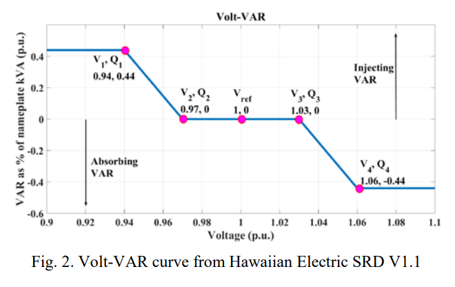

That graph is representated as a CURVE payload item like so:

```json
{
    "type": "CURVE",
    "values": [
        { 0.9,  0.4 },
        { 0.94, 0.4 },
        { 0.97, 0 },
        { 1,    0 },
        { 1.03, 0 },
        { 1.06, -0.44 }
    ]
}
```

### Reports

None required in this example

## 8.5 Load Control

Send day ahead LOAD_DISPATCH event signal targeted to one or many aggregators, with the aggregator managing the load profile of behind the meter batteries, water heaters, ‘BYOD’ thermostats, and EV.

### Events

POST event

```shell
curl  -X POST -H "Content-type: application/json" \
		-H "Authorization: Bearer bl_token" \
		-d @event_load_control.json \
		http://<baseUrl>/events
```

```json
{
	"eventName": "loadControlEvent",
	"programID": "44",
	"intervalPeriod": {
		"start": "2025-03-14T00:00:00.000Z",
		"duration": "PT4H"
	},
	"payloadDescriptors": [{
		"payloadType": "DISPATCH_SETPOINT",
		"units": "KW"
	}],
	"intervals": [{
		"id": 0,
		"payloads": [{
			"type": "DISPATCH_SETPOINT",
			"values": [0]
		}]
	}]
}
```
<p align="center"> Example 8.5-1: Create load control event </p>

No reporting example.

## 8.6 State of Charge Reporting

A grid entity seeks to have situational awareness of the energy state of storage based devices such as Electric Vehicles and Battery Storage. In this example, an event is used to request information about storage resources.

### Events
Post event

```shell
curl  -X POST -H "Content-type: application/json" \
		-H "Authorization: Bearer bl_token" \
		-d @event_SOC_report.json \
		http://\<baseUrl\>/events
```

```json
{
	"eventName": "SOC_report_Event",
	"programID": "0",
	"intervalPeriod": {
		"start": "0001-01-01",
		"duration": "PT0H"
	},
	"reportDescriptors": [{
			"payloadType": "STORAGE_USABLE_CAPACITY",
			"frequency": 0,
			"reportIntervals": "OPEN_INTERVALS"
		},
		{
			"payloadType": "STORAGE_CHARGE_LEVEL",
			"frequency": 0,
			"reportIntervals": "OPEN_INTERVALS"
		},
		{
			"payloadType": "STORAGE_MAX_DISCHARGE_POWER",
			"frequency": 0,
			"reportIntervals": "OPEN_INTERVALS"
		},
		{
			"payloadType": "STORAGE_MAX_CHARGE_POWER",
			"frequency": 0,
			"reportIntervals": "OPEN_INTERVALS"
		}
	]
}
```
<p align="center"> Example 8.6-1: Create state of charge report request event </p>

### Report

POST report

```shell
curl  -X POST -H "Content-type: application/json" \
		-H "Authorization: Bearer ven_token" \
		-d @report_SOC.json \
		http://\<baseUrl\>/reports
```

```json
{
	"reportName": "SOCReport",
	"eventID": "1",
	"clientName": "myClient",
	"resources": [{
		"resourceName": "Resource_1",
		"intervalPeriod": {
			"start": "2023-02-10T00:00:00.000Z",
			"duration": "PT1H"
		},
		"payloadDescriptors": [{
			"payLoadType": "STORAGE_USABLE_CAPACITY",
			"units": "KWH"
		}, {
			"payLoadType": "STORAGE_CHARGE_LEVEL",
			"units": "PERCENTAGE"
		}, {
			"payLoadType": "STORAGE_MAX_DISCHARGE_POWER",
			"units": "KWH"
		}, {
			"payLoadType": "STORAGE_MAX_CHARGE_POWER",
			"units": "KWH"
		}],
		"intervals": [{
			"id": 0,
			"payloads": [{
					"type": "STORAGE_USABLE_CAPACITY",
					"values": [0.018]
				},
				{
					"type": "STORAGE_CHARGE_LEVEL",
					"values": [33]
				},
				{
					"type": "STORAGE_MAX_DISCHARGE_POWER",
					"values": [0.011]
				},
				{
					"type": "STORAGE_MAX_CHARGE_POWER",
					"values": [0.007]
				}
			]
		}]
	}]
}
```
<p align="center"> Example 8.6-2: Create state of charge report </p>

## 8.7 Capability Forecast Reporting

Receive a rolling forecast of the aggregated load flexibility so that the BL is aware of how much load shed or generation can be dispatched up to 48 hours in the future.

This is an example of 'implied' intervals. Note there is not interval property in this event request, as there is no payload data being 'sent' to VENs. By interpreting the 
default intervalPeriod start and durations, in combination with the reportDescriptor flags, a VEN has the required information to generate
48 intervals of 1 hour duration, without the event containing 48 explicit intervals that contain no payload data. 

### Event

Post event

```shell
curl  -X POST -H "Content-type: application/json" \
		-H "Authorization: Bearer bl_token" \
		-d @event_capability_report.json \
		http://\<baseUrl\>/events
```

```json
{
	"eventName": "capability_report_Event",
	"programID": "0",
	"intervalPeriod": {
		"start": "2023-02-10T00:00:00.000Z",
		"duration": "PT1H"
	},
	"reportDescriptors": [{
			"payloadType": "LOAD_SHED_DELTA_AVAILABLE",
			"startInterval": 0,
			"numIntervals": 48,
			"historical": false,
			"frequency": 1,
			"repeat": -1
		},
		{
			"payloadType": "GENERATION_DELTA_AVAILABLE",
			"startInterval": 0,
			"numIntervals": 48,
			"historical": false,
			"frequency": 1,
			"repeat": -1
		}
	]
}
```
<p align="center"> Example 8.7-1: Create capability report request event </p>

### Report

POST report

```shell
curl  -X POST -H "Content-type: application/json" \
		-H "Authorization: Bearer ven_token" \
		-d @report_capability.json \
		http://\<baseUrl\>/reports
```

```json
{
	"reportName": "capabilityReport",
	"eventID": "1",
	"clientName": "myClient",
	"payloadDescriptors": [{
		"payloadType": "LOAD_SHED_DELTA_AVAILABLE",
		"units": "KWH"
	}, {
		"payloadType": "GENERATION_DELTA_AVAILABLE",
		"units": "PERCENTAGE"
	}],
	"resources": [{
		"resourceName": "Resource_1",
		"intervalPeriod": {
			"start": "2023-02-10T00:00:00.000Z",
			"duration": "PT1H"
		},
		"intervals": [{
			"id": 0,
			"payloads": [{
					"type": "LOAD_SHED_DELTA_AVAILABLE",
					"values": [30.0]
				},
				{
					"type": "GENERATION_DELTA_AVAILABLE",
					"values": [110.0]
				}
			]
		}]
	}]
}
```
<p align="center"> Example 8.7-2: Create capability report </p>

## 8.8 Operational Forecast Reporting

Receive a forecast of the aggregated resource load utilization or generation taking into account planned price and event optimizations and other operational considerations so that the upstream VTN’s application layer is aware of how much load utilization is likely to occur over the reporting period.

Note use of implied intervals as also illustrated in 8.7.

### Events

POST event

```shell
curl  -X POST -H "Content-type: application/json" \
		-H "Authorization: Bearer bl_token" \
		-d @event_ops_forecast.json \
		http://\<baseUrl\>/events
```

```json
{
	"eventName": "ops_forecast_Event",
	"programID": "0",
	"intervalPeriod": {
		"start": "2023-02-10T00:00:00.000Z",
		"duration": "PT1H"
	},
	"reportDescriptors": [{
		"payloadType": "USAGE",
		"aggregate": true,
		"startInterval": 0,
		"numIntervals": 24,
		"historical": false,
		"frequency": 1,
		"repeat": -1
	}]
}
```
<p align="center"> Example 8.8-1: Create operational forecast report request event </p>

The reportDescriptors in the example specifies an indefinite series of hourly forecasts for the following 24 hours, available load shed and generation.

Note the event’s intervalPeriod.duration = -1. This requires that each interval define its own duration.

- startInterval = 0	indicates that a report should be generated when the first interval has begun (see historical = False).

- numIntervals = 24	indicates the report should include readings for 24 intervals

- historical = False indicates that reporting should include the intervals that follow the startInterval.

- frequency = 1 indicates that a report should be generated after every interval

- repeat = -1 indicates that reports will repeat until the last interval has transpired, which is not defined as the event duration is -1. Repeat automatically increments the virtual startInterval by frequency amount.


### Reports

POST report

```shell
curl  -X POST -H "Content-type: application/json" \
		-H "Authorization: Bearer ven_token" \
		-d @report_ops_forecast.json \
		http://\<baseUrl\>/reports
```

```json
{
	"reportName": "opsForecastReport",
	"eventID": "1",
	"clientName": "myClient",
	"payloadDescriptors": [{
		"payloadType": "USAGE",
		"units": "KW"
	}],
	"resources": [{
		"resourceName": "Resource_1",
		"intervalPeriod": {
			"start": "2023-02-10T00:00:00.000Z",
			"duration": "PT1H"
		},
		"intervals": [{
			"id": 0,
			"payloads": [{
					"type": "USAGE",
					"values": [0.04]
				}

			]
		}]
	}]
}
```
<p align="center"> Example 8.8-2: Create operational forecast report </p>

## 8.9 OpenADR 2.0b Program Guide Use cases

The following use cases are detailed in the [OADR-2.0b-Program_Guide] and are referenced here to ensure OpenADR 3 has feature parity with 2.0b.

Italicized text are paraphrased quotes of the descriptions of events and reports from [OpenADR-2.0b-PG] . Where SIMPLE signals are described, this generally indicates compatibility with OpenADR 2.0a.

### 8.9.1 Critical Peak Pricing

Event Signals: If the deployment supports B profile VENs, in addition to the SIMPLE signal, an ELECTRICITY_PRICE signal may be included in the payload with a type of priceRelative, priceAbsolute, or priceMultiplier depending on the nature of the program.

Reporting Services: Telemetry reporting is typically not used as it is not absolutely necessary for CPP programs.

This Use Case is addressed above in the section titled “Day Ahead Prices with Usage report”. Note that prices in OpenADR 3 are always absolute and the type is simply PRICE.

### 8.9.2 Thermostat Program

Event Signals: A LOAD_CONTROL signal may be included in the payload with a type of x-loadControlLevelOffset or x-loadControlCapacity to specify the desired temperature setpoint offset or thermostatic cycling percentage respectively. It is recommended that a unit type of "temperature" be used in payloads utilizing the x- loadControlLevelOffset signalType to indicate Celsius or Fahrenheit for the offset.

Reporting Services: Telemetry status reports for small commercial Thermostat programs may be required, reporting at a minimum current setpoint offset of the thermostats which control the load shedding resources, as well as online/override status.

This Use Case is partially addressed above in the section titled “Load Shed”. Detailed reporting items are not directly supported. OpenADR 3 has a type of CONTROL_SETPOINT but does not support a thermostatic cycling percentage.

### 8.9.3 Fast DR Dispatch

Event Signals: A dispatch in the form of a LOAD_DISPATCH signal may be included in the payload with signal types of setpoint or delta, and units of powerReal. This signal represents the desired “operating point” of the load and can be expressed either as an absolute amount of mW (i.e. setpoint) or some relative number of mW (i.e. delta) from the resource's current operating point.

Reporting Services: In some cases the telemetry may include other data points such as voltage readings and charge state (i.e. energy) in the case where the resource is some form of storage. In some cases the reporting frequency may be as high as every 2 seconds.

These are two use cases; one to set the absolute setpoint of a resource with DISPATCH_SETPOINT and one to set a relative setpoint with CONTROL_SETPOINT. Each is illustrated below:

### Events

POST event

```shell
curl  -X POST -H "Content-type: application/json" \
		-H "Authorization: Bearer bl_token"
		-d @event_fast_dr.json \
		http://\<baseUrl\>/events
```

```json
{
	"eventName": "fast_dr_Event",
	"programID": "44",
	"intervalPeriod": {
		"start": "2023-02-10T00:00:00.000Z",
		"duration": "P9999Y"
	},
	"payloadDescriptors": [{
		"payloadType": "DISPATCH_SETPOINT",
		"units": "KW"
	}],
	"intervals": [{
		"id": 0,
		"payloads": [{
			"type": "DISPATCH_SETPOINT",
			"values": [0.50]
		}]
	}]
}
```
<p align="center"> Example 8.9.3-1: Create fast demand response dispatch event</p>

The following example illustrates modifying a setpoint to a value below the present setpoint.

POST event

```shell
curl  -X POST -H "Content-type: application/json" \
		-H "Authorization: Bearer bl_token" \
		-d @event_setpoint.json \
		http://\<baseUrl\>/events
```

```json
{
	"eventName": "setpoint_Event",
	"programID": "44",
	"intervalPeriod": {
		"start": "2023-02-10T00:00:00.000Z",
		"duration": "P9999Y"
	},
	"payloadDescriptors": [{
		"payloadType": "CONTROL_SETPOINT",
		"units": "KW"
	}],
	"intervals": [{
		"id": 0,
		"payloads": [{
			"type": "CONTROL_SETPOINT",
			"values": [-0.15]
		}]
	}]
}
```
<p align="center"> Example 8.9.3-2: Create setpoint event </p>

There are also two distinct reporting scenarios. The first requires voltage readings. An event may request such a report via:

POST event

```shell
curl  -X POST -H "Content-type: application/json" \
		-H "Authorization: Bearer bl_token" \
		-d @event_setpoint_report.json \
		http://\<baseUrl\>/events
```

```json
{
	"eventName": "setpoint_Event",
	"programID": "44",
	"intervalPeriod": {
		"start": "2023-02-10T00:00:00.000Z",
		"duration": "P9999Y"
	},
	"reportDescriptors": [{
		"payloadType": "SETPOINT",
		"readingType": "DIRECT_READ",
		"units": "VOLTAGE"
	}],
	"payloadDescriptors": [{
		"payloadType": "CONTROL_SETPOINT",
		"units": "KWH"
	}],
	"intervals": [{
		"id": 0,
		"payloads": [{
			"type": "CONTROL_SETPOINT",
			"values": [-0.15]
		}]
	}]
}
```
<p align="center"> Example 8.9.3-3: Create setpoint report request event </p>

### Reports

POST report

```shell
curl  -X POST -H "Content-type: application/json" \
		-H "Authorization: Bearer ven_token" \
		-d @report_setpoint.json \
		http://\<baseUrl\>/reports
```

```json
{
	"reportName": "setpointReport",
	"eventID": "1",
	"clientName": "myClient",
	"payloadDescriptors": [{
		"payloadType": "SETPOINT",
		"units": "PERCENT"
	}],
	"resources": [{
		"resourceName": "Resource_1",
		"intervalPeriod": {
			"start": "2023-02-10T00:00:00.000Z",
			"duration": "PT1H"
		},
		"intervals": [{
			"id": 0,
			"payloads": [{
					"type": "SETPOINT",
					"values": [0.10]
				}

			]
		}]
	}]
}
```
<p align="center"> Example 8.9.3-4: Create setpoint report </p>

### 8.9.4 Residential EV Time of Use

Event Signals: PRICE signals

Reporting Services: No reporting needed, all data can come from the meter.

This Use Case is addressed above in the section titled “Day Ahead Prices with Usage report”.

### 8.9.5 Public Station EV Real-Time Pricing

Event Signals: PRICE signals with prices.

Reporting Services: No reporting needed, but can be used if desired.

This Use Case is addressed above in the section titled “Day Ahead Prices with Usage report”.

### 8.9.6 DER DR

Event Signals: PRICE signals with 24 one hour intervals of prices over a 24 hour period.

Reporting Services: No reporting needed

This Use Case is addressed above in the section titled “Day Ahead Prices with Usage report”.

## 8.10 Capacity Management

Until recently, electric utility practice has been to allow any customer to import or export power at a level up to the line rating of the customer service at any time. This was not burdensome as the times when individual customers imported or exported at anomalously high levels were infrequent and not coordinated. The advent of excess PV export and vehicle charging have both changed that assumption. The options now available are to deny new customer DER connections (PV and EV) for the possibility of worst case scenarios violating limits, reducing customer capacity below their line limits – or, introducing digital management of capacity.

How best to manage capacity is still an open question and can be expected to evolve in the coming years, but two mechanisms are included – one based on announcing limits and the other based on subscriptions for lower levels and permission-based increases in that level.

### 8.10.1 Dynamic Operating Envelopes

Dynamic Operating Envelopes (DOE) are an alternative mechanism for managing site capacity limits implemented in some jurisdictions (see DER Management Envelope as per Section 9 title in CSIP-AUS (SA HB 218:2023) SA HB 218:2023 | Standards Australia). They communicate a schedule of available site-level import and/or export capacity, the operating envelope. The duration and interval length of the schedule will vary by application. When a new flexible load, such as an EV or stationary battery, wants to import power, it must restrict its consumption so that it does not contribute to an exceedance of the customer IMPORT_CAPACITY_LIMIT. Conversely for distributed generation, such as rooftop PV, that wants to export power, it must restrict its generation so that it does not contribute to an exceedance of the EXPORT_CAPACITY_LIMIT.

When a VEN connects to a VTN, the VTN will announce the customer’s dynamic operating envelope schedule with a payload element of IMPORT_CAPACITY_LIMIT and/or EXPORT_CAPACITY_LIMIT if applicable), in units of kW, with an event interval commonly days-long. A new dynamic operating envelope schedule may be announced at any time, including many times per day.

A common usage is for each event to request a report on site operational parameters such as voltage, site-level active and reactive power demand as shown in the example below.

### Events

Post event
```shell
curl  -X POST -H "Content-type: application/json" \
		-H "Authorization: Bearer bl_token" \
		-d @event_capacity_limit.json \
		http://\<baseUrl\>/events
```

```json
{
	"eventName": "capacity_limit_Event",
	"programID": "44",
	"intervalPeriod": {
		"start": "2023-02-10T00:00:00.000Z",
		"duration": "PT30M"
	},
	"reportDescriptors": [{
		"payloadType": "READING",
		"readingType": "DIRECT_READ",
		"units": "VOLTS",
		"startInterval": -1,
		"numIntervals": -1,
		"historical": true,
		"frequency": -1,
		"repeat": 1
	}, {
		"payloadType": "READING",
		"readingType": "DIRECT_READ",
		"units": "KW",
		"startInterval": -1,
		"numIntervals": -1,
		"historical": true,
		"frequency": -1,
		"repeat": 1
	}, {
		"payloadType": "READING",
		"readingType": "DIRECT_READ",
		"units": "KVAR",
		"startInterval": -1,
		"numIntervals": -1,
		"historical": true,
		"frequency": -1,
		"repeat": 1
	}],
	"payloadDescriptors": [{
			"payloadType": "IMPORT_CAPACITY_LIMIT",
			"units": "KW"
		},
		{
			"payloadType": "EXPORT_CAPACITY_LIMIT",
			"units": "KW"
		}
	],
	"intervals": [{
			"id": 0,
			"payloads": [{
					"type": "IMPORT_CAPACITY_LIMIT",
					"values": [
						10.0
					]
				},
				{
					"type": "EXPORT_CAPACITY_LIMIT",
					"values": [
						4.0
					]
				}

			]
		},
		{
			"id": 1,
			"payloads": [{
					"type": "IMPORT_CAPACITY_LIMIT",
					"values": [
						8.0
					]

				},
				{
					"type": "EXPORT_CAPACITY_LIMIT",
					"values": [
						6.0
					]
				}

			]
		}
	]
}
```
<p align="center"> Example 8.10.1-1: Create capacity limit event </p>

The above example illustrates 2 contiguous 30 minute intervals; additional intervals would cover additional time, e.g 48 30 minute intervals would define limits for an entire day.

Should an extended communications interruption occur and the scheduled IMPORT/EXPORT_CAPACITY_LIMIT enumeration values be exhausted, the VEN will utilise the IMPORT/EXPORT_CAPACITY_SUBSCRIPTION enumeration values as default limits. This would typically be announced from the VTN to the VEN on startup, with an event interval that could be years-long, and can be re-announced as needed with a new interval. Following a grid power outage, the VEN must disregard all existing IMPORT/EXPORT_CAPACITY_LIMIT, revert to the IMPORT/EXPORT_CAPACITY_SUBSCRIPTION and re-poll the VTN to establish if an updated IMPORT/EXPORT_CAPACITY_LIMIT schedule has been published.

### 8.10.2 Dynamic Capacity Management

Dynamic Capacity Management is a mechanism for addressing capacity constraints in the distribution system by creating a permission-based system of limiting customer power capacity. In a basic use case, customers subscribe to a capacity level that they normally never exceed for their ‘traditional’ end uses. When a new device, such as an EV or stationary battery, wants to import power, it can always do so at the difference between the rate of the import subscription level and the consumption of the balance of the system; to import power at a higher rate, a import reservation is required. Conversely for distributed generation, such as rooftop PV, that wants to export power, it can always generate at the total of the export subscription level and the consumption of the balance of the system; to export power at a higher rate, an export reservation is required. In both cases the coordination is with the customer site as a whole.

When a VEN connects to a VTN, the VTN will announce the customer’s subscribed capacity with a payload element of IMPORT_CAPACITY_SUBSCRIPTION (and/or EXPORT_CAPACITY_SUBSCRIPTION if applicable), commonly expressed in units of kW, with an event interval commonly years-long. If this is changed (through a process out of band of OpenADR) then a new subscription level is announced. The subscription should also include a report request that the VEN uses to request reservations.

At any time the customer may submit a request with a report including payload elements of IMPORT_CAPACITY_RESERVATION and IMPORT_CAPACITY_RESERVATION_FEE (and/or EXPORT_CAPACITY_RESERVATION and EXPORT_CAPACITY_RESERVATION_FEE), commonly expressed in units of kW or currency/kW (e.g. $/kW) respectively; this report can have multiple intervals, each of which generates an independent request. This is the additional capacity requested and the fee the customer is willing to pay. The customer will commonly begin with a fee of zero. The VTN will generate an event based on this to announce the customer’s upcoming reservations -- a combination of any past reservations that have not expired and successful new ones. To be a successful request, the requested capacity must be available and if the fee request must be sufficient. If multiple requests are submitted simultaneously, it is possible that some will be successful and some not. If the VEN submits a request with a fee higher than is required, the reservation fee is only the required amount. The upcoming reservations are announced with the IMPORT_CAPACITY_RESERVATION and IMPORT_CAPACITY_RESERVATION_FEE payload elements, similarly announced in units of kW and currency/kW). Finally, at the same time the VTN will send out an announcement of future capacity that can be reserved with the IMPORT_CAPACITY_AVAILABLE and IMPORT_CAPACITY_AVAILABLE_FEE payload elements with the same units. All of these four payload elements have counterparts for export which can be used in combination with or instead of import payloads. The VTN may reject reservations if the timing intervals do not match what the VTN expects. For example, the VTN may expect reservations to be on 15-minute intervals and so reject ones that have start times or durations that don’t match this.

All of these are announced as intervals and can have one or many intervals in the sequence. Because the capacity information is customer-specific, this is a program requiring authentication, not a tariff relationship as the underlying energy prices are for the same customer.

The diagram below illustrates an example high-level interaction sequence, with a detailed description following.

<!-- img src="./ug_img/DyCM.png" alt="Dynamic Capacity Management"/ -->

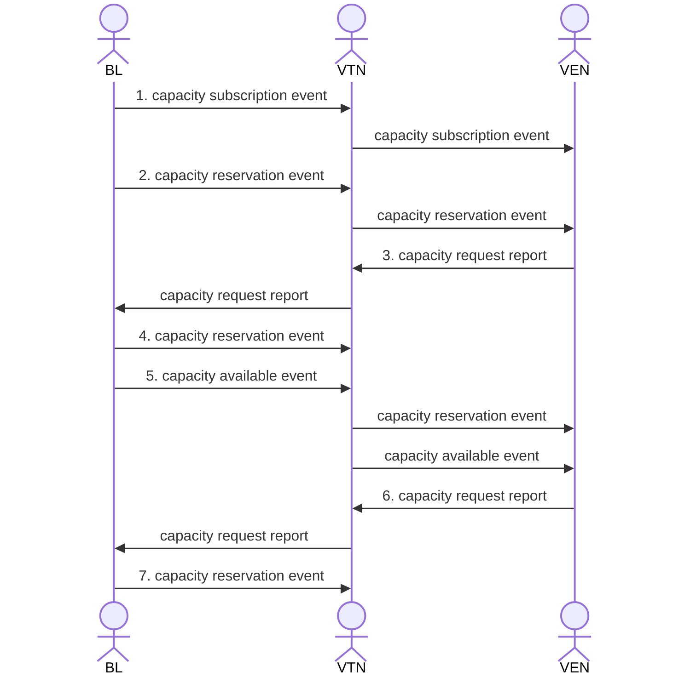

<p align="center"> Figure 8.10.2-1: Dynamic Capacity Management  </p>

The anticipated flow is (only numbered interactions are described):

BL logic sends a capacity subscription event to the VTN that contains subscription information. This event could include a report request for capacity request from VENs. A capacity subscription event includes a payload that contains the import and/or export capacity subscription (in kW) for the subscription.

BL may send a capacity reservation event to the VTN at any time. If the capacity subscription event did not include a capacity request report request, this event is expected to  simply request a capacity request report from VENs.

When a VEN wishes to consume more power than its subscription level, it will send a capacity request report to the VTN. The report includes payloads that indicate the interval(s) over which extra capacity is requested and a powerLevel for each.

If BL reads a capacity request report it may create a new capacity reservation event targeted to the requesting VEN. This event is expected to include payloads that indicate a powerLevel over some set of intervals, thus providing a history of the reservations granted to the VEN. These results indicate to the VEN whether the requested reservation has been granted or not.

BL may also target a capacity available event to a VEN to indicate intervals over which capacity reservations might be requested. Such events include payloads containing powerLevel and price.

A VEN may generate a new capacity reservation request report in response to information gleaned from the previous capacity reservation event and capacity available event.

BL may grant or deny the latest reservation request from a VEN by targeting a capacity reservation event to a VEN..

Example request bodies for the above events and reports are as follows; all of the examples are for import but apply equally to export:

### Events

POST event
```shell
curl  -X POST -H "Content-type: application/json" \
		-H "Authorization: Bearer bl_token" \
		-d @event_capacity_subscription.json \
		http://\<baseUrl\>/events
```

```json
{
	"eventName": "capacity_subscription_Event",
	"programID": "44",
	"intervalPeriod": {
		"start": "2023-02-10T00:00:00.000Z",
		"duration": "P9999Y"
	},
	"payloadDescriptors": [{
		"payloadType": "CAPACITY_SUBSCRIPTION",
		"units": "KW"
	}],
	"intervals": [{
		"id": 0,
		"payloads": [{
			"type": "CAPACITY_SUBSCRIPTION",
			"values": [240]
		}]
	}]
}
```
<p align="center"> Example 8.10.2-1: Create capacity subscription event  </p>

POST event
```shell
curl  -X POST -H "Content-type: application/json" \
		-H "Authorization: Bearer bl_token" \
		-d @event_capacity_reservation_reportReq.json \
		http://\<baseUrl\>/events
```

```json
{
	"eventName": "capacity_reservation_reportReq_Event",
	"programID": "0",
	"intervalPeriod": {
		"start": "0001-01-01",
		"duration": "PT0H"
	},
	"reportDescriptors": [
    	{
			"payloadType": "CAPACITY_RESERVATION",
			"reportIntervals": "OPEN_INTERVALS"
		}
  	]
}
```
<p align="center"> Example 8.10.2-2: Create capacity reservation report request event  </p>

### Reports

POST report

```shell
curl  -X POST -H "Content-type: application/json" \
		-H "Authorization: Bearer ven_token" \
		-d @report_capacity_sub.json \
		http://\<baseUrl\>/reports
```

```json
{
  "reportName": "capacityReservationReport",
  "eventID": "1",
  "clientName": "myClient",
  "payloadDescriptors": [{
     "payloadType": "IMPORT_CAPACITY_RESERVATION",
     "units": "KW"
  }],
  "resources": [{
     "resourceName": "Resource_1",
     "intervalPeriod": {
        "start": "2023-02-10T00:00:00.000Z",
        "duration": "PT1H"
     },
     "intervals": [{
        "id": 0,
        "payloads": [{
              "type": "IMPORT_CAPACITY_RESERVATION",
              "values": [242]
           }

        ]
     }]
  }]
}
```
<p align="center"> Example 8.10.2-3: Create capacity reservation report </p>

### Events

POST event

```shell
curl  -X POST -H "Content-type: application/json" \
		-H "Authorization: Bearer bl_token" \
		-d @event_capacity_reservation.json \
		http://\<baseUrl\>/events
```

```json
{
  "eventName": "capacity_reservation_Event",
  "programID": "44",
  "intervalPeriod": {
    "start": "0001-01-01",
    "duration": "PT0H"
  },
  "reportDescriptors": [
    {
      "payloadType": "CAPACITY_RESERVATION"
    }
  ],
  "payloadDescriptors": [
    {
      "payloadType": "CAPACITY_RESERVATION",
      "units": "KW"
    },
    {
      "payloadType": "CAPACITY_RESERVATION_FEE",
      "units": "USD"
    }
  ],
  "intervals": [
    {
      "id": 0,
      "intervalPeriod": {
        "start": "0001-01-01",
        "duration": "PT0H"
      },
      "payloads": [
        {
          "type": "CAPACITY_RESERVATION",
          "values": [
            242
          ]
        },
        {
          "type": "CAPACITY_RESERVATION_FEE",
          "values": [
            0.11
          ]
        }
      ]
    }
  ],
  "targets": [
    "VEN-99"
  ]
}

```
<p align="center"> Example 8.10.2-4: Create capacity reservation event </p>

POST event

```shell
curl  -X POST -H "Content-type: application/json" \
		-H "Authorization: Bearer bl_token" \
		-d @event_capacity_available.json \
		http://\<baseUrl\>/
```

```json
{
  "eventName": "capacity_available_Event",
  "programID": "44",
  "intervalPeriod": {
    "start": "0001-01-01",
    "duration": "PT0H"
  },
  "reportDescriptors": [
    {
      "payloadType": "CAPACITY_RESERVATION"
    }
  ],
  "payloadDescriptors": [
    {
      "payloadType": "CAPACITY_AVAILABLE",
      "units": "KW"
    },
    {
      "payloadType": "CAPACITY_AVAILABLE_FEE",
      "units": "USD"
    }
  ],
  "intervals": [
    {
      "id": 0,
      "intervalPeriod": {
        "start": "2023-02-10T00:00:00.000Z",
        "duration": "PT1H"
      },
      "payloads": [
        {
          "type": "CAPACITY_AVAILABLE",
          "values": [
            242
          ]
        },
        {
          "type": "CAPACITY_AVAILABLE_FEE",
          "values": [
            0.11
          ]
        }
      ]
    }
  ],
  "targets": [
    "VEN-99"
  ]
}

```
<p align="center"> Example 8.10.2-5: Create capacity available event </p>

## 8.11 OpenADR and CTA-2045

OpenADR 3 is well suited to be a standard external protocol for CTA-2045B, which is a standard for an external module on a flexible load or other device to provide replaceable interface devices with different communication and computation capabilities. For many capabilities of CTA-2045, e.g. sending prices, an emergency signal, or reporting energy use, there are existing mechanisms in OpenADR that implement the functionality. For a few capabilities, enumeration values specific to CTA-2045 have been added. A document that describes unambiguous mapping between the two standards is forthcoming.

## 8.12 Updated Event with Custom Dispatch Instructions

A business logic (BL) entity wishes to communicate an upcoming event to VENs, incorporating additional instructions on how they should respond during different periods. The example below provides two payload samples for the same event, communicated at different points in time.

- In the first sample, participants are initially instructed to employ regular load reduction measures and to keep their combustion generation resources on standby, during a two-hour event.
- The second sample updates the original event. It instructs participants to continue the same load control regimen until the end of the first hour, but extends the event by hour to three total hours, and instructs participants to deploy their combustion generation resources (in addition to their regular load reduction resources) during the second and third hours.

### Events

POST event

```shell
curl  -X POST -H "Content-type: application/json" \
		-H "Authorization: Bearer bl_token" \
		-d @event_with_instructions.json \
		http://\<baseUrl\>/events
```

```json
{
    "eventName": "eventWithInstructions",
    "programID": "53",
    "payloadDescriptors": [{
        "payloadType": "DISPATCH_INSTRUCTION"
    }],
    "intervals": [
        {
            "id": 0,
            "intervalPeriod": {
                "start": "2025-02-13 19:00:00.000Z",
                "duration": "PT2H"
            },
            "payloads": [{
                "type": "DISPATCH_INSTRUCTION",
                "values": ["load_reduction", "combustion_gen_standby"]
            }]
        }
    ]
}
```
<p align="center"> Example 8.12-1: Initial dispatch instructions</p>

PUT event

```shell
curl  -X PUT -H "Content-type: application/json" \
		-H "Authorization: Bearer bl_token" \
		-d @event_with_instructions.json \
		http://\<baseUrl\>/events/53
```

```json
{
    "eventName": "eventWithInstructions",
    "programID": "53",
    "payloadDescriptors": [{
        "payloadType": "DISPATCH_INSTRUCTION"
    }],
    "intervals": [
        {
            "id": 0,
            "intervalPeriod": {
                "start": "2025-02-13T19:00:00.000Z",
                "duration": "PT1H"
            },
            "payloads": [{
                "type": "DISPATCH_INSTRUCTION",
                "values": ["load_reduction", "combustion_gen_standby"]
            }]
        },
        {
            "id": 1,
            "intervalPeriod": {
                "duration": "PT2H"
            },
            "payloads": [{
                "type": "DISPATCH_INSTRUCTION",
                "values": [ "load_reduction", "combustion_gen"]
            }]
        }
    ]
}
```
<p align="center"> Example 8.12-2: Updated dispatch instructions</p>

### 8.13 Dynamic Targeting
BL may 'grant' targets to VENs and subsequently create programs and events that may only be read by VENs with the assigned targets. 

This section describes the following workflow:
* BL creates ven object with 'allowed' targets
* BL creates resource object with more 'allowed' targets
* BL creates program object
* BL creates event object with ven targets 
* VEN reads event object

##### BL creates ven object with 'allowed' targets
BL may 'grant' targets to a VEN via an associated ven object. BL may update targets at any time to accomodate
shifting business goals, e.g. reassigning VENs to groups or regions.

POST ven

```shell
curl  -X POST -H "Content-type: application/json" \
		-H "Authorization: Bearer bl_token" \
		-d @ven_targets.json \
		http://\<baseUrl\>/vens
```

```json
{
  "venName": "VENID_0999",
  "objectType": "BL_VEN_REQUEST",
  "clientID": "ven_client",
  "targets": [
    "ven_0999",
    "group1",
    "areaX"
  ]
}
```
<p align="center"> Example 8.13-1: BL creates ven with targets </p>

##### BL creates resource object with more 'allowed' targets
BL can target obejcts to specific sets of resources by assigning targets to a VEN's resource objects. 

POST resource
```shell
curl  -X POST -H "Content-type: application/json" \
		-H "Authorization: Bearer bl_token" \
		-d @resource_targets.json \
		http://\<baseUrl\/resources
```

```json
{
  "resourceName": "RESOURCE_0999",
  "objectType": "BL_RESOURCE_REQUEST",
  "clientID": "ven_client",
  "venID": "0",
  "targets": [
    "resource_0999"
  ]
}

```
<p align="center"> Example 8.13-2: VEN creates resource with targets</p>


##### BL creates program object
A program object must be present on the VTN before an event may be created, as event must refer to an existing program. 

POST program

```shell
curl  -X POST -H "Content-type: application/json" \
		-H "Authorization: Bearer bl_token" \
		-d @program.json \
		http://\<baseUrl\/programs
```

```json
{
  "programName": "PROGRAM_0999"
}
```
<p align="center"> Example 8.13-3: BL creates program</p>

##### BL creates event object
In this simple example, BL creates an event intended to be consumed by VENs with the target "ven_0999", presumably a single VEN.
events may include targets such as "group1" or "areaX" as illustrated in the ven example above, which may be assigned to multple ven objects. 

PUT event

```shell
curl  -X POST -H "Content-type: application/json" \
		-H "Authorization: Bearer bl_token" \
		-d @event_targets_ven.json \
		http://\<baseUrl\/events
```

```json
{
  "programID": "0",
  "eventName": "EVENT_0999",
  "targets": [
    "ven_0999"
  ]
}

```
<p align="center"> Example 8.13-4: BL creates event with targets </p>

##### VEN reads event object
In this example, the VEN does not need to include targets as query params, as the VTN discovers the targets 'granted' to the client
by inspecting the ven object associated with the requestor (via the clientID associated with the requestor's bearer token).

GET event

```shell
curl  -X GET -H "Content-type: application/json" \
		-H "Authorization: Bearer ven_token" \
		-d @ven_targets.json \
		http://\<baseUrl\/events
```

```json
[
  {
    "createdDateTime": "12:22:12",
    "eventName": "EVENT_0999",
    "id": "0",
    "objectType": "EVENT",
    "programID": "0",
    "targets": [
      "ven_0999"
    ]
  }
]

```
<p align="center"> Example 8.13-5: VEN reads event with targets </p>


#### Additional examples
Our workflow can be extended to include: 

* BL creates event w resource targets
* VEN reads targeted resource object 

##### BL creates event with resource targets

POST event

```shell
curl  -X POST -H "Content-type: application/json" \
		-H "Authorization: Bearer bl_token" \
		-d @event_targets_resource.json \
		http://\<baseUrl\/events
```

```json
{
  "programID": "0",
  "eventName": "EVENT_0999",
  "targets": [
    "resource_0999"
  ]
}

```
<p align="center"> Example 8.13-6: BL creates event with resource targets </p>

##### VEN reads event w resource targets
VTN discovers the targets 'granted' to the client by inspecting the resource objects associated with the requestor, as described in Example 8.13-5.

GET event

```shell
curl  -X GET -H "Content-type: application/json" \
		-H "Authorization: Bearer ven_token" \
		-d @ven_targets.json \
		http://\<baseUrl\/resources
```

```json
[
  {
    "clientID": "ven_client",
    "createdDateTime": "12:21:14",
    "id": "0",
    "objectType": "RESOURCE",
    "resourceName": "RESOURCE_0999",
    "targets": [
      "resource_0999"
    ],
    "venID": "0"
  }
]

```
<p align="center"> Example 8.13-7: VEN reads event with resource targets </p>


End of Document
